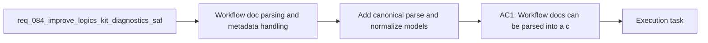

## item_125_add_canonical_parse_and_normalize_models_for_workflow_docs_and_skill_metadata - Add canonical parse and normalize models for workflow docs and skill metadata
> From version: 1.11.1
> Status: Done
> Understanding: 96%
> Confidence: 94%
> Progress: 100%
> Complexity: High
> Theme: Kit runtime and operator tooling
> Reminder: Update status/understanding/confidence/progress and linked task references when you edit this doc.

# Problem
- Workflow-doc parsing, section extraction, and skill metadata handling are still too dispersed across helper functions and command-specific code paths.
- That duplication makes audits, migrations, diagnostics, and future safe-write features harder to keep consistent.
- This item should define canonical read-side parse and normalize models that multiple kit surfaces can share without overlapping the write-side assembly work already scoped in `req_083`.

# Scope
- In:
  - Shared typed or structured parse and normalize models for workflow docs.
  - Canonical normalization for key skill metadata surfaces such as `SKILL.md` and agent configuration metadata.
  - Adoption of the shared read-side contract by at least two kit paths.
- Out:
  - Full schema migration support already covered by `item_123`.
  - Release metadata or conventions registry work covered by `item_126`.
  - Bulk safe-write preview work covered by `item_127`.

# Acceptance criteria
- AC1: Workflow docs can be parsed into a canonical internal representation that exposes normalized identifiers, sections, and key metadata consistently.
- AC2: Skill metadata can be normalized through the same internal contract family so tooling does not have to reinterpret each file shape independently.
- AC3: At least two kit surfaces adopt the shared parse or normalize layer, proving it is a real contract instead of an unused helper.

# AC Traceability
- AC1 -> Scope. Proof: implement canonical workflow-doc parse models and normalization helpers.
- AC2 -> Scope. Proof: normalize at least one skill metadata surface through the same contract family.
- AC3 -> Scope. Proof: switch at least two consumers to the shared contract.

# Decision framing
- Product framing: Not needed
- Product signals: (none detected)
- Product follow-up: No product brief follow-up is expected based on current signals.
- Architecture framing: Consider
- Architecture signals: data model and persistence, contracts and integration
- Architecture follow-up: Capture an ADR only if the canonical read-side model becomes a long-lived public contract across several skills.

# Links
- Product brief(s): (none yet)
- Architecture decision(s): (none yet)
- Request: `req_084_improve_logics_kit_diagnostics_safety_and_internal_runtime_contracts`
- Primary task(s): `task_096_orchestration_delivery_for_req_084_diagnostics_safety_and_internal_runtime_contracts`

# AI Context
- Summary: Define canonical parse and normalize models for workflow docs and skill metadata so kit features can share one read-side contract.
- Keywords: parse, normalize, workflow-docs, skill-metadata, internal-model, contracts
- Use when: Use when implementing shared read-side models for kit parsing and metadata normalization.
- Skip when: Skip when the work targets another feature, repository, or workflow stage.

# Priority
- Impact: High
- Urgency: Medium

# Notes
- Derived from request `req_084_improve_logics_kit_diagnostics_safety_and_internal_runtime_contracts`.
- Source file: `logics/request/req_084_improve_logics_kit_diagnostics_safety_and_internal_runtime_contracts.md`.
- Request context seeded into this backlog item from `logics/request/req_084_improve_logics_kit_diagnostics_safety_and_internal_runtime_contracts.md`.
- Task `task_096_orchestration_delivery_for_req_084_diagnostics_safety_and_internal_runtime_contracts` was finished via `logics_flow.py finish task` on 2026-03-24.
