## item_126_centralize_logics_kit_conventions_capability_registry_and_machine_readable_release_metadata - Centralize Logics kit conventions capability registry and machine-readable release metadata
> From version: 1.11.1
> Status: Done
> Understanding: 96%
> Confidence: 94%
> Progress: 100%
> Complexity: High
> Theme: Kit runtime and operator tooling
> Reminder: Update status/understanding/confidence/progress and linked task references when you edit this doc.

# Problem
- The kit still spreads conventions, supported features, and release-evolution hints across docs, code, and implied behavior.
- That makes it harder for skills, audits, doctor output, and future automation to know what is supported or deprecated without reading several files.
- This item should centralize conventions, capability metadata, and machine-readable release notes in one reusable registry layer.

# Scope
- In:
  - A centralized conventions registry for statuses, sections, link types, naming rules, or equivalent kit rules.
  - Machine-readable capability metadata describing supported kit features or feature availability.
  - Machine-readable release or change metadata that can describe feature additions, deprecations, or breaking changes for kit operators.
- Out:
  - JSON output contracts already covered by `item_122`.
  - Schema versioning and named migrations already covered by `item_123`.
  - Skill fixture coverage already covered by `item_128`.

```mermaid
%% logics-kind: backlog
%% logics-signature: backlog|centralize-logics-kit-conventions-capabi|req-084-improve-logics-kit-diagnostics-s|the-kit-still-spreads-conventions-suppor|ac1-the-kit-exposes-a-centralized
flowchart LR
    Request[req_084_improve_logics_kit_diagnostics_saf] --> Problem[The kit still spreads conventions supporte]
    Problem --> Scope[Centralize Logics kit conventions capabili]
    Scope --> Acceptance[AC1: The kit exposes a centralized]
    Acceptance --> Tasks[task_096_orchestration_delivery_for_req_08]
```

# Acceptance criteria
- AC1: The kit exposes a centralized conventions registry that downstream tooling can reuse instead of redefining workflow-doc rules locally.
- AC2: Capability metadata makes it possible to discover whether a repo or skill supports specific kit features without heuristic inspection alone.
- AC3: Release-evolution metadata captures at least feature additions, deprecations, or breaking changes in a structured way that future tooling can consume.

# AC Traceability
- AC1 -> Scope. Proof: add and document a conventions registry consumed by at least one tool surface.
- AC2 -> Scope. Proof: expose capability metadata that can answer feature-support queries.
- AC3 -> Scope. Proof: generate or maintain machine-readable release metadata with structured change categories.

# Decision framing
- Product framing: Not needed
- Product signals: (none detected)
- Product follow-up: No product brief follow-up is expected based on current signals.
- Architecture framing: Consider
- Architecture signals: contracts and integration, versioning and compatibility
- Architecture follow-up: Capture an ADR only if the registry format becomes the authoritative compatibility contract across the kit.

# Links
- Product brief(s): (none yet)
- Architecture decision(s): (none yet)
- Request: `req_084_improve_logics_kit_diagnostics_safety_and_internal_runtime_contracts`
- Primary task(s): `task_096_orchestration_delivery_for_req_084_diagnostics_safety_and_internal_runtime_contracts`

# AI Context
- Summary: Centralize reusable conventions, capability metadata, and machine-readable release evolution data for the Logics kit.
- Keywords: conventions, registry, capabilities, releases, metadata, compatibility
- Use when: Use when implementing reusable registries that describe kit behavior and supported features.
- Skip when: Skip when the work targets another feature, repository, or workflow stage.

# Priority
- Impact: Medium
- Urgency: Medium

# Notes
- Derived from request `req_084_improve_logics_kit_diagnostics_safety_and_internal_runtime_contracts`.
- Source file: `logics/request/req_084_improve_logics_kit_diagnostics_safety_and_internal_runtime_contracts.md`.
- Request context seeded into this backlog item from `logics/request/req_084_improve_logics_kit_diagnostics_safety_and_internal_runtime_contracts.md`.
- Task `task_096_orchestration_delivery_for_req_084_diagnostics_safety_and_internal_runtime_contracts` was finished via `logics_flow.py finish task` on 2026-03-24.
