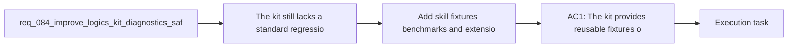

## item_128_add_skill_fixtures_benchmarks_and_extension_contracts_for_kit_regression_coverage - Add skill fixtures benchmarks and extension contracts for kit regression coverage
> From version: 1.11.1
> Status: Done
> Understanding: 96%
> Confidence: 94%
> Progress: 100%
> Complexity: High
> Theme: Kit runtime and operator tooling
> Reminder: Update status/understanding/confidence/progress and linked task references when you edit this doc.

# Problem
- The kit still lacks a standard regression surface for skills beyond ad hoc tests and repo-specific examples.
- Without reusable fixtures, extension expectations, and lightweight performance baselines, maintainers have less confidence when evolving templates, parsers, or cross-skill contracts.
- This item should add kit-level regression scaffolding that helps both first-party and future third-party skills evolve safely.

# Scope
- In:
  - Reusable fixtures or example corpora for skill-level validation.
  - Extension expectations or a lightweight contract for new skills integrating with the kit.
  - Lightweight performance or regression baselines for critical skill flows.
- Out:
  - Core workflow-doc parse models from `item_125`.
  - Release metadata or conventions registry work from `item_126`.
  - Plugin-facing guidance or UX.

# Acceptance criteria
- AC1: The kit provides reusable fixtures or example corpora that can validate representative skill behaviors.
- AC2: A lightweight extension contract describes what new or external skills should provide to integrate cleanly with the kit.
- AC3: Lightweight benchmarks or performance baselines exist for at least one critical skill or workflow path and are suitable for regression tracking.

# AC Traceability
- AC1 -> Scope. Proof: add reusable fixtures used by automated skill validation.
- AC2 -> Scope. Proof: document and validate a minimal extension contract for new skills.
- AC3 -> Scope. Proof: add lightweight performance or regression checks for a representative critical path.
- AC5 -> Request alignment. Proof: this item is the request-level implementation slice for reusable fixtures, extension expectations, and lightweight benchmark coverage.

# Decision framing
- Product framing: Not needed
- Product signals: (none detected)
- Product follow-up: No product brief follow-up is expected based on current signals.
- Architecture framing: Not needed
- Architecture signals: (none detected)
- Architecture follow-up: No architecture decision follow-up is expected based on current signals.

# Links
- Product brief(s): (none yet)
- Architecture decision(s): (none yet)
- Request: `req_084_improve_logics_kit_diagnostics_safety_and_internal_runtime_contracts`
- Primary task(s): `task_096_orchestration_delivery_for_req_084_diagnostics_safety_and_internal_runtime_contracts`

# AI Context
- Summary: Add reusable fixtures, extension expectations, and lightweight benchmarks so skill-level kit changes have a stable regression surface.
- Keywords: fixtures, benchmarks, extensions, skills, regression, performance
- Use when: Use when improving skill validation and maintainability baselines for the kit.
- Skip when: Skip when the work targets another feature, repository, or workflow stage.

# Priority
- Impact: Medium
- Urgency: Medium

# Notes
- Derived from request `req_084_improve_logics_kit_diagnostics_safety_and_internal_runtime_contracts`.
- Source file: `logics/request/req_084_improve_logics_kit_diagnostics_safety_and_internal_runtime_contracts.md`.
- Request context seeded into this backlog item from `logics/request/req_084_improve_logics_kit_diagnostics_safety_and_internal_runtime_contracts.md`.
- Task `task_096_orchestration_delivery_for_req_084_diagnostics_safety_and_internal_runtime_contracts` was finished via `logics_flow.py finish task` on 2026-03-24.
