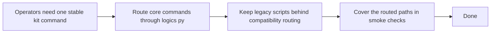

## item_130_add_a_unified_logics_cli_entrypoint_with_compatibility_routing - Add a unified logics CLI entrypoint with compatibility routing
> From version: 1.12.0
> Schema version: 1.0
> Status: Done
> Understanding: 100%
> Confidence: 98%
> Progress: 100%
> Complexity: High
> Theme: Kit runtime ergonomics and scale
> Reminder: Update status/understanding/confidence/progress and linked task references when you edit this doc.

# Problem
- Operators still had to remember several direct script paths, which made the kit feel script-centric instead of platform-like.
- The repo needed one stable entrypoint that can route toward the flow manager, bootstrapper, linter, audit, indexer, and config inspection flows.

# Scope
- In:
  - add `logics/skills/logics.py` as the stable CLI surface
  - keep compatibility by routing toward existing scripts instead of rewriting every script interface
  - cover the unified path in smoke tests
- Out:
  - removing the legacy direct script paths
  - introducing a packaging/distribution story beyond the repository checkout

# Acceptance criteria
- AC1: A top-level `logics.py` entrypoint exists and routes to bootstrap, flow, audit, index, lint, doctor, and config inspection flows.
- AC2: The routed CLI keeps the underlying command contracts intact instead of changing operator semantics unexpectedly.
- AC3: Smoke coverage proves the unified CLI can bootstrap, create docs, promote, split, lint, and audit a temporary repository.

# AC Traceability
- AC1 -> `logics/skills/logics.py`. Proof: the wrapper routes `bootstrap`, `flow`, `audit`, `index`, `lint`, `config show`, and `doctor`.
- AC2 -> `logics/skills/README.md` and `logics/skills/logics-flow-manager/SKILL.md`. Proof: operator docs now present `python logics/skills/logics.py ...` as the preferred stable entrypoint while keeping compatibility references.
- AC3 -> `logics/skills/tests/run_cli_smoke_checks.py` and `logics/skills/tests/test_logics_flow.py`. Proof: the smoke fixture now exercises the routed CLI and the dedicated CLI test verifies bootstrap plus config inspection.

# Decision framing
- Product framing: Not needed
- Product signals: (none detected)
- Product follow-up: No product brief follow-up is expected based on current signals.
- Architecture framing: Not needed
- Architecture signals: (none detected)
- Architecture follow-up: No architecture decision follow-up is expected based on current signals.

# Links
- Product brief(s): (none yet)
- Architecture decision(s): (none yet)
- Request: `req_085_add_repo_config_runtime_entrypoints_and_transactional_scaling_primitives_to_the_logics_kit`
- Primary task(s): `task_097_orchestration_delivery_for_req_085_repo_config_runtime_entrypoints_and_transactional_scaling_primitives`

# AI Context
- Summary: Provide a single stable `logics.py` operator entrypoint that routes toward the core kit scripts.
- Keywords: logics, cli, routing, bootstrap, audit, lint, index, compatibility
- Use when: Use when operators should invoke the kit through one documented command surface.
- Skip when: Skip when the work is limited to a single script that does not affect operator entrypoints.

# References
- `logics/request/req_085_add_repo_config_runtime_entrypoints_and_transactional_scaling_primitives_to_the_logics_kit.md`
- `logics/tasks/task_097_orchestration_delivery_for_req_085_repo_config_runtime_entrypoints_and_transactional_scaling_primitives.md`
- `logics/skills/logics.py`
- `logics/skills/README.md`
- `logics/skills/logics-flow-manager/SKILL.md`
- `logics/skills/tests/run_cli_smoke_checks.py`
- `logics/skills/tests/test_logics_flow.py`

# Priority
- Impact: High
- Urgency: High

# Notes
- This item turned the kit from “a folder of scripts” into a repo-local CLI with compatibility routing.
- Legacy script paths remain valid, but they are no longer the only documented operator contract.
