## item_131_extend_machine_readable_outputs_across_automation_facing_kit_skills - Extend machine-readable outputs across automation-facing kit skills
> From version: 1.12.0
> Schema version: 1.0
> Status: Done
> Understanding: 100%
> Confidence: 98%
> Progress: 100%
> Complexity: High
> Theme: Kit runtime ergonomics and scale
> Reminder: Update status/understanding/confidence/progress and linked task references when you edit this doc.

# Problem
- The flow manager already exposed JSON contracts, but adjacent automation-facing scripts still forced downstream tooling back into text parsing.
- The kit needed a broader structured surface so repo automation could bootstrap, lint, and index without mixing JSON from one script with ad hoc text from another.

# Scope
- In:
  - add JSON output contracts to the bootstrapper, indexer, and doc linter
  - keep text output available for operators
  - document the structured entrypoints through the unified CLI
- Out:
  - rewriting every kit skill in one pass
  - removing human-readable text output

```mermaid
%% logics-kind: backlog
%% logics-signature: backlog|extend-machine-readable-outputs-across-a|req-085-add-repo-config-runtime-entrypoi|the-flow-manager-already-exposed-json|ac1-the-bootstrapper-can-return-a
flowchart LR
    Request[req_085_add_repo_config_runtime_entrypoint] --> Problem[The flow manager already exposed JSON]
    Problem --> Scope[Extend machine-readable outputs across aut]
    Scope --> Acceptance[AC1: The bootstrapper can return a]
    Acceptance --> Tasks[task_097_orchestration_delivery_for_req_08]
```

# Acceptance criteria
- AC1: The bootstrapper can return a machine-readable payload describing the planned actions and repo root.
- AC2: The indexer can return counts plus runtime-index cache stats in JSON.
- AC3: The doc linter can return machine-readable issues and warnings without changing its pass/fail semantics.

# AC Traceability
- AC1 -> `logics/skills/logics-bootstrapper/scripts/logics_bootstrap.py`. Proof: `--format json` now emits the bootstrap action plan and status.
- AC2 -> `logics/skills/logics-indexer/scripts/generate_index.py`. Proof: `--format json` reports output metadata and incremental cache hit/miss stats.
- AC3 -> `logics/skills/logics-doc-linter/scripts/logics_lint.py`. Proof: `--format json` returns structured issue and warning lists while preserving the exit code contract.

# Decision framing
- Product framing: Not needed
- Product signals: (none detected)
- Product follow-up: No product brief follow-up is expected based on current signals.
- Architecture framing: Not needed
- Architecture signals: (none detected)
- Architecture follow-up: No architecture decision follow-up is expected based on current signals.

# Links
- Product brief(s): (none yet)
- Architecture decision(s): (none yet)
- Request: `req_085_add_repo_config_runtime_entrypoints_and_transactional_scaling_primitives_to_the_logics_kit`
- Primary task(s): `task_097_orchestration_delivery_for_req_085_repo_config_runtime_entrypoints_and_transactional_scaling_primitives`

# AI Context
- Summary: Extend stable JSON output contracts beyond the flow manager to the core automation-facing kit scripts.
- Keywords: logics, json, machine-readable, bootstrap, lint, index, automation
- Use when: Use when adjacent kit automation should be consumed by scripts without text parsing.
- Skip when: Skip when the change is only about human-facing prose output.

# References
- `logics/request/req_085_add_repo_config_runtime_entrypoints_and_transactional_scaling_primitives_to_the_logics_kit.md`
- `logics/tasks/task_097_orchestration_delivery_for_req_085_repo_config_runtime_entrypoints_and_transactional_scaling_primitives.md`
- `logics/skills/logics-bootstrapper/scripts/logics_bootstrap.py`
- `logics/skills/logics-indexer/scripts/generate_index.py`
- `logics/skills/logics-doc-linter/scripts/logics_lint.py`
- `logics/skills/README.md`
- `logics/skills/tests/test_bootstrapper.py`
- `logics/skills/tests/test_indexer_links.py`

# Priority
- Impact: High
- Urgency: Medium

# Notes
- This item completed the “broader machine-readable surface” expected by `req_085` without turning the whole kit into a single-format-only toolchain.
- The unified CLI now exposes these contracts through `logics.py`, which lets automation stay stable while operators keep readable text output.
