## item_132_add_incremental_workflow_and_skill_indexing_for_repeated_kit_operations - Add incremental workflow and skill indexing for repeated kit operations
> From version: 1.12.0
> Schema version: 1.0
> Status: Done
> Understanding: 100%
> Confidence: 98%
> Progress: 100%
> Complexity: High
> Theme: Kit runtime ergonomics and scale
> Reminder: Update status/understanding/confidence/progress and linked task references when you edit this doc.

# Problem
- Repeated context, graph, registry, doctor, benchmark, and indexing operations reparsed the same workflow docs and skill packages every time.
- The kit needed a reusable cache contract with explicit invalidation so repeated automation could stay fast without drifting stale.

# Scope
- In:
  - add a runtime-index module with file-signature-based reuse
  - reuse the index across workflow-doc and skill-package scans
  - expose `sync build-index` and surface cache statistics
- Out:
  - a long-lived daemon or external cache service
  - speculative indexing of non-Logics repository content

```mermaid
%% logics-kind: backlog
%% logics-signature: backlog|add-incremental-workflow-and-skill-index|req-085-add-repo-config-runtime-entrypoi|repeated-context-graph-registry-doctor-b|ac1-a-runtime-index-exists-for
flowchart LR
    Request[req_085_add_repo_config_runtime_entrypoint] --> Problem[Repeated context graph registry doctor ben]
    Problem --> Scope[Add incremental workflow and skill indexin]
    Scope --> Acceptance[AC1: A runtime index exists for]
    Acceptance --> Tasks[task_097_orchestration_delivery_for_req_08]
```

# Acceptance criteria
- AC1: A runtime index exists for workflow docs and skill packages with deterministic invalidation based on file signatures.
- AC2: Flow-manager scans can reuse cached entries instead of reparsing unchanged docs and skills.
- AC3: Operators can rebuild or inspect the index and see hit/miss statistics.

# AC Traceability
- AC4 -> `logics/skills/logics-flow-manager/scripts/logics_flow_index.py`. Proof: the runtime index stores signatures for workflow docs and skill packages, reuses unchanged entries, and drops removed entries.
- AC4 -> `logics/skills/logics-flow-manager/scripts/logics_flow.py`. Proof: context-pack, graph export, registry export, skill validation, doctor, benchmark, and dispatcher-context scans now load indexed workflow docs and skills.
- AC4 -> `logics/skills/logics-indexer/scripts/generate_index.py`. Proof: `generate_index.py --format json` and `sync build-index --format json` expose cache hits, misses, and document counts.

# Decision framing
- Product framing: Not needed
- Product signals: (none detected)
- Product follow-up: No product brief follow-up is expected based on current signals.
- Architecture framing: Not needed
- Architecture signals: (none detected)
- Architecture follow-up: No architecture decision follow-up is expected based on current signals.

# Links
- Product brief(s): (none yet)
- Architecture decision(s): (none yet)
- Request: `req_085_add_repo_config_runtime_entrypoints_and_transactional_scaling_primitives_to_the_logics_kit`
- Primary task(s): `task_097_orchestration_delivery_for_req_085_repo_config_runtime_entrypoints_and_transactional_scaling_primitives`

# AI Context
- Summary: Add a deterministic incremental runtime index for workflow docs and skill packages and reuse it across repeated kit operations.
- Keywords: logics, index, cache, workflow, skills, reuse, stats
- Use when: Use when repeated kit commands should reuse cached corpus state instead of reparsing unchanged files.
- Skip when: Skip when the operation is one-shot and does not benefit from cached workflow or skill metadata.

# References
- `logics/request/req_085_add_repo_config_runtime_entrypoints_and_transactional_scaling_primitives_to_the_logics_kit.md`
- `logics/tasks/task_097_orchestration_delivery_for_req_085_repo_config_runtime_entrypoints_and_transactional_scaling_primitives.md`
- `logics/skills/logics-flow-manager/scripts/logics_flow_index.py`
- `logics/skills/logics-flow-manager/scripts/logics_flow.py`
- `logics/skills/logics-indexer/scripts/generate_index.py`
- `logics/skills/tests/test_indexer_links.py`
- `logics/skills/tests/test_logics_flow.py`

# Priority
- Impact: High
- Urgency: Medium

# Notes
- The runtime index is stored at `logics/.cache/runtime_index.json` by default and is itself configurable through `logics.yaml`.
- This item converted the req_085 “cache/index” requirement from a note in docs into a real reusable runtime primitive.
