## item_135_upgrade_the_logics_ollama_specialist_for_deepseek_coder_v2_installation_setup_and_access - Upgrade the Logics Ollama specialist for deepseek-coder-v2 installation setup and access
> From version: 1.12.1
> Schema version: 1.0
> Status: Ready
> Understanding: 96%
> Confidence: 93%
> Progress: 0%
> Complexity: Medium
> Theme: Local Ollama coding workflows
> Reminder: Update status/understanding/confidence/progress and linked task references when you edit this doc.

# Problem
- The repository's `logics-ollama-specialist` still teaches a CodeLlama-first workflow and frontend integration patterns, but it does not capture the newer local coding path around `deepseek-coder-v2`.
- Operators need a single skill that can verify Ollama itself, pull the preferred DeepSeek Coder tag, validate the local API, and wire VS Code access through Continue without forcing a full config rewrite.
- This backlog slice should update the repository skill and helper assets so the DeepSeek workflow becomes a first-class documented path instead of an off-repo one-off.

# Scope
- In:
  - Update `logics/skills/logics-ollama-specialist/SKILL.md` to cover `deepseek-coder-v2` installation, setup, access, and validation
  - Add or revise helper scripts and references needed for repeatable checks around the Ollama binary, local API, model availability, and Continue config
  - Document a stable Continue config path and patching guidance for local Ollama use
- Out:
  - Roo Code integration
  - Dedicated autocomplete model pairing
  - Non-local hosted model providers

```mermaid
%% logics-kind: backlog
%% logics-signature: backlog|upgrade-the-logics-ollama-specialist-for|req-086-upgrade-the-logics-ollama-specia|the-repository-s-logics-ollama-specialis|ac1-the-skill-documents-the-preferred
flowchart LR
    Request[req_086] --> Problem[DeepSeek Coder workflow is missing from the repo skill]
    Problem --> Scope[Update skill docs scripts and references]
    Scope --> AC1[AC1: Preferred DeepSeek path is documented]
    AC1 --> AC2[AC2: Install and validation flow is actionable]
    AC2 --> AC3[AC3: Continue access path is covered]
    AC3 --> AC4[AC4: Helper assets support repeatable checks]
    AC4 --> Task[Execution task]
```

# Acceptance criteria
- AC1: The skill documents the preferred `deepseek-coder-v2` local setup, including explicit `deepseek-coder-v2:16b` guidance and when not to default to larger tags.
- AC2: The skill and helper assets cover Ollama install or verification, daemon validation, model pull, and at least one local smoke-test path.
- AC3: The skill documents Continue access through `~/.continue/config.yaml`, including `provider`, `model`, and `apiBase` expectations plus patch-in-place guidance.
- AC4: The updated skill references or scripts support repeatable operator checks for the DeepSeek workflow and remain aligned with the existing repository skill structure.

# AC Traceability
- AC1 -> Scope: document the preferred DeepSeek setup in `logics/skills/logics-ollama-specialist/SKILL.md`. Proof: the skill names the preferred tag and explains model-selection defaults.
- AC2 -> Scope: revise helper assets and commands for install, daemon, model, and smoke-test validation. Proof: updated scripts or references show a runnable validation path.
- AC3 -> Scope: add Continue guidance to the skill. Proof: the skill shows the config path and required local fields without overwriting unrelated config.
- AC4 -> Scope: keep the workflow actionable through repository-native helper assets. Proof: the updated references and scripts support the documented DeepSeek operator path.

# Decision framing
- Product framing: Not needed
- Product signals: (none detected)
- Product follow-up: No product brief follow-up is expected based on current signals.
- Architecture framing: Consider
- Architecture signals: data model and persistence
- Architecture follow-up: Review whether an architecture decision is needed before implementation becomes harder to reverse.

# Links
- Product brief(s): (none yet)
- Architecture decision(s): (none yet)
- Request: `req_086_upgrade_the_logics_ollama_specialist_for_deepseek_coder_v2_installation_setup_and_access`
- Primary task(s): `task_098_orchestration_delivery_for_req_086_and_req_087_local_ollama_coding_workflows`

# AI Context
- Summary: Upgrade the repository Ollama skill so it supports `deepseek-coder-v2` installation, validation, and Continue access as a first-class local coding workflow.
- Keywords: ollama, deepseek-coder-v2, continue, installation, validation, local model
- Use when: Use when executing the foundational DeepSeek Coder skill upgrade in the repository.
- Skip when: Skip when the work targets another feature, repository, or workflow stage.

# References
- `logics/request/req_086_upgrade_the_logics_ollama_specialist_for_deepseek_coder_v2_installation_setup_and_access.md`
- `logics/skills/logics-ollama-specialist/SKILL.md`
- `logics/skills/logics-ollama-specialist/scripts/ollama_check.sh`
- `logics/skills/logics-ollama-specialist/scripts/ollama_install_macos.sh`
- `logics/skills/logics-ollama-specialist/references/ollama-integration.md`

# Priority
- Impact: Medium. The skill becomes materially more useful for current local coding setups and avoids off-repo tribal knowledge.
- Urgency: Medium. The gap is active and user-facing, but it is still documentation and helper-surface work rather than a production outage.

# Notes
- Derived from request `req_086_upgrade_the_logics_ollama_specialist_for_deepseek_coder_v2_installation_setup_and_access`.
- Source file: `logics/request/req_086_upgrade_the_logics_ollama_specialist_for_deepseek_coder_v2_installation_setup_and_access.md`.
- Request context seeded into this backlog item from `logics/request/req_086_upgrade_the_logics_ollama_specialist_for_deepseek_coder_v2_installation_setup_and_access.md`.
