## item_136_extend_the_logics_ollama_specialist_for_roo_code_and_dedicated_local_autocomplete_workflows - Extend the Logics Ollama specialist for Roo Code and dedicated local autocomplete workflows
> From version: 1.12.1
> Schema version: 1.0
> Status: Ready
> Understanding: 95%
> Confidence: 92%
> Progress: 0%
> Complexity: Medium
> Theme: Editor integrations for local coding models
> Reminder: Update status/understanding/confidence/progress and linked task references when you edit this doc.

# Problem
- The baseline DeepSeek workflow alone does not cover two follow-up operator needs: agentic local coding through Roo Code and low-latency inline completion through a smaller dedicated local model.
- Without explicit decision guidance, operators may try to force `deepseek-coder-v2` to serve every role, leading to a slower or less clear local coding experience.
- This backlog slice should extend the same repository skill so the editor integrations stay coherent and layered on top of the foundational Ollama workflow rather than branching into unrelated one-off notes.

# Scope
- In:
  - Add Roo Code configuration and validation guidance to `logics-ollama-specialist`
  - Add a dedicated local autocomplete pattern that pairs the main DeepSeek model with a smaller completion-oriented model
  - Add decision guidance that explains when to use Continue, Roo Code, or a split chat-plus-autocomplete setup
- Out:
  - Replacing or duplicating the foundational install path from `item_135`
  - Hosted or cloud model providers
  - New plugin runtime features in this repository

```mermaid
%% logics-kind: backlog
%% logics-signature: backlog|extend-the-logics-ollama-specialist-for-|req-086-upgrade-the-logics-ollama-specia|the-baseline-deepseek-workflow-alone-doe|ac1-the-skill-documents-roo-code
flowchart LR
    Request[req_087] --> Problem[Editor integration follow-up is missing]
    Problem --> Scope[Extend the skill with Roo and autocomplete guidance]
    Scope --> AC1[AC1: Roo Code path is documented]
    AC1 --> AC2[AC2: Dedicated autocomplete path is documented]
    AC2 --> AC3[AC3: Decision guidance is explicit]
    AC3 --> AC4[AC4: Validation and troubleshooting stay actionable]
    AC4 --> Task[Execution task]
```

# Acceptance criteria
- AC1: The skill documents Roo Code setup against local Ollama, including provider choice, base URL, model id, and a basic validation path.
- AC2: The skill documents a dedicated local autocomplete pattern that pairs `deepseek-coder-v2` with a smaller local completion model and explains the intended tradeoff.
- AC3: The skill explains when to use Continue, when to use Roo Code, and when to use a split chat-plus-autocomplete setup.
- AC4: References or helper assets cover the common troubleshooting and validation steps for the new editor workflows without regressing the base path from `item_135`.

# AC Traceability
- AC1 -> Scope: add Roo Code guidance to the repository skill. Proof: the skill documents provider, base URL, model id, and validation checks.
- AC2 -> Scope: add the dedicated autocomplete pattern. Proof: the skill names a completion-model path and explains why it differs from the main chat or edit model.
- AC3 -> Scope: add editor-selection guidance. Proof: the skill includes decision rules for Continue, Roo Code, and split-model local coding.
- AC4 -> Scope: keep the new paths actionable. Proof: references or scripts include validation and troubleshooting steps for the new editor workflows.

# Decision framing
- Product framing: Not needed
- Product signals: (none detected)
- Product follow-up: No product brief follow-up is expected based on current signals.
- Architecture framing: Consider
- Architecture signals: data model and persistence
- Architecture follow-up: Review whether an architecture decision is needed before implementation becomes harder to reverse.

# Links
- Product brief(s): (none yet)
- Architecture decision(s): (none yet)
- Request: `req_087_extend_the_logics_ollama_specialist_for_roo_code_and_dedicated_local_autocomplete_workflows`
- Primary task(s): `task_098_orchestration_delivery_for_req_086_and_req_087_local_ollama_coding_workflows`

# AI Context
- Summary: Extend the repository Ollama skill with Roo Code and dedicated local autocomplete workflows layered on top of the foundational DeepSeek setup.
- Keywords: ollama, roo code, autocomplete, continue, deepseek-coder-v2, local coding
- Use when: Use when executing the editor-integration follow-up wave after the core DeepSeek workflow is in place.
- Skip when: Skip when the work targets another feature, repository, or workflow stage.

# References
- `logics/request/req_087_extend_the_logics_ollama_specialist_for_roo_code_and_dedicated_local_autocomplete_workflows.md`
- `logics/request/req_086_upgrade_the_logics_ollama_specialist_for_deepseek_coder_v2_installation_setup_and_access.md`
- `logics/backlog/item_135_upgrade_the_logics_ollama_specialist_for_deepseek_coder_v2_installation_setup_and_access.md`
- `logics/skills/logics-ollama-specialist/SKILL.md`
- `logics/skills/logics-ollama-specialist/references/ollama-integration.md`

# Priority
- Impact: Medium. The skill becomes substantially more useful for local coding operators who need either agentic flows or faster completion.
- Urgency: Medium-low. This follows a real need, but it should land after or alongside the foundational DeepSeek workflow rather than ahead of it.

# Notes
- Derived from request `req_087_extend_the_logics_ollama_specialist_for_roo_code_and_dedicated_local_autocomplete_workflows`.
- Source file: `logics/request/req_087_extend_the_logics_ollama_specialist_for_roo_code_and_dedicated_local_autocomplete_workflows.md`.
- Request context seeded into this backlog item from `logics/request/req_087_extend_the_logics_ollama_specialist_for_roo_code_and_dedicated_local_autocomplete_workflows.md`.
