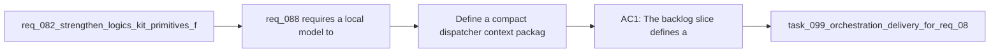

## item_137_define_a_compact_dispatcher_context_package_and_strict_local_decision_contract - Define a compact dispatcher context package and strict local decision contract
> From version: 1.12.1
> Schema version: 1.0
> Status: Done
> Understanding: 99%
> Confidence: 97%
> Progress: 100%
> Complexity: Medium
> Theme: Local dispatcher contracts and bounded context
> Reminder: Update status/understanding/confidence/progress and linked task references when you edit this doc.

# Problem
- `req_088` requires a local model to reason over workflow state without scanning or mutating the repository directly.
- The dispatcher cannot be implemented safely until the baseline input package and the decision payload contract are explicit, bounded, and easy to validate.
- Without a compact context contract and a strict schema, the local model will either receive too much raw state or return ambiguous decisions that the deterministic runner cannot trust.

# Scope
- In:
  - Define the baseline structured state package that the dispatcher consumes, centered on `context-pack` with optional enrichment from `export-graph`, `export-registry`, or audit payloads.
  - Define the canonical machine-readable response schema for the local model, including `action`, `target_ref`, `proposed_args`, `rationale`, and `confidence` or equivalent bounded fields.
  - Define validation rules for unknown keys, missing required fields, malformed values, and ambiguous target references.
  - Document examples and operator-facing defaults for the V1 contract, including `suggestion-only` as the default execution posture.
- Out:
  - Executing any Logics flow command.
  - Wiring a live Ollama adapter or other runtime-specific transport.
  - Allowing free-form file-write proposals outside the validated contract.

# Acceptance criteria
- AC1: The backlog slice defines a baseline dispatcher input package built from existing machine-readable Logics outputs, with `context-pack` as the default and optional enrichment paths documented explicitly.
- AC2: The local decision contract is defined as a strict machine-readable schema with bounded fields, explicit required keys, and rejection rules for unknown or malformed payload content.
- AC3: The contract documents how ambiguous or missing `target_ref` values are handled, including a fail-closed default instead of implicit target guessing.
- AC4: The V1 defaults are explicit, including `suggestion-only` as the starting execution mode and a canonical example payload that downstream tooling can validate against.

# AC Traceability
- req088-AC1 -> Scope: define the baseline structured state package for the dispatcher. Proof: the item documents `context-pack` as the default input and bounds when graph, registry, or audit artifacts may enrich that compact state.
- req088-AC2 -> Scope: define the canonical local decision schema. Proof: the item specifies the required machine-readable fields, bounded types, and rejection rules for malformed or unknown payload content.
- req088-AC4 -> Scope: document safe defaults and ambiguity handling for V1. Proof: the item records `suggestion-only` as the baseline posture and defines fail-closed handling for missing or ambiguous target references.
- AC1 -> Scope: define the baseline structured state package for the dispatcher. Proof: the item documents `context-pack` as the default input and bounds when additional graph, registry, or audit artifacts may be added.
- AC2 -> Scope: define the canonical local decision schema. Proof: the item specifies the required fields, bounded types, and rejection rules for unknown or malformed keys.
- AC3 -> Scope: define validation and ambiguity handling rules. Proof: the item states that ambiguous or missing target references fail closed rather than being normalized implicitly.
- AC4 -> Scope: document safe defaults and operator framing for V1. Proof: the item records `suggestion-only` as the baseline posture and includes a canonical payload example.

# Decision framing
- Product framing: Not needed
- Product signals: (none detected)
- Product follow-up: No product brief follow-up is expected based on current signals.
- Architecture framing: Consider
- Architecture signals: schema contract and workflow state packaging
- Architecture follow-up: Consider an architecture decision if the context package or decision schema will become a long-lived integration contract for several runners.

# Links
- Product brief(s): (none yet)
- Architecture decision(s): (none yet)
- Request: `req_088_add_a_local_llm_dispatcher_for_deterministic_logics_flow_orchestration`
- Primary task(s): `task_099_orchestration_delivery_for_req_088_local_llm_dispatcher_for_deterministic_logics_flow_orchestration`

# AI Context
- Summary: Define the compact dispatcher input package and the strict local decision schema that a deterministic Logics runner can validate safely.
- Keywords: logics, dispatcher, context-pack, schema, json, target_ref, suggestion-only
- Use when: Use when defining the contract between local models and deterministic Logics workflow execution.
- Skip when: Skip when the work is about runtime transport, model hosting, or direct flow execution implementation.

# References
- `logics/request/req_088_add_a_local_llm_dispatcher_for_deterministic_logics_flow_orchestration.md`
- `logics/skills/logics-flow-manager/scripts/logics_flow.py`
- `logics/skills/logics-flow-manager/scripts/logics_flow_dispatcher.py`
- `logics/skills/logics-flow-manager/scripts/logics_flow_registry.py`
- `logics/skills/logics-flow-manager/scripts/logics_flow_support.py`
- `logics/skills/tests/test_logics_flow.py`
- `logics/request/req_082_strengthen_logics_kit_primitives_for_compact_ai_context_and_reusable_handoff_generation.md`
- `logics/request/req_083_add_internal_logics_kit_governance_migration_and_machine_readable_tooling_primitives.md`

# Priority
- Impact: High. The dispatcher remains unsafe and underspecified until the contract is explicit.
- Urgency: Medium. This is the first gating slice for any implementation, but it does not by itself deliver runtime execution.

# Notes
- Derived from request `req_088_add_a_local_llm_dispatcher_for_deterministic_logics_flow_orchestration`.
- Source file: `logics/request/req_088_add_a_local_llm_dispatcher_for_deterministic_logics_flow_orchestration.md`.
- Request context seeded into this backlog item from `logics/request/req_088_add_a_local_llm_dispatcher_for_deterministic_logics_flow_orchestration.md`.
- Task `task_099_orchestration_delivery_for_req_088_local_llm_dispatcher_for_deterministic_logics_flow_orchestration` was finished via `logics_flow.py finish task` on 2026-03-24.
