## item_138_build_a_deterministic_dispatcher_runner_with_whitelisted_logics_action_mapping - Build a deterministic dispatcher runner with whitelisted Logics action mapping
> From version: 1.12.1
> Schema version: 1.0
> Status: Done
> Understanding: 99%
> Confidence: 97%
> Progress: 100%
> Complexity: High
> Theme: Deterministic workflow execution safeguards
> Reminder: Update status/understanding/confidence/progress and linked task references when you edit this doc.

# Problem
- `req_088` is explicitly guardrail-first: the model may propose a decision, but only the deterministic flow manager may execute workflow mutations.
- Even with a strict schema, the dispatcher remains unsafe until a runner validates the payload, resolves allowed arguments, and maps the decision onto a controlled subset of `logics_flow.py` operations.
- The repository currently lacks a dedicated execution layer that can reject invalid payloads, constrain action coverage, and preserve a suggestion-first operating mode for risky or ambiguous transitions.

# Scope
- In:
  - Implement a deterministic runner that consumes validated dispatcher payloads and maps them onto a whitelist of allowed Logics commands.
  - Start with a bounded V1 whitelist, such as `new`, `promote`, `split`, `finish`, and a constrained non-destructive `sync` surface.
  - Define explicit behavior for invalid payloads, unknown actions, ambiguous targets, unsupported arguments, and command failures.
  - Preserve operator safety through `suggestion-only` as the default mode, with any reviewed execution path requiring explicit opt-in.
- Out:
  - Designing the baseline context package or canonical payload schema itself.
  - Binding to a specific local-model transport such as Ollama HTTP calls.
  - Granting the model arbitrary file-write access or direct markdown mutation authority.

```mermaid
%% logics-kind: backlog
%% logics-signature: backlog|build-a-deterministic-dispatcher-runner-|req-084-improve-logics-kit-diagnostics-s|req-088-is-explicitly-guardrail-first-th|ac1-a-deterministic-runner-can-map
flowchart LR
    Request[req_088] --> Problem[The dispatcher needs a deterministic execution gate]
    Problem --> Scope[Validate payloads and map only allowed actions]
    Scope --> AC1[AC1: Allowed actions map onto bounded Logics flows]
    AC1 --> AC2[AC2: Invalid or ambiguous payloads fail closed]
    AC2 --> AC3[AC3: Suggestion-only remains the default mode]
    AC3 --> Task[Execution task]
```

# Acceptance criteria
- AC1: A deterministic runner can map validated dispatcher decisions onto an explicit whitelist of allowed Logics flows without granting the model arbitrary mutation authority.
- AC2: The runner rejects invalid payloads, unknown actions, unsupported argument combinations, and ambiguous target references with explicit structured failures.
- AC3: The runner defaults to `suggestion-only` mode and requires explicit operator opt-in for any reviewed execution path that performs a workflow mutation.
- AC4: The runner returns structured execution results that record the validated action, mapped command, and success or failure outcome so downstream auditing stays deterministic.

# AC Traceability
- req088-AC2 -> Scope: consume validated dispatcher payloads and preserve strict execution boundaries. Proof: the runner accepts only validated actions and argument shapes instead of free-form mutation requests.
- req088-AC3 -> Scope: implement a bounded action whitelist and mapping layer. Proof: the runner supports only the allowed Logics command subset and rejects any action outside the whitelist.
- req088-AC4 -> Scope: preserve operator safety defaults and structured execution behavior. Proof: `suggestion-only` remains the default mode while invalid, ambiguous, or failed executions produce explicit structured results.
- AC1 -> Scope: implement a bounded action whitelist and mapping layer. Proof: the runner supports only the allowed command subset and rejects any action outside the whitelist.
- AC2 -> Scope: define explicit invalid-payload and ambiguity handling. Proof: malformed, unsupported, or ambiguous decisions produce structured failures instead of fallback mutations.
- AC3 -> Scope: preserve operator safety defaults. Proof: `suggestion-only` remains the default mode and reviewed execution requires explicit opt-in.
- AC4 -> Scope: make execution output machine-readable. Proof: the runner emits structured results describing the validated decision, mapped command, and execution result.

# Decision framing
- Product framing: Not needed
- Product signals: (none detected)
- Product follow-up: No product brief follow-up is expected based on current signals.
- Architecture framing: Consider
- Architecture signals: command whitelist boundaries and execution safety model
- Architecture follow-up: Consider an architecture decision if the whitelist, execution modes, or failure semantics become shared contracts for several dispatcher backends.

# Links
- Product brief(s): (none yet)
- Architecture decision(s): (none yet)
- Request: `req_088_add_a_local_llm_dispatcher_for_deterministic_logics_flow_orchestration`
- Primary task(s): `task_099_orchestration_delivery_for_req_088_local_llm_dispatcher_for_deterministic_logics_flow_orchestration`

# AI Context
- Summary: Build the deterministic runner that validates local dispatcher decisions and maps only whitelisted actions onto Logics flow commands.
- Keywords: logics, dispatcher, runner, whitelist, validate, suggestion-only, sync
- Use when: Use when implementing the controlled execution gate between local model output and Logics workflow mutations.
- Skip when: Skip when the work is about contract definition, runtime adapters, or hosted orchestration.

# References
- `logics/request/req_088_add_a_local_llm_dispatcher_for_deterministic_logics_flow_orchestration.md`
- `logics/backlog/item_137_define_a_compact_dispatcher_context_package_and_strict_local_decision_contract.md`
- `logics/skills/logics-flow-manager/scripts/logics_flow.py`
- `logics/skills/logics-flow-manager/scripts/logics_flow_dispatcher.py`
- `logics/skills/logics-flow-manager/scripts/logics_flow_support.py`
- `logics/skills/tests/test_logics_flow.py`
- `logics/request/req_084_improve_logics_kit_diagnostics_safety_and_internal_runtime_contracts.md`

# Priority
- Impact: High. This is the safety-critical slice that keeps the dispatcher deterministic instead of agentic.
- Urgency: Medium. It depends on the contract work, but it is required before any real local dispatch loop can be trusted.

# Notes
- Derived from request `req_088_add_a_local_llm_dispatcher_for_deterministic_logics_flow_orchestration`.
- Source file: `logics/request/req_088_add_a_local_llm_dispatcher_for_deterministic_logics_flow_orchestration.md`.
- Request context seeded into this backlog item from `logics/request/req_088_add_a_local_llm_dispatcher_for_deterministic_logics_flow_orchestration.md`.
- Task `task_099_orchestration_delivery_for_req_088_local_llm_dispatcher_for_deterministic_logics_flow_orchestration` was finished via `logics_flow.py finish task` on 2026-03-24.
