## item_139_add_an_ollama_first_local_dispatcher_adapter_audit_trail_and_operator_entrypoints - Add an Ollama-first local dispatcher adapter, audit trail, and operator entrypoints
> From version: 1.12.1
> Schema version: 1.0
> Status: Ready
> Understanding: 97%
> Confidence: 95%
> Progress: 0%
> Complexity: Medium
> Theme: Local runtime integration and operator auditability
> Reminder: Update status/understanding/confidence/progress and linked task references when you edit this doc.

# Problem
- `req_088` is meant to be local-model friendly, with Ollama or another local HTTP runtime as the baseline orchestration path.
- After the contract and deterministic runner exist, the repository still needs a practical way to call a local model, request the strict decision payload, and preserve an audit trail for operator review.
- Without an Ollama-first adapter and operator-facing entrypoints, the dispatcher stays a design-only layer instead of a usable local workflow primitive.

# Scope
- In:
  - Add a local runtime adapter that can call Ollama through an HTTP API and request strict machine-readable dispatcher decisions.
  - Keep the adapter boundary small enough that another local runtime could be added later without rewriting the runner contract.
  - Add operator-facing entrypoints, docs, or helper surfaces for the local dispatch loop with `suggestion-only` as the baseline.
  - Add a structured audit trail, such as JSONL or equivalent, that records dispatcher input summaries, raw model output, validated action, executed command, and result.
- Out:
  - Hosted orchestration services or cloud-only dependencies.
  - General-purpose coding-agent delegation outside Logics workflow orchestration.
  - Expanding the execution whitelist beyond what the deterministic runner already allows.

```mermaid
%% logics-kind: backlog
%% logics-signature: backlog|add-an-ollama-first-local-dispatcher-ada|req-088-add-a-local-llm-dispatcher-for-d|req-088-is-meant-to-be-local-model|ac1-the-backlog-slice-introduces-an
flowchart LR
    Request[req_088] --> Problem[The local dispatcher needs a practical runtime and audit path]
    Problem --> Scope[Add Ollama-first adapter audit trail and entrypoints]
    Scope --> AC1[AC1: Ollama-first adapter requests strict decisions]
    AC1 --> AC2[AC2: Audit trail captures decisions and outcomes]
    AC2 --> AC3[AC3: Operator entrypoints preserve safe defaults]
    AC3 --> Task[Execution task]
```

# Acceptance criteria
- AC1: The backlog slice introduces an Ollama-first local runtime adapter that can submit compact dispatcher context and request the strict decision schema over HTTP.
- AC2: The adapter boundary is documented or implemented so a future local runtime can be swapped in without changing the deterministic runner contract.
- AC3: The delivery includes an operator-facing entrypoint or documented invocation path that keeps `suggestion-only` as the default posture for local dispatch.
- AC4: The dispatcher flow records a structured audit trail that captures the decision input summary, raw model output, validated decision, mapped command, and final result.

# AC Traceability
- req088-AC4 -> Scope: add operator-facing entrypoints and structured auditability around local dispatch. Proof: the item records `suggestion-only` as the baseline posture and requires a structured audit artifact for each dispatch attempt.
- req088-AC5 -> Scope: add an Ollama-first local runtime adapter with a replaceable boundary. Proof: the item makes the baseline orchestration path local-model friendly through Ollama HTTP while keeping the adapter boundary small enough for future local runtimes.
- AC1 -> Scope: add an Ollama-first adapter for local dispatch. Proof: the local runtime can receive compact context and return the strict dispatcher payload over HTTP.
- AC2 -> Scope: preserve a runtime boundary that is not hard-wired into the runner. Proof: the runner contract stays transport-agnostic while the adapter owns Ollama-specific behavior.
- AC3 -> Scope: add an operator-facing invocation path. Proof: the delivery includes a baseline local entrypoint or docs that keep `suggestion-only` as the default mode.
- AC4 -> Scope: add structured auditability. Proof: a local audit artifact records the input summary, model output, validated action, command, and result for each dispatch attempt.

# Decision framing
- Product framing: Not needed
- Product signals: (none detected)
- Product follow-up: No product brief follow-up is expected based on current signals.
- Architecture framing: Consider
- Architecture signals: runtime adapter boundary and audit persistence
- Architecture follow-up: Consider an architecture decision if the adapter interface or audit format will be reused by multiple local runtimes or repositories.

# Links
- Product brief(s): (none yet)
- Architecture decision(s): (none yet)
- Request: `req_088_add_a_local_llm_dispatcher_for_deterministic_logics_flow_orchestration`
- Primary task(s): `task_099_orchestration_delivery_for_req_088_local_llm_dispatcher_for_deterministic_logics_flow_orchestration`

# AI Context
- Summary: Add the Ollama-first runtime adapter, operator entrypoints, and structured audit trail that make the local dispatcher usable in practice.
- Keywords: ollama, dispatcher, adapter, audit, jsonl, local runtime, operator
- Use when: Use when turning the local dispatcher contract and runner into a usable local workflow path.
- Skip when: Skip when the work is about hosted runtimes, direct file mutation, or non-Logics orchestration.

# References
- `logics/request/req_088_add_a_local_llm_dispatcher_for_deterministic_logics_flow_orchestration.md`
- `logics/backlog/item_137_define_a_compact_dispatcher_context_package_and_strict_local_decision_contract.md`
- `logics/backlog/item_138_build_a_deterministic_dispatcher_runner_with_whitelisted_logics_action_mapping.md`
- `logics/skills/logics-flow-manager/scripts/logics_flow.py`
- `logics/skills/logics-ollama-specialist/SKILL.md`
- `logics/skills/logics-ollama-specialist/references/ollama-integration.md`

# Priority
- Impact: Medium. This slice turns the dispatcher into a practical local operator workflow instead of a paper design.
- Urgency: Medium. It should follow the contract and runner slices, but it is required for the baseline local-model story promised by the request.

# Notes
- Derived from request `req_088_add_a_local_llm_dispatcher_for_deterministic_logics_flow_orchestration`.
- Source file: `logics/request/req_088_add_a_local_llm_dispatcher_for_deterministic_logics_flow_orchestration.md`.
- Request context seeded into this backlog item from `logics/request/req_088_add_a_local_llm_dispatcher_for_deterministic_logics_flow_orchestration.md`.
