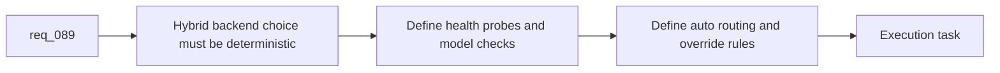

## item_140_define_deterministic_hybrid_backend_detection_health_probes_and_auto_routing_for_logics_assist_flows - Define deterministic hybrid backend detection health probes and auto routing for Logics assist flows
> From version: 1.12.1
> Schema version: 1.0
> Status: Done
> Understanding: 99%
> Confidence: 97%
> Progress: 100%
> Complexity: Medium
> Theme: Hybrid backend detection and routing
> Reminder: Update status/understanding/confidence/progress and linked task references when you edit this doc.

# Problem
- `req_089` needs one predictable way to decide whether a supported assist flow should use `ollama`, `codex`, or `auto`.
- Backend selection cannot stay implicit or flow-specific because operator trust depends on knowing that `auto` means the same thing everywhere.
- The runtime also needs a compact health surface for Ollama reachability, expected model availability, and backend readiness so later assist flows and plugin diagnostics can reuse one source of truth.

# Scope
- In:
  - define deterministic backend-selection rules for `ollama`, `codex`, and `auto`
  - define health probes for Ollama reachability and expected model readiness
  - expose structured routing results reusable by assist flows, diagnostics, and audit logs
  - define the config or override points that let operators force a backend intentionally
- Out:
  - implementing individual assist flows
  - plugin-specific rendering of backend health
  - duplicating Ollama installation guidance already owned by the specialist skill

# Acceptance criteria
- AC1: Backend selection rules for `ollama`, `codex`, and `auto` are explicit, deterministic, and reusable across supported assist flows.
- AC2: The routing layer defines structured health probes for Ollama reachability and expected model readiness instead of relying on ad hoc shell checks per flow.
- AC3: The selected backend and the reason it was selected are emitted in a structured form that downstream audit, plugin, and CLI surfaces can reuse.

# AC Traceability
- req089-AC1 -> Scope: define deterministic backend routing. Proof: the item requires explicit `ollama` / `codex` / `auto` selection rules plus model-health checks.
- req089-AC3 -> Scope: define structured backend choice and failure reasons. Proof: the item requires reusable structured routing results rather than silent fallback.
- req089-AC6 -> Scope: expose routing results to runtime surfaces. Proof: the item requires the same backend signal to be reusable by assist flows, diagnostics, and audit logs.

# Decision framing
- Product framing: Not needed
- Product signals: (none detected)
- Product follow-up: No product brief follow-up is expected based on current signals.
- Architecture framing: Consider
- Architecture signals: runtime contract and backend-selection policy
- Architecture follow-up: Consider an architecture decision if the backend selector becomes a long-lived contract consumed by plugin and agent adapters.

# Links
- Product brief(s): (none yet)
- Architecture decision(s): `adr_011_keep_hybrid_assist_runtime_contracts_shared_backend_agnostic_and_safely_bounded`
- Request: `req_089_add_a_hybrid_ollama_or_codex_local_orchestration_backend_for_repetitive_logics_delivery_tasks`
- Primary task(s): `task_100_orchestration_delivery_for_req_089_to_req_095_hybrid_assist_runtime_portfolio_governance_portability_and_plugin_exposure`

# AI Context
- Summary: Define one deterministic backend router for hybrid assist flows, including Ollama health probes, model readiness checks, and reusable `auto` routing semantics.
- Keywords: hybrid backend, ollama, codex, auto, health probe, model readiness, routing
- Use when: Use when implementing or reviewing the shared backend selector for Logics hybrid assist flows.
- Skip when: Skip when the work is only about one feature-specific assist flow or about Ollama installation itself.

# References
- `logics/request/req_089_add_a_hybrid_ollama_or_codex_local_orchestration_backend_for_repetitive_logics_delivery_tasks.md`
- `logics/skills/logics.py`
- `logics/skills/logics-flow-manager/scripts/logics_flow.py`
- `logics/skills/logics-flow-manager/scripts/logics_flow_dispatcher.py`
- `logics/skills/logics-ollama-specialist/SKILL.md`
- `logics/skills/logics-ollama-specialist/scripts/ollama_check.sh`

# Priority
- Impact: High. Every hybrid assist flow depends on the backend selector being coherent.
- Urgency: High. This is a gating slice for the rest of the hybrid runtime.

# Notes
- This item should centralize backend detection rather than letting each assist flow probe Ollama independently.
