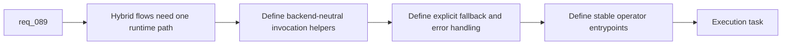

## item_141_add_backend_neutral_hybrid_runtime_invocation_fallback_handling_and_operator_entrypoints - Add backend-neutral hybrid runtime invocation fallback handling and operator entrypoints
> From version: 1.12.1
> Schema version: 1.0
> Status: Ready
> Understanding: 99%
> Confidence: 95%
> Progress: 0%
> Complexity: High
> Theme: Hybrid runtime invocation and safe operator entrypoints
> Reminder: Update status/understanding/confidence/progress and linked task references when you edit this doc.

# Problem
- Backend detection alone does not deliver operator value unless assist flows can invoke one shared runtime path and receive one consistent fallback behavior.
- The runtime needs backend-neutral entrypoints so future assist flows do not bake Ollama or Codex semantics into their own command surfaces.
- Fallback behavior must be explicit and auditable rather than hidden inside flow-specific shell glue.

# Scope
- In:
  - define shared runtime invocation helpers that can call Ollama or Codex-backed assist implementations through one contract
  - define structured fallback handling for invalid payloads, backend errors, and forced backend overrides
  - define stable operator entrypoint patterns for future hybrid assist commands
  - preserve `proposal-only` defaults unless a deterministic runner already exists
- Out:
  - implementing every first-wave or second-wave assist flow
  - plugin-only shortcuts that bypass the shared runtime path
  - allowing direct unsafe repository mutation from a backend-specific adapter

# Acceptance criteria
- AC1: The hybrid runtime exposes backend-neutral invocation surfaces so supported assist commands can reuse one execution path regardless of backend.
- AC2: Fallback behavior for backend errors, invalid payloads, and forced backend overrides is explicit and structured instead of being hidden in flow-specific glue.
- AC3: Operator entrypoints follow stable naming and safety rules that future assist flows can extend without redefining the hybrid runtime contract.

# AC Traceability
- req089-AC2 -> Scope: define backend-neutral invocation helpers. Proof: the item requires one shared runtime path instead of backend-specific command surfaces.
- req089-AC3 -> Scope: define explicit fallback handling. Proof: the item requires structured fallback rules for invalid payloads and backend failures.
- req089-AC4 -> Scope: preserve safe operator entrypoints. Proof: the item requires `proposal-only` defaults unless a deterministic execution path already exists.

# Decision framing
- Product framing: Not needed
- Product signals: (none detected)
- Product follow-up: No product brief follow-up is expected based on current signals.
- Architecture framing: Consider
- Architecture signals: runtime invocation boundary and fallback contract
- Architecture follow-up: Consider an architecture decision if the shared invocation surface becomes the stable base for multiple agent adapters.

# Links
- Product brief(s): (none yet)
- Architecture decision(s): `adr_011_keep_hybrid_assist_runtime_contracts_shared_backend_agnostic_and_safely_bounded`
- Request: `req_089_add_a_hybrid_ollama_or_codex_local_orchestration_backend_for_repetitive_logics_delivery_tasks`
- Primary task(s): `task_100_orchestration_delivery_for_req_089_to_req_095_hybrid_assist_runtime_portfolio_governance_portability_and_plugin_exposure`

# AI Context
- Summary: Define the backend-neutral invocation layer, explicit fallback behavior, and stable operator entrypoints that future hybrid assist flows will reuse.
- Keywords: hybrid runtime, entrypoint, fallback, operator command, proposal-only, invocation
- Use when: Use when wiring the shared runtime path that first-wave and second-wave hybrid assist flows will call.
- Skip when: Skip when the work belongs only to a single feature-specific assist flow.

# References
- `logics/request/req_089_add_a_hybrid_ollama_or_codex_local_orchestration_backend_for_repetitive_logics_delivery_tasks.md`
- `logics/request/req_093_add_shared_hybrid_assist_contracts_fallback_policy_activation_rules_and_audit_governance_for_logics_delivery_automation.md`
- `logics/skills/logics.py`
- `logics/skills/logics-flow-manager/scripts/logics_flow.py`
- `logics/skills/logics-flow-manager/scripts/logics_flow_dispatcher.py`

# Priority
- Impact: High. A shared invocation layer prevents each assist flow from inventing its own backend semantics.
- Urgency: High. This should land before a large assist-flow portfolio is added.

# Notes
- This slice should keep the runtime central and leave UI-specific wrappers to later plugin work.
