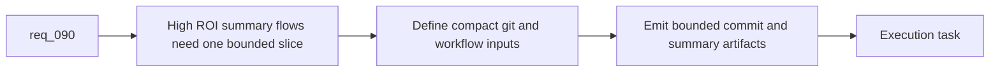

## item_142_add_hybrid_commit_message_pr_summary_and_changelog_summary_assist_flows - Add hybrid commit-message, PR-summary, and changelog-summary assist flows
> From version: 1.12.1
> Schema version: 1.0
> Status: Ready
> Understanding: 99%
> Confidence: 95%
> Progress: 0%
> Complexity: Medium
> Theme: First-wave hybrid summary flows
> Reminder: Update status/understanding/confidence/progress and linked task references when you edit this doc.

# Problem
- `req_090` prioritizes short structured summary tasks because they are high-frequency and high-ROI candidates for local-model delegation.
- Commit messages, PR summaries, and changelog summaries are repetitive enough to benefit from a bounded hybrid flow, but they still need stable contracts and safe execution boundaries.
- Without one dedicated slice, summary behavior will drift between ad hoc prompts and manual operator habits.

# Scope
- In:
  - add bounded hybrid flows for commit-message generation, PR-summary generation, and changelog-summary drafting
  - define compact input contracts built from git diff stats, changed files, and linked workflow refs
  - keep actual git commit execution under Codex or deterministic-runner control
  - document operator-facing command surfaces and expected output forms
- Out:
  - auto-committing by model output alone
  - open-ended release-note generation beyond the bounded summary contract
  - plugin-specific rendering of these summaries

# Acceptance criteria
- AC1: Bounded hybrid summary flows exist for commit messages, PR summaries, and changelog summaries with compact structured inputs and strict bounded outputs.
- AC2: Actual git or repository mutation remains outside the model output path, with execution still controlled by Codex or a deterministic runner.
- AC3: Operator-facing commands and result formats are documented clearly enough to be reused from CLI, plugin, and agent-trigger surfaces.

# AC Traceability
- req090-AC1 -> Scope: add first-wave summary flows. Proof: the item covers commit-message, PR-summary, and changelog-summary generation.
- req090-AC2 -> Scope: define compact input and bounded output contracts. Proof: the item requires structured git and workflow inputs plus strict summary outputs.
- req090-AC3 -> Scope: keep execution separate from generation. Proof: the item explicitly keeps actual git execution out of the model output path.

# Decision framing
- Product framing: Not needed
- Product signals: (none detected)
- Product follow-up: No product brief follow-up is expected based on current signals.
- Architecture framing: Not needed
- Architecture signals: (none detected)
- Architecture follow-up: No architecture decision follow-up is expected based on current signals.

# Links
- Product brief(s): `prod_001_hybrid_assist_operator_experience_for_repetitive_logics_delivery_flows`
- Architecture decision(s): `adr_011_keep_hybrid_assist_runtime_contracts_shared_backend_agnostic_and_safely_bounded`
- Request: `req_090_add_high_roi_hybrid_ollama_or_codex_assist_flows_for_repetitive_logics_delivery_operations`
- Primary task(s): `task_100_orchestration_delivery_for_req_089_to_req_095_hybrid_assist_runtime_portfolio_governance_portability_and_plugin_exposure`

# AI Context
- Summary: Add bounded hybrid flows for commit messages, PR summaries, and changelog summaries without letting the model own git execution.
- Keywords: commit message, pr summary, changelog, hybrid assist, bounded output
- Use when: Use when delivering the first summary-heavy assist flows from the req_090 portfolio.
- Skip when: Skip when the work is about plugin rendering or direct commit execution.

# References
- `logics/request/req_090_add_high_roi_hybrid_ollama_or_codex_assist_flows_for_repetitive_logics_delivery_operations.md`
- `logics/request/req_089_add_a_hybrid_ollama_or_codex_local_orchestration_backend_for_repetitive_logics_delivery_tasks.md`
- `logics/skills/logics.py`
- `logics/skills/logics-flow-manager/scripts/logics_flow.py`
- `logics/skills/logics-flow-manager/scripts/logics_flow_dispatcher.py`

# Priority
- Impact: High. These are among the clearest ROI wins for the hybrid runtime.
- Urgency: High. They provide fast operator-visible value once the runtime foundation exists.

# Notes
- Commit-message generation and commit-plan generation stay separate concerns; the latter belongs to the second-wave review portfolio.
