## item_143_add_hybrid_validation_summary_next_step_dispatch_and_workflow_triage_flows - Add hybrid validation-summary, next-step dispatch, and workflow-triage flows
> From version: 1.12.1
> Schema version: 1.0
> Status: Done
> Understanding: 99%
> Confidence: 97%
> Progress: 100%
> Complexity: High
> Theme: First-wave hybrid triage and orchestration flows
> Reminder: Update status/understanding/confidence/progress and linked task references when you edit this doc.

# Problem
- Validation recap, next-step dispatch, and workflow triage are frequent bounded decisions that currently still cost operator attention.
- These flows are central to the value proposition of `req_090`, but they need a separate slice because they touch workflow semantics more directly than simple textual summaries.
- The existing dispatcher work in `req_088` offers a precedent, but this first-wave portfolio needs operator-friendly flows that stay bounded and safe.

# Scope
- In:
  - add hybrid validation-summary generation for test, lint, audit, and doctor outputs
  - add hybrid next-step suggestion and workflow triage flows on top of bounded workflow state
  - reuse strict machine-readable contracts and deterministic workflow execution boundaries
  - document which outputs are proposal-only and which ones can feed deterministic follow-up actions
- Out:
  - allowing the model to mutate workflow docs directly
  - replacing the dedicated dispatcher safety rules already defined by `req_088`
  - broad project-level planning outside bounded workflow surfaces

```mermaid
%% logics-kind: backlog
%% logics-signature: backlog|add-hybrid-validation-summary-next-step-|req-088-add-a-local-llm-dispatcher-for-d|validation-recap-next-step-dispatch-and-|ac1-hybrid-validation-summary-next-step-
flowchart LR
    Request[req_088_add_a_local_llm_dispatcher_for_det] --> Problem[Validation recap next-step dispatch and wo]
    Problem --> Scope[Add hybrid validation-summary next-step di]
    Scope --> Acceptance[AC1: Hybrid validation-summary next-step s]
    Acceptance --> Tasks[task_100_orchestration_delivery_for_req_08]
```

# Acceptance criteria
- AC1: Hybrid validation-summary, next-step suggestion, and workflow-triage flows are defined with compact structured inputs and strict bounded outputs.
- AC2: These flows reuse deterministic workflow boundaries and do not allow direct workflow mutation from model output alone.
- AC3: The slice makes explicit which results remain purely assistive and which may feed later deterministic follow-up through reviewed execution paths.

# AC Traceability
- req090-AC1 -> Scope: add validation-summary, next-step, and triage flows. Proof: the item covers those three first-wave orchestration surfaces explicitly.
- req090-AC2 -> Scope: reuse strict machine-readable contracts. Proof: the item requires compact structured inputs and bounded outputs for each flow.
- req090-AC3 -> Scope: keep deterministic workflow boundaries intact. Proof: the item explicitly excludes direct workflow mutation from model output alone.

# Decision framing
- Product framing: Not needed
- Product signals: (none detected)
- Product follow-up: No product brief follow-up is expected based on current signals.
- Architecture framing: Consider
- Architecture signals: workflow contract reuse and dispatch boundary
- Architecture follow-up: Consider whether an architecture decision is needed if these flows substantially extend the dispatcher contract from req_088.

# Links
- Product brief(s): `prod_001_hybrid_assist_operator_experience_for_repetitive_logics_delivery_flows`
- Architecture decision(s): `adr_011_keep_hybrid_assist_runtime_contracts_shared_backend_agnostic_and_safely_bounded`
- Request: `req_090_add_high_roi_hybrid_ollama_or_codex_assist_flows_for_repetitive_logics_delivery_operations`
- Primary task(s): `task_100_orchestration_delivery_for_req_089_to_req_095_hybrid_assist_runtime_portfolio_governance_portability_and_plugin_exposure`

# AI Context
- Summary: Add first-wave hybrid flows for validation recap, next-step dispatch, and workflow triage while preserving deterministic workflow boundaries.
- Keywords: validation summary, next step, triage, workflow, hybrid assist, dispatcher
- Use when: Use when delivering the workflow-oriented part of the first-wave hybrid assist portfolio.
- Skip when: Skip when the work is about summary-only artifacts or broad autonomous planning.

# References
- `logics/request/req_088_add_a_local_llm_dispatcher_for_deterministic_logics_flow_orchestration.md`
- `logics/request/req_090_add_high_roi_hybrid_ollama_or_codex_assist_flows_for_repetitive_logics_delivery_operations.md`
- `logics/skills/logics-flow-manager/scripts/logics_flow.py`
- `logics/skills/logics-flow-manager/scripts/logics_flow_dispatcher.py`
- `logics/skills/tests/test_logics_flow.py`

# Priority
- Impact: High. These flows directly reduce repetitive orchestration work.
- Urgency: High. They are part of the minimum first-wave assist portfolio.

# Notes
- This slice should reuse dispatcher lessons from `req_088` instead of reinventing target-resolution or execution semantics.
