## item_145_make_hybrid_assist_commands_and_payloads_reusable_from_codex_and_claude_adapters - Make hybrid assist commands and payloads reusable from Codex and Claude adapters
> From version: 1.12.1
> Schema version: 1.0
> Status: Done
> Understanding: 99%
> Confidence: 97%
> Progress: 100%
> Complexity: Medium
> Theme: Agent-agnostic hybrid runtime surfaces
> Reminder: Update status/understanding/confidence/progress and linked task references when you edit this doc.

# Problem
- `req_091` exists because the hybrid runtime can easily drift into Codex-only assumptions even when the underlying flow-manager commands are reusable.
- Thin Claude adapters and Codex skills need to invoke the same runtime commands and payload contracts rather than maintain parallel semantics.
- If commands, payloads, or examples stay Codex-specific, cross-agent compatibility will become a documentation claim instead of a real contract.

# Scope
- In:
  - make hybrid assist commands and payloads agent-neutral at the shared runtime layer
  - define how Codex skills and Claude bridge files invoke the same runtime surfaces
  - document which metadata remains adapter-specific versus runtime-shared
  - keep `logics/` as the source of truth for flow semantics
- Out:
  - building a large Claude-specific orchestration tree
  - removing Codex-specific overlay affordances where they are still legitimately specialized
  - duplicating prompts or workflow rules across adapters

```mermaid
%% logics-kind: backlog
%% logics-signature: backlog|make-hybrid-assist-commands-and-payloads|req-055-add-a-minimal-claude-code-bridge|req-091-exists-because-the-hybrid-runtim|ac1-hybrid-assist-commands-and-payload
flowchart LR
    Request[req_055_add_a_minimal_claude_code_bridge_f] --> Problem[req_091 exists because the hybrid runtime]
    Problem --> Scope[Make hybrid assist commands and payloads]
    Scope --> Acceptance[AC1: Hybrid assist commands and payload]
    Acceptance --> Tasks[task_100_orchestration_delivery_for_req_08]
```

# Acceptance criteria
- AC1: Hybrid assist commands and payload contracts are reusable from Codex skills and Claude bridge adapters without changing workflow semantics.
- AC2: Adapter-specific files remain thin and derivative, with the shared runtime under `logics/` staying the source of truth.
- AC3: The slice documents which semantics are runtime-shared and which metadata stays legitimately adapter-specific.

# AC Traceability
- req091-AC1 -> Scope: make commands and payloads agent-neutral. Proof: the item requires one shared runtime contract rather than Codex-only semantics.
- req091-AC2 -> Scope: keep adapters thin and derivative. Proof: the item explicitly prevents duplicated prompts or workflow rules.
- req091-AC6 -> Scope: document adapter-specific versus shared concerns. Proof: the item requires clear boundaries between runtime-shared and adapter-specific metadata.

# Decision framing
- Product framing: Not needed
- Product signals: (none detected)
- Product follow-up: No product brief follow-up is expected based on current signals.
- Architecture framing: Consider
- Architecture signals: cross-agent contract and source-of-truth boundary
- Architecture follow-up: Consider an architecture decision if the Codex/Claude adapter model becomes a long-lived repository standard.

# Links
- Product brief(s): (none yet)
- Architecture decision(s): `adr_011_keep_hybrid_assist_runtime_contracts_shared_backend_agnostic_and_safely_bounded`
- Request: `req_091_ensure_hybrid_logics_delivery_automation_stays_compatible_with_claude_environments_and_windows_runtimes`
- Primary task(s): `task_100_orchestration_delivery_for_req_089_to_req_095_hybrid_assist_runtime_portfolio_governance_portability_and_plugin_exposure`

# AI Context
- Summary: Keep hybrid assist commands and payloads reusable from Codex and Claude adapters while preserving `logics/` as the source of truth.
- Keywords: codex, claude, adapter, shared runtime, payload, command, source of truth
- Use when: Use when making hybrid assist activation truly agent-agnostic at the runtime layer.
- Skip when: Skip when the work is about one adapter-only UX surface.

# References
- `logics/request/req_055_add_a_minimal_claude_code_bridge_for_logics_agents.md`
- `logics/request/req_091_ensure_hybrid_logics_delivery_automation_stays_compatible_with_claude_environments_and_windows_runtimes.md`
- `.claude/commands/logics-flow.md`
- `.claude/agents/logics-flow-manager.md`
- `logics/skills/logics.py`
- `logics/skills/logics-flow-manager/SKILL.md`

# Priority
- Impact: High. Cross-agent compatibility collapses if shared runtime surfaces remain Codex-specific.
- Urgency: High. This should shape the assist runtime before many flows are added.

# Notes
- The goal is parity of runtime semantics, not identical metadata file formats between Codex and Claude adapters.
