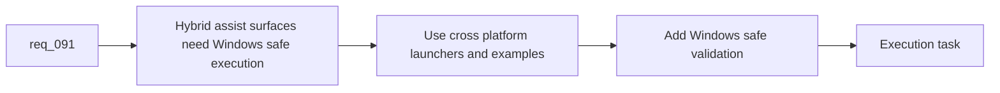

## item_146_harden_hybrid_assist_runtime_examples_launchers_and_validation_for_windows_safe_execution - Harden hybrid assist runtime examples, launchers, and validation for Windows-safe execution
> From version: 1.12.1
> Schema version: 1.0
> Status: Ready
> Understanding: 99%
> Confidence: 95%
> Progress: 0%
> Complexity: Medium
> Theme: Windows-safe hybrid runtime portability
> Reminder: Update status/understanding/confidence/progress and linked task references when you edit this doc.

# Problem
- Hybrid assist flows will fail the portability contract of `req_091` if their commands, examples, or tests silently assume POSIX-only launchers, quoting, or temp paths.
- The repo already has Windows-hardening work in adjacent areas, but the new hybrid runtime introduces a fresh command surface that needs the same discipline.
- If Windows-safe execution is not encoded early, the hybrid runtime will ship as “works from the author’s shell” rather than “supported cross-platform.”

# Scope
- In:
  - harden hybrid assist command examples around cross-platform Python launchers and Windows-safe quoting
  - keep path and temp-file conventions compatible with Windows-safe operator and CI execution
  - add validation or smoke coverage that exercises the supported hybrid runtime surface on a Windows-safe path
  - label intentionally POSIX-only or macOS-only helper assets explicitly
- Out:
  - rewriting all historical docs unrelated to hybrid assist
  - forcing every OS-specific helper to become cross-platform
  - broad plugin runtime hardening beyond the hybrid assist surface

# Acceptance criteria
- AC1: Hybrid assist command examples and launchers are documented in a Windows-safe way, using cross-platform Python invocation and avoiding avoidable POSIX-only syntax.
- AC2: The supported hybrid runtime surface accounts for Windows-safe path, temp-path, and quoting behavior rather than relying on POSIX defaults.
- AC3: Validation covers at least one meaningful Windows-safe execution path for the hybrid assist runtime, with intentionally OS-specific helpers labeled clearly.

# AC Traceability
- req091-AC3 -> Scope: harden launchers and examples. Proof: the item requires cross-platform Python invocation and avoids avoidable POSIX-only syntax.
- req091-AC5 -> Scope: add Windows-safe validation. Proof: the item requires a meaningful Windows-safe execution path for the hybrid runtime.
- req091-AC7 -> Scope: encode real support constraints. Proof: the item requires labeled OS-specific helpers rather than implicit platform assumptions.

# Decision framing
- Product framing: Not needed
- Product signals: (none detected)
- Product follow-up: No product brief follow-up is expected based on current signals.
- Architecture framing: Not needed
- Architecture signals: (none detected)
- Architecture follow-up: No architecture decision follow-up is expected based on current signals.

# Links
- Product brief(s): (none yet)
- Architecture decision(s): `adr_011_keep_hybrid_assist_runtime_contracts_shared_backend_agnostic_and_safely_bounded`
- Request: `req_091_ensure_hybrid_logics_delivery_automation_stays_compatible_with_claude_environments_and_windows_runtimes`
- Primary task(s): `task_100_orchestration_delivery_for_req_089_to_req_095_hybrid_assist_runtime_portfolio_governance_portability_and_plugin_exposure`

# AI Context
- Summary: Keep the hybrid assist runtime honestly Windows-safe through cross-platform launchers, bounded examples, and explicit validation.
- Keywords: windows, cross-platform, launcher, quoting, path, validation, hybrid assist
- Use when: Use when hardening hybrid assist commands and tests for Windows-safe support.
- Skip when: Skip when the work is about adapter semantics only or about unrelated Windows hardening outside the hybrid runtime.

# References
- `logics/request/req_062_harden_windows_compatibility_across_the_vs_code_plugin_and_logics_kit.md`
- `logics/request/req_063_clarify_windows_operator_guidance_and_platform_specific_helper_boundaries_in_the_logics_docs.md`
- `logics/request/req_091_ensure_hybrid_logics_delivery_automation_stays_compatible_with_claude_environments_and_windows_runtimes.md`
- `logics/skills/README.md`
- `logics/skills/logics.py`
- `logics/skills/logics-flow-manager/SKILL.md`

# Priority
- Impact: High. Windows-safe support claims are not credible if the new runtime surface is POSIX-only.
- Urgency: Medium. This should land alongside the first usable hybrid runtime surfaces.

# Notes
- Prefer explicit Windows-safe variants over pseudo-portable examples when shell syntax differs materially.
