## item_147_add_diff_risk_triage_and_commit_plan_suggestion_flows - Add diff-risk triage and commit-plan suggestion flows
> From version: 1.12.1
> Schema version: 1.0
> Status: Done
> Understanding: 99%
> Confidence: 97%
> Progress: 100%
> Complexity: Medium
> Theme: Second-wave hybrid review signals
> Reminder: Update status/understanding/confidence/progress and linked task references when you edit this doc.

# Problem
- `req_092` identifies diff-risk triage and commit-plan suggestion as the next bounded review-oriented hybrid flows after the first-wave summary and triage work.
- These flows are useful precisely because they stay recommendation-oriented, but they still need structured outputs and clear non-mutative boundaries.
- If they are handled ad hoc, commit planning and risk labeling will become inconsistent and difficult to trust.

# Scope
- In:
  - add hybrid diff-risk triage with bounded labels and short rationale
  - add hybrid commit-plan suggestions covering one commit, multi-commit, or submodule-plus-parent strategies
  - keep outputs assistive and non-mutative by default
  - ground inputs in changed files, diff stats, and workflow refs rather than full repository scans
- Out:
  - executing git commits automatically from the suggested plan
  - broad code-review generation beyond bounded risk labels and plan hints
  - plugin-only visualization of the results

```mermaid
%% logics-kind: backlog
%% logics-signature: backlog|add-diff-risk-triage-and-commit-plan-sug|req-090-add-high-roi-hybrid-ollama-or-co|req-092-identifies-diff-risk-triage-and-|ac1-bounded-diff-risk-triage-exists-with
flowchart LR
    Request[req_090_add_high_roi_hybrid_ollama_or_code] --> Problem[req_092 identifies diff-risk triage and co]
    Problem --> Scope[Add diff-risk triage and commit-plan sugge]
    Scope --> Acceptance[AC1: Bounded diff-risk triage exists with]
    Acceptance --> Tasks[task_100_orchestration_delivery_for_req_08]
```

# Acceptance criteria
- AC1: Bounded diff-risk triage exists with a controlled label set and short rationale suitable for audit and operator review.
- AC2: Commit-plan suggestion exists as a structured recommendation that can distinguish common delivery cases such as one commit, multiple commits, or submodule-plus-parent sequencing.
- AC3: Both flows stay non-mutative and rely on compact changed-surface context rather than open-ended repository reasoning.

# AC Traceability
- req092-AC1 -> Scope: add diff-risk triage and commit-plan suggestion flows. Proof: the item explicitly covers those two second-wave review surfaces.
- req092-AC2 -> Scope: use compact structured inputs and bounded outputs. Proof: the item requires changed files, diff stats, and workflow refs rather than unbounded repository scans.
- req092-AC4 -> Scope: keep the outputs assistive. Proof: the item explicitly excludes direct git execution from the suggested plan.

# Decision framing
- Product framing: Not needed
- Product signals: (none detected)
- Product follow-up: No product brief follow-up is expected based on current signals.
- Architecture framing: Not needed
- Architecture signals: (none detected)
- Architecture follow-up: No architecture decision follow-up is expected based on current signals.

# Links
- Product brief(s): `prod_001_hybrid_assist_operator_experience_for_repetitive_logics_delivery_flows`
- Architecture decision(s): `adr_011_keep_hybrid_assist_runtime_contracts_shared_backend_agnostic_and_safely_bounded`
- Request: `req_092_add_a_second_wave_of_hybrid_ollama_or_codex_assist_flows_for_risk_triage_commit_planning_closure_summaries_doc_consistency_checks_and_validation_checklists`
- Primary task(s): `task_100_orchestration_delivery_for_req_089_to_req_095_hybrid_assist_runtime_portfolio_governance_portability_and_plugin_exposure`

# AI Context
- Summary: Add second-wave hybrid review signals for diff-risk triage and commit-plan suggestion without allowing direct git mutation.
- Keywords: diff risk, commit plan, hybrid assist, review, non-mutative
- Use when: Use when implementing the first review-oriented slice from the req_092 portfolio.
- Skip when: Skip when the work is about direct commit execution or broad code review.

# References
- `logics/request/req_092_add_a_second_wave_of_hybrid_ollama_or_codex_assist_flows_for_risk_triage_commit_planning_closure_summaries_doc_consistency_checks_and_validation_checklists.md`
- `logics/request/req_090_add_high_roi_hybrid_ollama_or_codex_assist_flows_for_repetitive_logics_delivery_operations.md`
- `logics/skills/logics.py`
- `logics/skills/logics-flow-manager/scripts/logics_flow.py`
- `logics/skills/logics-flow-manager/scripts/logics_flow_dispatcher.py`

# Priority
- Impact: Medium. These flows improve operator review quality and delivery packaging.
- Urgency: Medium. They follow the first-wave assist portfolio but should reuse the same shared runtime.

# Notes
- Commit-plan suggestion should remain distinct from commit-message generation so each output stays bounded and reviewable.
