## item_148_add_closure_summary_and_validation_checklist_generation_flows - Add closure-summary and validation-checklist generation flows
> From version: 1.12.1
> Schema version: 1.0
> Status: Done
> Understanding: 99%
> Confidence: 97%
> Progress: 100%
> Complexity: Medium
> Theme: Second-wave hybrid delivery hygiene
> Reminder: Update status/understanding/confidence/progress and linked task references when you edit this doc.

# Problem
- Operators repeatedly need short closure summaries and tailored validation checklists once a task or request nears completion.
- These are good second-wave hybrid candidates because they use compact context and produce bounded operational outputs.
- Without a dedicated slice, closure and validation outputs will stay generic or drift into one-off prompting habits.

# Scope
- In:
  - add closure-summary generation for `task`, `item`, and `req` delivery surfaces
  - add validation-checklist generation based on changed file categories and runtime surfaces
  - bind outputs to linked refs, validation artifacts, and changed-surface context
  - keep the flows assistive rather than auto-closing docs or auto-running checks
- Out:
  - directly finishing workflow docs based only on generated summaries
  - replacing real lint, test, audit, or doctor execution
  - open-ended retrospective writing beyond bounded closure and checklist outputs

```mermaid
%% logics-kind: backlog
%% logics-signature: backlog|add-closure-summary-and-validation-check|req-092-add-a-second-wave-of-hybrid-olla|operators-repeatedly-need-short-closure-|ac1-closure-summary-generation-exists-fo
flowchart LR
    Request[req_092_add_a_second_wave_of_hybrid_ollama] --> Problem[Operators repeatedly need short closure su]
    Problem --> Scope[Add closure-summary and validation-checkli]
    Scope --> Acceptance[AC1: Closure-summary generation exists for]
    Acceptance --> Tasks[task_100_orchestration_delivery_for_req_08]
```

# Acceptance criteria
- AC1: Closure-summary generation exists for `task`, `item`, and `req` surfaces with bounded output grounded in linked refs, changed files, and validation artifacts.
- AC2: Validation-checklist generation exists with checklist items derived from changed-surface categories rather than generic boilerplate.
- AC3: The flows remain assistive and do not auto-close docs or replace actual validation commands.

# AC Traceability
- req092-AC1 -> Scope: add closure summaries and validation checklists. Proof: the item explicitly covers those two second-wave assist flows.
- req092-AC2 -> Scope: ground outputs in compact structured inputs. Proof: the item requires linked refs, validation artifacts, and changed-surface categories.
- req092-AC4 -> Scope: keep the flows assistive. Proof: the item excludes automatic doc closure and replacement of real validation execution.

# Decision framing
- Product framing: Not needed
- Product signals: (none detected)
- Product follow-up: No product brief follow-up is expected based on current signals.
- Architecture framing: Not needed
- Architecture signals: (none detected)
- Architecture follow-up: No architecture decision follow-up is expected based on current signals.

# Links
- Product brief(s): `prod_001_hybrid_assist_operator_experience_for_repetitive_logics_delivery_flows`
- Architecture decision(s): `adr_011_keep_hybrid_assist_runtime_contracts_shared_backend_agnostic_and_safely_bounded`
- Request: `req_092_add_a_second_wave_of_hybrid_ollama_or_codex_assist_flows_for_risk_triage_commit_planning_closure_summaries_doc_consistency_checks_and_validation_checklists`
- Primary task(s): `task_100_orchestration_delivery_for_req_089_to_req_095_hybrid_assist_runtime_portfolio_governance_portability_and_plugin_exposure`

# AI Context
- Summary: Add second-wave closure-summary and validation-checklist generation flows grounded in linked refs and validation artifacts.
- Keywords: closure summary, validation checklist, hybrid assist, task, request, delivery hygiene
- Use when: Use when implementing bounded closure and validation assistance in the req_092 portfolio.
- Skip when: Skip when the work is about real validation execution or automatic closure of workflow docs.

# References
- `logics/request/req_092_add_a_second_wave_of_hybrid_ollama_or_codex_assist_flows_for_risk_triage_commit_planning_closure_summaries_doc_consistency_checks_and_validation_checklists.md`
- `logics/skills/logics.py`
- `logics/skills/logics-flow-manager/scripts/logics_flow.py`
- `logics/skills/logics-flow-manager/scripts/workflow_audit.py`
- `logics/skills/README.md`

# Priority
- Impact: Medium. These flows reduce repetitive delivery hygiene work once implementation is mostly done.
- Urgency: Medium. They become more useful once first-wave hybrid commands already exist.

# Notes
- Validation checklist generation should point operators toward real commands, not pretend to replace them.
