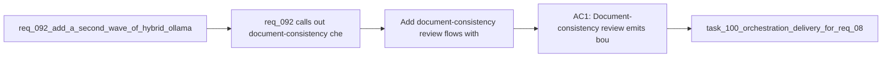

## item_149_add_document_consistency_review_flows_with_verified_non_mutative_follow_up - Add document-consistency review flows with verified non-mutative follow-up
> From version: 1.12.1
> Schema version: 1.0
> Status: Done
> Understanding: 98%
> Confidence: 97%
> Progress: 100%
> Complexity: High
> Theme: Second-wave hybrid document review
> Reminder: Update status/understanding/confidence/progress and linked task references when you edit this doc.

# Problem
- `req_092` calls out document-consistency checks as a useful assist flow, but these findings are only valuable if they stay bounded, reviewable, and easy to verify.
- Documentation anomalies are a high-noise area if the model is allowed to speculate too loosely.
- A dedicated slice is needed so anomaly detection stays non-mutative and verified rather than turning into free-form doc rewriting.

# Scope
- In:
  - add bounded document-consistency review flows that emit candidate anomalies with short rationale
  - focus on verifiable issues such as status drift, missing links, traceability gaps, or obvious request/backlog/task inconsistencies
  - require deterministic or human verification before any follow-up mutation
  - define how findings are surfaced without pretending they are authoritative by default
- Out:
  - free-form auto-editing of workflow docs from model output
  - speculative content-quality judgments with no clear verification path
  - replacing linter or audit tooling where deterministic checks already exist

# Acceptance criteria
- AC1: Document-consistency review emits bounded candidate anomalies with short rationale rather than free-form editing proposals.
- AC2: The slice focuses on verifiable issues such as status drift, broken traceability, or obvious workflow-link inconsistencies.
- AC3: Any follow-up remains non-mutative until deterministic checks or human review confirm the finding.

# AC Traceability
- req092-AC1 -> Scope: add document-consistency review flows. Proof: the item explicitly covers that second-wave assist surface.
- req092-AC4 -> Scope: require verification before mutation. Proof: the item keeps all findings non-mutative until deterministic or human confirmation.
- req092-AC6 -> Scope: avoid unsafe expansion. Proof: the item excludes free-form doc rewriting and speculative judgments with no clear verification path.

# Decision framing
- Product framing: Not needed
- Product signals: (none detected)
- Product follow-up: No product brief follow-up is expected based on current signals.
- Architecture framing: Consider
- Architecture signals: assistive anomaly detection and deterministic verification boundary
- Architecture follow-up: Consider whether an architecture decision is needed if model-detected anomalies become part of the long-lived workflow-governance surface.

# Links
- Product brief(s): `prod_001_hybrid_assist_operator_experience_for_repetitive_logics_delivery_flows`
- Architecture decision(s): `adr_011_keep_hybrid_assist_runtime_contracts_shared_backend_agnostic_and_safely_bounded`
- Request: `req_092_add_a_second_wave_of_hybrid_ollama_or_codex_assist_flows_for_risk_triage_commit_planning_closure_summaries_doc_consistency_checks_and_validation_checklists`
- Primary task(s): `task_100_orchestration_delivery_for_req_089_to_req_095_hybrid_assist_runtime_portfolio_governance_portability_and_plugin_exposure`

# AI Context
- Summary: Add bounded document-consistency review flows that emit candidate anomalies and require verified non-mutative follow-up.
- Keywords: document consistency, anomaly, workflow drift, non-mutative, verification, hybrid assist
- Use when: Use when implementing the doc-review slice of the req_092 portfolio.
- Skip when: Skip when the work is about free-form doc editing or deterministic lint rules that already exist.

# References
- `logics/request/req_092_add_a_second_wave_of_hybrid_ollama_or_codex_assist_flows_for_risk_triage_commit_planning_closure_summaries_doc_consistency_checks_and_validation_checklists.md`
- `logics/skills/logics-doc-linter/scripts/logics_lint.py`
- `logics/skills/logics-flow-manager/scripts/workflow_audit.py`
- `logics/skills/logics-flow-manager/scripts/logics_flow.py`
- `logics/skills/README.md`

# Priority
- Impact: Medium. Useful for review hygiene, but only if false positives stay bounded and verifiable.
- Urgency: Medium. Best delivered after the shared contract and audit model are in place.

# Notes
- This slice should complement deterministic lint and audit tooling, not compete with it.
