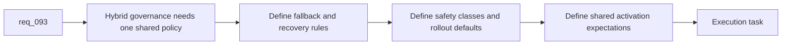

## item_151_codify_shared_fallback_safety_class_activation_and_rollout_rules_for_hybrid_assist_flows - Codify shared fallback, safety-class, activation, and rollout rules for hybrid assist flows
> From version: 1.12.1
> Schema version: 1.0
> Status: Ready
> Understanding: 99%
> Confidence: 95%
> Progress: 0%
> Complexity: High
> Theme: Shared hybrid runtime governance
> Reminder: Update status/understanding/confidence/progress and linked task references when you edit this doc.

# Problem
- `req_093` also needs one place to standardize fallback semantics, execution-safety classes, activation rules, and rollout expectations.
- If those rules differ by flow, operators will not know whether `auto`, `proposal-only`, or `suggestion-only` mean the same thing from one command to another.
- Activation inconsistency would also break plugin, Codex, and Claude discoverability.

# Scope
- In:
  - codify one fallback policy for `ollama`, `codex`, and `auto`
  - codify shared execution-safety classes such as `proposal-only`, `deterministic-runner`, and `codex-only`
  - codify shared activation expectations for CLI, Codex skill triggers, Claude bridge adapters, and Windows-safe runtime usage
  - codify rollout defaults and graduation rules for future flows
- Out:
  - detailed metrics collection, which belongs to the observability slice
  - implementing every activation surface in UI or docs
  - feature-specific exceptions not justified by the shared governance model

# Acceptance criteria
- AC1: One shared fallback policy exists for `ollama`, `codex`, and `auto`, including explicit recovery behavior for backend failure or invalid payloads.
- AC2: Shared execution-safety classes are defined and reused across hybrid assist flows instead of being named ad hoc per command.
- AC3: Shared activation and rollout rules exist for CLI, Codex, Claude, overlay, and Windows-safe invocation surfaces.

# AC Traceability
- req093-AC2 -> Scope: codify one fallback policy. Proof: the item requires a single shared policy for `ollama`, `codex`, and `auto`.
- req093-AC3 -> Scope: codify shared safety classes. Proof: the item requires `proposal-only`, `deterministic-runner`, and `codex-only` class reuse.
- req093-AC4/AC6 -> Scope: codify activation and rollout rules. Proof: the item requires shared activation expectations plus default rollout and graduation rules.

# Decision framing
- Product framing: Not needed
- Product signals: (none detected)
- Product follow-up: No product brief follow-up is expected based on current signals.
- Architecture framing: Consider
- Architecture signals: fallback policy and runtime activation contract
- Architecture follow-up: Consider an architecture decision if the safety-class and activation model becomes a long-lived runtime invariant.

# Links
- Product brief(s): (none yet)
- Architecture decision(s): `adr_011_keep_hybrid_assist_runtime_contracts_shared_backend_agnostic_and_safely_bounded`
- Request: `req_093_add_shared_hybrid_assist_contracts_fallback_policy_activation_rules_and_audit_governance_for_logics_delivery_automation`
- Primary task(s): `task_100_orchestration_delivery_for_req_089_to_req_095_hybrid_assist_runtime_portfolio_governance_portability_and_plugin_exposure`

# AI Context
- Summary: Standardize fallback policy, safety classes, activation rules, and rollout defaults across the hybrid assist platform.
- Keywords: fallback, safety class, proposal-only, activation, rollout, auto, codex, ollama
- Use when: Use when defining the shared behavioral policy that every hybrid assist flow must reuse.
- Skip when: Skip when the work is only about one feature-specific command or about metrics collection.

# References
- `logics/request/req_091_ensure_hybrid_logics_delivery_automation_stays_compatible_with_claude_environments_and_windows_runtimes.md`
- `logics/request/req_093_add_shared_hybrid_assist_contracts_fallback_policy_activation_rules_and_audit_governance_for_logics_delivery_automation.md`
- `logics/skills/logics.py`
- `logics/skills/logics-flow-manager/scripts/logics_flow.py`
- `.claude/commands/logics-flow.md`
- `.claude/agents/logics-flow-manager.md`

# Priority
- Impact: High. Shared fallback and activation semantics are necessary for operator trust and portability.
- Urgency: High. This should be in place before the assist surface expands materially.

# Notes
- The shared policy should make it harder to add unsafe convenience flows casually.
