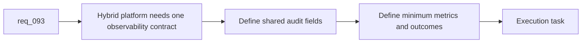

## item_152_add_shared_hybrid_audit_metrics_and_observability_governance - Add shared hybrid audit, metrics, and observability governance
> From version: 1.12.1
> Schema version: 1.0
> Status: Ready
> Understanding: 99%
> Confidence: 95%
> Progress: 0%
> Complexity: Medium
> Theme: Shared hybrid observability
> Reminder: Update status/understanding/confidence/progress and linked task references when you edit this doc.

# Problem
- `req_093` needs one observability contract so the team can compare hybrid flows on backend choice, fallback rate, and execution outcome instead of reading incompatible logs.
- Auditability is also the bridge between runtime behavior and later plugin visibility or ROI review.
- Without one slice dedicated to audit and metrics governance, the hybrid platform will accumulate logs but not useful observability.

# Scope
- In:
  - define shared audit fields and emitted artifacts for hybrid runs
  - define the minimum metrics needed to compare assist flows, such as backend choice, fallback rate, invalid-payload rate, and operator acceptance
  - define how these signals stay compatible with CLI, plugin, and later review loops
  - define enough observability guidance to support degraded-mode debugging
- Out:
  - building full analytics infrastructure
  - plugin-specific dashboards
  - per-flow business logic beyond shared observability fields

# Acceptance criteria
- AC1: Shared audit fields and emitted artifacts exist for hybrid runs, with enough structure to identify backend choice, fallback, validation state, and produced outputs.
- AC2: Shared minimum metrics exist for comparing assist flows, including at least backend choice, fallback rate, invalid-payload rate, and operator acceptance or rejection.
- AC3: The observability contract is reusable by CLI, plugin, and later review-loop work instead of being tied to one consumer surface.

# AC Traceability
- req093-AC5 -> Scope: define shared audit and metrics fields. Proof: the item requires the minimum metrics and emitted artifacts needed to compare hybrid flows.
- req093-AC4 -> Scope: keep observability reusable across surfaces. Proof: the item requires compatibility with CLI, plugin, and later review-loop consumers.
- req093-AC7 -> Scope: keep the slice horizontal. Proof: the item excludes feature-specific business logic beyond the shared observability fields.

# Decision framing
- Product framing: Not needed
- Product signals: (none detected)
- Product follow-up: No product brief follow-up is expected based on current signals.
- Architecture framing: Consider
- Architecture signals: audit contract and cross-surface observability
- Architecture follow-up: Consider an architecture decision if hybrid audit artifacts become a stable inspection surface for plugin and operators.

# Links
- Product brief(s): (none yet)
- Architecture decision(s): `adr_011_keep_hybrid_assist_runtime_contracts_shared_backend_agnostic_and_safely_bounded`
- Request: `req_093_add_shared_hybrid_assist_contracts_fallback_policy_activation_rules_and_audit_governance_for_logics_delivery_automation`
- Primary task(s): `task_100_orchestration_delivery_for_req_089_to_req_095_hybrid_assist_runtime_portfolio_governance_portability_and_plugin_exposure`

# AI Context
- Summary: Define the shared audit and metrics contract that makes hybrid assist behavior comparable, debuggable, and reusable across CLI and plugin surfaces.
- Keywords: audit, metrics, observability, fallback rate, backend choice, hybrid assist
- Use when: Use when standardizing the shared observability layer for hybrid assist flows.
- Skip when: Skip when the work is about one feature-specific metric or a plugin-only dashboard.

# References
- `logics/request/req_093_add_shared_hybrid_assist_contracts_fallback_policy_activation_rules_and_audit_governance_for_logics_delivery_automation.md`
- `logics/request/req_094_add_hybrid_assist_measurement_shared_context_strategy_and_degraded_mode_governance_for_logics_delivery_automation.md`
- `logics/skills/logics-flow-manager/scripts/logics_flow_dispatcher.py`
- `logics/skills/logics-flow-manager/scripts/logics_flow.py`
- `logics/skills/README.md`

# Priority
- Impact: High. Observability is required to judge whether the hybrid platform is helping or merely adding complexity.
- Urgency: Medium. It should land early enough to shape the first real assist runs.

# Notes
- Keep the shared audit model small enough that every flow emits it consistently.
