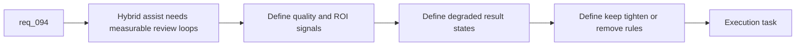

## item_154_add_hybrid_assist_measurement_review_loops_and_degraded_result_policies - Add hybrid assist measurement, review loops, and degraded-result policies
> From version: 1.12.1
> Schema version: 1.0
> Status: Done
> Understanding: 99%
> Confidence: 97%
> Progress: 100%
> Complexity: High
> Theme: Hybrid assist evaluation and degraded behavior
> Reminder: Update status/understanding/confidence/progress and linked task references when you edit this doc.

# Problem
- `req_094` also requires a disciplined way to judge whether hybrid flows should stay enabled, stay `suggestion-only`, be tightened, or be removed.
- Degraded behavior must be explicit: operators need to know whether a result came from a healthy run, a fallback path, a low-context run, or a state that needs human review.
- Without measurement and degraded-result policies, the hybrid platform will accumulate convenience features without clear evidence that they are helping.

# Scope
- In:
  - define measurement signals and review loops for hybrid-flow quality and ROI
  - define degraded-result states for timeout, missing context, invalid payloads, repeated slowness, and low-confidence outputs
  - define operator-visible explanations for degraded outcomes
  - define rules for keeping a flow enabled, keeping it assistive, tightening it, or removing it
- Out:
  - building a full analytics dashboard
  - per-flow business heuristics that do not belong in the shared policy
  - feature-specific payload design already covered by the governance request

# Acceptance criteria
- AC1: Shared measurement signals exist for evaluating hybrid-flow quality and ROI over time rather than relying on intuition alone.
- AC2: Degraded-result states are defined for timeout, invalid payload, missing context, repeated slowness, and low-confidence outcomes.
- AC3: Operators can distinguish healthy, fallback, degraded, and human-review-only outcomes through explicit result-state explanations.
- AC4: Review-loop rules define when a hybrid flow should stay enabled, stay assistive, be tightened, or be removed.

# AC Traceability
- req094-AC1 -> Scope: define measurement signals. Proof: the item requires shared signals for quality and ROI over time.
- req094-AC3/AC4 -> Scope: define degraded states and explanations. Proof: the item requires explicit operator-visible result states.
- req094-AC5 -> Scope: define review-loop rules. Proof: the item requires decisions for keeping, tightening, or removing a flow.

# Decision framing
- Product framing: Consider
- Product signals: activation and retention
- Product follow-up: Review whether a product brief is needed if the hybrid portfolio begins to affect default operator journeys significantly.
- Architecture framing: Consider
- Architecture signals: degraded-state contract and lifecycle governance
- Architecture follow-up: Consider an architecture decision if degraded-result states become a stable cross-surface runtime contract.

# Links
- Product brief(s): (none yet)
- Product brief(s): `prod_001_hybrid_assist_operator_experience_for_repetitive_logics_delivery_flows`
- Architecture decision(s): `adr_011_keep_hybrid_assist_runtime_contracts_shared_backend_agnostic_and_safely_bounded`
- Request: `req_094_add_hybrid_assist_measurement_shared_context_strategy_and_degraded_mode_governance_for_logics_delivery_automation`
- Primary task(s): `task_100_orchestration_delivery_for_req_089_to_req_095_hybrid_assist_runtime_portfolio_governance_portability_and_plugin_exposure`

# AI Context
- Summary: Define shared measurement loops, degraded-result states, and keep-or-tighten review rules for the hybrid assist platform.
- Keywords: measurement, roi, degraded mode, timeout, low confidence, review loop, hybrid assist
- Use when: Use when deciding how hybrid assist flows should be evaluated and how degraded outcomes should be surfaced.
- Skip when: Skip when the work is limited to one feature-specific output shape.

# References
- `logics/request/req_094_add_hybrid_assist_measurement_shared_context_strategy_and_degraded_mode_governance_for_logics_delivery_automation.md`
- `logics/request/req_093_add_shared_hybrid_assist_contracts_fallback_policy_activation_rules_and_audit_governance_for_logics_delivery_automation.md`
- `logics/skills/logics-flow-manager/scripts/logics_flow_dispatcher.py`
- `logics/skills/logics-flow-manager/scripts/logics_flow.py`
- `logics/skills/README.md`

# Priority
- Impact: High. Measurement and degraded-mode policy are what keep the hybrid platform honest over time.
- Urgency: Medium. This should land early, but it can follow the first core runtime contracts by a short distance.

# Notes
- The degraded-state taxonomy should be small enough that operators can actually learn it.
