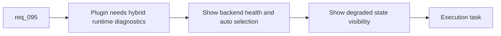

## item_155_extend_plugin_environment_diagnostics_with_hybrid_runtime_health_backend_selection_and_degraded_state_visibility - Extend plugin environment diagnostics with hybrid runtime health, backend selection, and degraded-state visibility
> From version: 1.12.1
> Schema version: 1.0
> Status: Done
> Understanding: 99%
> Confidence: 97%
> Progress: 100%
> Complexity: Medium
> Theme: Plugin hybrid runtime diagnostics
> Reminder: Update status/understanding/confidence/progress and linked task references when you edit this doc.

# Problem
- `req_095` needs the plugin to expose hybrid runtime health, not just repo-local kit state and Codex overlay state.
- Operators need to see whether Ollama is reachable, which backend `auto` resolved to, and whether the current hybrid runtime is degraded before they trust plugin-triggered assist flows.
- Without one focused slice, the plugin will keep showing a partial system picture.

# Scope
- In:
  - extend plugin environment inspection with hybrid runtime health
  - surface backend auto-selection and degraded-state summaries in environment or status views
  - keep the plugin a thin consumer of structured runtime results from shared CLI surfaces
  - align messaging with existing repo-local and overlay diagnostics instead of replacing them
- Out:
  - reimplementing backend routing inside the plugin
  - every future assist action button
  - plugin-only health checks that bypass the shared runtime contract

# Acceptance criteria
- AC1: Plugin environment views expose hybrid runtime health in addition to repo-local and Codex-overlay state.
- AC2: Backend auto-selection and degraded-state summaries are visible from the plugin without requiring raw terminal inspection.
- AC3: The plugin stays a thin consumer of shared runtime status rather than reimplementing backend logic itself.

# AC Traceability
- req095-AC1 -> Scope: extend diagnostics with hybrid runtime health. Proof: the item requires Ollama reachability, backend choice, and degraded-state visibility.
- req095-AC3 -> Scope: show degraded or fallback state clearly. Proof: the item requires visible summaries rather than hidden terminal-only state.
- req095-AC6 -> Scope: keep the plugin thin. Proof: the item explicitly excludes reimplementing backend routing inside the extension.

# Decision framing
- Product framing: Not needed
- Product signals: (none detected)
- Product follow-up: No product brief follow-up is expected based on current signals.
- Architecture framing: Not needed
- Architecture signals: (none detected)
- Architecture follow-up: No architecture decision follow-up is expected based on current signals.

# Links
- Product brief(s): `prod_002_plugin_hybrid_assist_runtime_visibility_and_action_ux`
- Architecture decision(s): `adr_012_keep_the_vs_code_plugin_as_a_thin_client_over_shared_hybrid_runtime_commands`
- Request: `req_095_adapt_the_vs_code_logics_plugin_to_expose_hybrid_assist_runtime_status_actions_audit_and_cross_agent_messaging`
- Primary task(s): `task_100_orchestration_delivery_for_req_089_to_req_095_hybrid_assist_runtime_portfolio_governance_portability_and_plugin_exposure`

# AI Context
- Summary: Extend plugin diagnostics so hybrid runtime health, backend selection, and degraded states are visible alongside existing repo-local and overlay signals.
- Keywords: plugin, diagnostics, backend selection, degraded state, hybrid runtime, ollama
- Use when: Use when adapting the plugin environment and status surfaces for the hybrid assist runtime.
- Skip when: Skip when the work is about feature-specific assist buttons or plugin-only business logic.

# References
- `logics/request/req_095_adapt_the_vs_code_logics_plugin_to_expose_hybrid_assist_runtime_status_actions_audit_and_cross_agent_messaging.md`
- `src/logicsEnvironment.ts`
- `src/logicsViewProvider.ts`
- `README.md`
- `logics/skills/logics.py`

# Priority
- Impact: High. Operators need a clear system picture before they trust plugin-triggered hybrid flows.
- Urgency: Medium. This should arrive before the plugin exposes many new assist actions.

# Notes
- The plugin should render shared runtime state, not invent a second health model.
