## item_156_add_plugin_tool_actions_for_high_value_hybrid_assist_flows_through_shared_runtime_commands - Add plugin tool actions for high-value hybrid assist flows through shared runtime commands
> From version: 1.12.1
> Schema version: 1.0
> Status: Done
> Understanding: 99%
> Confidence: 97%
> Progress: 100%
> Complexity: High
> Theme: Plugin actions over shared hybrid runtime
> Reminder: Update status/understanding/confidence/progress and linked task references when you edit this doc.

# Problem
- The plugin currently exposes bootstrap, overlay, and guided Codex actions, but not the new high-value hybrid assist flows.
- If plugin actions are added without a dedicated slice, the UI risks either becoming noisy or bypassing the shared runtime command surfaces.
- Representative assist actions need to land in the plugin in a disciplined way so the extension remains a client of `logics.py`.

# Scope
- In:
  - add plugin tool or command-palette actions for representative high-value hybrid assist flows
  - invoke canonical shared runtime commands rather than extension-owned business logic
  - select a limited first set of actions such as commit-all, next-step suggestion, validation summary, or workflow triage
  - define how plugin actions surface result-state and backend provenance consistently
- Out:
  - adding a button for every future assist flow immediately
  - bypassing shared runtime commands from the extension
  - final plugin audit/result rendering, which belongs to a separate slice

```mermaid
%% logics-kind: backlog
%% logics-signature: backlog|add-plugin-tool-actions-for-high-value-h|req-095-adapt-the-vs-code-logics-plugin-|the-plugin-currently-exposes-bootstrap-o|ac1-representative-high-value-hybrid-ass
flowchart LR
    Request[req_095_adapt_the_vs_code_logics_plugin_to] --> Problem[The plugin currently exposes bootstrap ove]
    Problem --> Scope[Add plugin tool actions for high-value]
    Scope --> Acceptance[AC1: Representative high-value hybrid assi]
    Acceptance --> Tasks[task_100_orchestration_delivery_for_req_08]
```

# Acceptance criteria
- AC1: Representative high-value hybrid assist actions are available from the plugin through tool or command-palette surfaces.
- AC2: Those actions invoke canonical shared runtime commands instead of extension-owned business logic.
- AC3: The first plugin action set stays intentionally limited and focused on proven high-value flows rather than exposing the full future portfolio at once.

# AC Traceability
- req095-AC2 -> Scope: add representative hybrid actions. Proof: the item requires plugin tool surfaces for high-value assist flows.
- req095-AC6 -> Scope: invoke canonical shared runtime commands. Proof: the item explicitly excludes bypassing the shared runtime from the extension.
- req095-AC7 -> Scope: keep the surface validated and disciplined. Proof: the item limits the first plugin action set to proven high-value flows.

# Decision framing
- Product framing: Consider
- Product signals: activation and usability
- Product follow-up: Review whether a product brief is needed once plugin-triggered hybrid actions become part of the default operator journey.
- Architecture framing: Not needed
- Architecture signals: (none detected)
- Architecture follow-up: No architecture decision follow-up is expected based on current signals.

# Links
- Product brief(s): `prod_002_plugin_hybrid_assist_runtime_visibility_and_action_ux`
- Architecture decision(s): `adr_012_keep_the_vs_code_plugin_as_a_thin_client_over_shared_hybrid_runtime_commands`
- Request: `req_095_adapt_the_vs_code_logics_plugin_to_expose_hybrid_assist_runtime_status_actions_audit_and_cross_agent_messaging`
- Primary task(s): `task_100_orchestration_delivery_for_req_089_to_req_095_hybrid_assist_runtime_portfolio_governance_portability_and_plugin_exposure`

# AI Context
- Summary: Add a limited set of plugin tool actions for high-value hybrid assist flows through shared runtime commands.
- Keywords: plugin, tools menu, command palette, commit-all, next step, validation summary, hybrid assist
- Use when: Use when exposing the first hybrid assist actions from the VS Code extension.
- Skip when: Skip when the work is about plugin diagnostics or plugin-only business logic.

# References
- `logics/request/req_095_adapt_the_vs_code_logics_plugin_to_expose_hybrid_assist_runtime_status_actions_audit_and_cross_agent_messaging.md`
- `src/logicsViewProvider.ts`
- `src/logicsWebviewHtml.ts`
- `src/extension.ts`
- `logics/skills/logics.py`

# Priority
- Impact: High. Plugin actions are the visible operator-facing payoff for the hybrid runtime.
- Urgency: Medium. This should follow the shared runtime and diagnostics groundwork.

# Notes
- The first plugin action set should be small and intentional enough to stay learnable.
