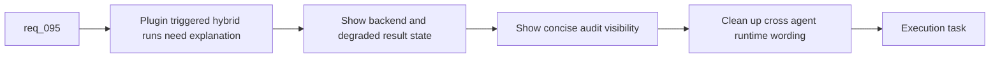

## item_157_add_plugin_audit_visibility_result_panels_and_cross_agent_runtime_messaging_cleanup - Add plugin audit visibility, result panels, and cross-agent runtime messaging cleanup
> From version: 1.12.1
> Schema version: 1.0
> Status: Done
> Understanding: 99%
> Confidence: 97%
> Progress: 100%
> Complexity: High
> Theme: Plugin result visibility and messaging cleanup
> Reminder: Update status/understanding/confidence/progress and linked task references when you edit this doc.

# Problem
- Once the plugin can launch hybrid assist flows, it also needs to explain what happened: which backend ran, whether fallback occurred, whether the result is degraded, and where the audit trail lives.
- The current plugin wording remains heavily Codex-oriented, which will become misleading once hybrid assist surfaces are shared across CLI, Codex, Claude, and plugin paths.
- Without one dedicated slice, audit visibility and wording cleanup will trail behind the behavior and reduce trust.

# Scope
- In:
  - add plugin-visible result or audit summary surfaces for hybrid runs
  - expose backend provenance, fallback status, degraded state, and human-review requirement when relevant
  - clean up plugin and README messaging to distinguish shared hybrid runtime from Codex-specific overlays or launch paths
  - keep result rendering driven by structured runtime outputs
- Out:
  - building a full analytics dashboard inside the plugin
  - changing the shared runtime contract inside the extension
  - removing legitimate Codex-specific UX where it still belongs

# Acceptance criteria
- AC1: Plugin result surfaces show backend provenance, fallback or degraded state, and human-review requirements when hybrid runs complete.
- AC2: Plugin audit visibility is good enough that operators can inspect what action or artifact was proposed or produced without going straight to raw logs.
- AC3: Plugin and README wording distinguish shared hybrid runtime actions from Codex-specific overlays or launch affordances.

# AC Traceability
- req095-AC3 -> Scope: show backend provenance and degraded state. Proof: the item requires visible backend, fallback, and human-review state in plugin results.
- req095-AC4 -> Scope: expose concise audit visibility. Proof: the item requires plugin-facing run summaries instead of terminal-only raw logs.
- req095-AC5 -> Scope: clean up messaging. Proof: the item requires clear separation between shared hybrid runtime and Codex-specific overlay or launch language.

# Decision framing
- Product framing: Consider
- Product signals: usability and trust
- Product follow-up: Review whether a product brief is needed if hybrid runtime messaging becomes a central part of the extension UX.
- Architecture framing: Not needed
- Architecture signals: (none detected)
- Architecture follow-up: No architecture decision follow-up is expected based on current signals.

# Links
- Product brief(s): `prod_002_plugin_hybrid_assist_runtime_visibility_and_action_ux`
- Architecture decision(s): `adr_012_keep_the_vs_code_plugin_as_a_thin_client_over_shared_hybrid_runtime_commands`
- Request: `req_095_adapt_the_vs_code_logics_plugin_to_expose_hybrid_assist_runtime_status_actions_audit_and_cross_agent_messaging`
- Primary task(s): `task_100_orchestration_delivery_for_req_089_to_req_095_hybrid_assist_runtime_portfolio_governance_portability_and_plugin_exposure`

# AI Context
- Summary: Add plugin-visible audit and result summaries for hybrid runs and clean up messaging so shared runtime surfaces are not mislabeled as Codex-only features.
- Keywords: plugin, audit, result panel, backend provenance, fallback, degraded state, messaging
- Use when: Use when finishing the plugin-facing presentation layer for hybrid assist behavior.
- Skip when: Skip when the work is only about launching actions or about raw runtime semantics.

# References
- `logics/request/req_095_adapt_the_vs_code_logics_plugin_to_expose_hybrid_assist_runtime_status_actions_audit_and_cross_agent_messaging.md`
- `src/logicsViewProvider.ts`
- `src/logicsWebviewHtml.ts`
- `src/logicsViewDocumentController.ts`
- `README.md`
- `logics/skills/logics.py`

# Priority
- Impact: High. Trust in plugin-triggered hybrid actions depends on visible result state and clear wording.
- Urgency: Medium. It should follow initial diagnostics and action wiring closely.

# Notes
- Keep result summaries concise enough for the plugin UI while still pointing back to structured audit artifacts when needed.
