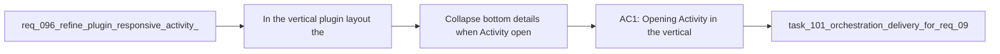

## item_158_collapse_bottom_details_when_activity_opens_in_vertical_plugin_layout - Collapse bottom details when Activity opens in vertical plugin layout
> From version: 1.12.1
> Schema version: 1.0
> Status: Done
> Understanding: 98%
> Confidence: 96%
> Progress: 100%
> Complexity: Medium
> Theme: Plugin responsive layout behavior
> Reminder: Update status/understanding/confidence/progress and linked task references when you edit this doc.

# Problem
- In the vertical plugin layout, the details panel already consumes the lower part of the viewport.
- Opening `Activity` in that mode currently risks stacking another competing panel into the same constrained height budget.
- Without one focused slice, the activity/details interaction will stay visually awkward and harder to reason about than the other responsive layout rules.

# Scope
- In:
  - detect the vertical layout case where details are docked below the main browsing surface
  - collapse the bottom details panel when `Activity` opens in that specific layout
  - keep the behavior explicit, reversible, and bounded to the relevant responsive mode
  - add regression coverage for the new layout-specific behavior
- Out:
  - changing non-vertical layouts unnecessarily
  - redesigning the full responsive layout system
  - unrelated detail-panel content or action-footer changes

# Acceptance criteria
- AC1: Opening `Activity` in the vertical layout where details are docked below the main browsing area automatically collapses the details panel.
- AC2: The collapse behavior is bounded to the relevant layout state and does not change non-conflicting layouts unexpectedly.
- AC3: Webview regression coverage verifies the layout-specific `Activity` behavior.

# AC Traceability
- req096-AC1 -> Scope: collapse the bottom details panel when `Activity` opens in the vertical layout. Proof: the item is dedicated to the one responsive case where both panels compete for the same lower viewport budget.
- req096-AC5 -> Scope: keep the work plugin-scoped. Proof: the item is limited to webview layout and interaction behavior.
- req096-AC6 -> Scope: add regression coverage. Proof: the item explicitly includes tests for the new activity/details interaction.

# Decision framing
- Product framing: Not needed
- Product signals: (none detected)
- Product follow-up: No product brief follow-up is expected based on current signals.
- Architecture framing: Not needed
- Architecture signals: (none detected)
- Architecture follow-up: No architecture decision follow-up is expected based on current signals.

# Links
- Product brief(s): (none yet)
- Architecture decision(s): `adr_005_define_responsive_layout_scroll_and_sizing_rules_for_plugin_views`
- Request: `req_096_refine_plugin_responsive_activity_toolbar_iconography_timestamp_precision_and_agent_neutral_context_pack_wording`
- Primary task(s): `task_101_orchestration_delivery_for_req_096_and_req_097_plugin_polish_and_hybrid_local_model_profile_flexibility`

# AI Context
- Summary: Make the plugin collapse bottom-docked details when Activity opens in vertical layout so the lower viewport is not split between two competing panels.
- Keywords: plugin, activity, details, vertical layout, responsive behavior, webview
- Use when: Use when refining activity/details interaction in the bottom-docked plugin layout.
- Skip when: Skip when the work is about toolbar iconography, timestamp formatting, or kit-side model support.

# References
- `logics/request/req_096_refine_plugin_responsive_activity_toolbar_iconography_timestamp_precision_and_agent_neutral_context_pack_wording.md`
- `src/logicsWebviewHtml.ts`
- `media/main.js`
- `media/mainInteractions.js`
- `media/layoutController.js`
- `tests/webview.harness-details-and-filters.test.ts`

# Priority
- Impact: Medium. This removes a layout conflict that makes the plugin feel less intentional in constrained vertical space.
- Urgency: Medium. It should ship with the other plugin polish slices so the responsive UX stays coherent.

# Notes
- Keep the interaction explicit enough that users can re-open details immediately after opening Activity if they want both in sequence.
