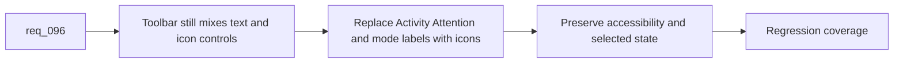

## item_159_replace_textual_activity_attention_and_view_mode_labels_with_accessible_toolbar_icons - Replace textual Activity, Attention, and view-mode labels with accessible toolbar icons
> From version: 1.12.1
> Schema version: 1.0
> Status: Ready
> Understanding: 98%
> Confidence: 95%
> Progress: 0%
> Complexity: Medium
> Theme: Plugin toolbar density and control clarity
> Reminder: Update status/understanding/confidence/progress and linked task references when you edit this doc.

# Problem
- The plugin toolbar still mixes icon buttons with text-heavy controls for `Activity`, `Attention`, and the view-mode toggle.
- That inconsistency makes the header denser than necessary and leaves the control row visually less coherent than the rest of the webview chrome.
- Without a dedicated slice, iconification risks being handled partially or without strong accessibility coverage.

# Scope
- In:
  - replace the visible text labels for `Activity`, `Attention`, and the `List` / `Board` view-mode toggle with icon-led controls
  - preserve accessible labels, keyboard discoverability, and clear tooltips
  - keep active-state feedback explicit so users can still tell which filters or view mode are engaged
  - add targeted webview regression coverage for the new controls
- Out:
  - redesigning the entire toolbar
  - removing accessible text equivalents from ARIA labels or tooltips
  - changing unrelated filter-row controls

# Acceptance criteria
- AC1: The plugin toolbar uses icon-led controls instead of visible text labels for `Activity`, `Attention`, and the view-mode toggle.
- AC2: Accessible labels, tooltips, and selected-state feedback remain explicit after the visual label change.
- AC3: Webview regression coverage verifies the icon-led toolbar controls and their discoverability contract.

# AC Traceability
- req096-AC2 -> Scope: replace visible labels with icon-led controls. Proof: the item is dedicated to `Activity`, `Attention`, and `List` / `Board` iconography.
- req096-AC5 -> Scope: keep the change plugin-scoped. Proof: the item only adjusts toolbar rendering and interaction affordances.
- req096-AC6 -> Scope: add regression coverage. Proof: the item requires tests for the new icon controls and their state feedback.

# Decision framing
- Product framing: Not needed
- Product signals: (none detected)
- Product follow-up: No product brief follow-up is expected based on current signals.
- Architecture framing: Not needed
- Architecture signals: (none detected)
- Architecture follow-up: No architecture decision follow-up is expected based on current signals.

# Links
- Product brief(s): (none yet)
- Architecture decision(s): `adr_005_define_responsive_layout_scroll_and_sizing_rules_for_plugin_views`
- Request: `req_096_refine_plugin_responsive_activity_toolbar_iconography_timestamp_precision_and_agent_neutral_context_pack_wording`
- Primary task(s): `task_101_orchestration_delivery_for_req_096_and_req_097_plugin_polish_and_hybrid_local_model_profile_flexibility`

# AI Context
- Summary: Replace text-heavy toolbar labels with accessible icons for Activity, Attention, and view mode to make the plugin header denser and more coherent.
- Keywords: plugin, toolbar, icons, activity, attention, board, list, accessibility
- Use when: Use when refining the primary toolbar controls in the plugin webview.
- Skip when: Skip when the work is about layout collapse rules, timestamp formatting, or kit-side runtime behavior.

# References
- `logics/request/req_096_refine_plugin_responsive_activity_toolbar_iconography_timestamp_precision_and_agent_neutral_context_pack_wording.md`
- `src/logicsWebviewHtml.ts`
- `media/main.js`
- `media/mainInteractions.js`
- `tests/webview.harness-core.test.ts`
- `tests/webview.harness-details-and-filters.test.ts`

# Priority
- Impact: Medium. This improves toolbar coherence and reduces header noise without changing the underlying behavior.
- Urgency: Medium. It should ship together with the rest of the plugin polish rather than as an isolated cosmetic change.

# Notes
- Preserve enough tooltip and ARIA detail that first-time users do not lose discoverability.
