## item_160_make_recent_plugin_updated_timestamps_more_precise_under_twenty_four_hours - Make recent plugin Updated timestamps more precise under twenty four hours
> From version: 1.12.1
> Schema version: 1.0
> Status: Done
> Understanding: 98%
> Confidence: 96%
> Progress: 100%
> Complexity: Low
> Theme: Plugin recency readability
> Reminder: Update status/understanding/confidence/progress and linked task references when you edit this doc.

# Problem
- The plugin currently shows `Updated` values too coarsely for recently changed workflow docs.
- During active delivery sessions, operators care whether something changed minutes ago, a few hours ago, or yesterday, and the current formatting is not precise enough under that threshold.
- Without a dedicated slice, timestamp polish risks being folded into unrelated UI work and losing explicit regression protection.

# Scope
- In:
  - refine relative `Updated` formatting for docs changed less than 24 hours ago
  - keep the recent-format rule easy to understand and visually stable
  - limit the work to presentation-layer formatting rather than stored timestamp semantics
  - add targeted regression coverage for recent timestamp output
- Out:
  - changing underlying file timestamp collection
  - introducing highly noisy or constantly updating live timers
  - redesigning older-date formatting without need

```mermaid
%% logics-kind: backlog
%% logics-signature: backlog|make-recent-plugin-updated-timestamps-mo|req-096-refine-plugin-responsive-activit|the-plugin-currently-shows-updated-value|ac1-updated-values-are-more-precise
flowchart LR
    Request[req_096_refine_plugin_responsive_activity_] --> Problem[The plugin currently shows Updated values]
    Problem --> Scope[Make recent plugin Updated timestamps more]
    Scope --> Acceptance[AC1: Updated values are more precise]
    Acceptance --> Tasks[task_101_orchestration_delivery_for_req_09]
```

# Acceptance criteria
- AC1: `Updated` values are more precise for workflow docs changed less than 24 hours ago.
- AC2: The more precise formatting remains bounded and understandable rather than turning into a noisy live timer.
- AC3: Regression coverage verifies the recent timestamp formatting behavior.

# AC Traceability
- req096-AC3 -> Scope: add finer-grained formatting under 24 hours. Proof: the item is dedicated to the recent `Updated` precision rule.
- req096-AC5 -> Scope: keep the work presentation-only. Proof: the item explicitly excludes underlying timestamp storage changes.
- req096-AC6 -> Scope: add regression coverage. Proof: the item requires tests for the formatting contract.

# Decision framing
- Product framing: Not needed
- Product signals: (none detected)
- Product follow-up: No product brief follow-up is expected based on current signals.
- Architecture framing: Not needed
- Architecture signals: (none detected)
- Architecture follow-up: No architecture decision follow-up is expected based on current signals.

# Links
- Product brief(s): (none yet)
- Architecture decision(s): (none yet)
- Request: `req_096_refine_plugin_responsive_activity_toolbar_iconography_timestamp_precision_and_agent_neutral_context_pack_wording`
- Primary task(s): `task_101_orchestration_delivery_for_req_096_and_req_097_plugin_polish_and_hybrid_local_model_profile_flexibility`

# AI Context
- Summary: Improve the precision of recent Updated values in the plugin when workflow docs changed within the last twenty four hours.
- Keywords: plugin, updated, timestamp, relative time, recency, formatting
- Use when: Use when polishing how recent document updates are presented in the plugin UI.
- Skip when: Skip when the work is about toolbar controls, context-pack wording, or runtime model selection.

# References
- `logics/request/req_096_refine_plugin_responsive_activity_toolbar_iconography_timestamp_precision_and_agent_neutral_context_pack_wording.md`
- `media/renderBoard.js`
- `media/renderDetails.js`
- `tests/webview.harness-core.test.ts`

# Priority
- Impact: Medium. Better recency precision makes active work easier to scan and trust.
- Urgency: Low. It is worth shipping with the broader plugin polish but is less urgent than layout or accessibility issues.

# Notes
- Favor one predictable recent-time format over several overly clever variants.
