## item_161_generalize_plugin_context_pack_wording_beyond_codex_while_preserving_codex_specific_actions - Generalize plugin context pack wording beyond Codex while preserving Codex specific actions
> From version: 1.12.1
> Schema version: 1.0
> Status: Done
> Understanding: 98%
> Confidence: 96%
> Progress: 100%
> Complexity: Medium
> Theme: Agent-neutral plugin handoff wording
> Reminder: Update status/understanding/confidence/progress and linked task references when you edit this doc.

# Problem
- The plugin still says `Context pack for Codex` in a surface that increasingly behaves like a shared AI handoff/context package rather than a Codex-exclusive concept.
- That wording is now misleading because the surrounding product direction already distinguishes shared hybrid-assist/runtime concepts from truly Codex-specific overlays or injection actions.
- Without a dedicated slice, wording changes may happen partially and leave users unsure what is generic versus Codex-only.

# Scope
- In:
  - rename or reframe the shared context-pack surface with agent-neutral wording
  - preserve clear labeling for actions that are still explicitly Codex-specific
  - update plugin copy and README wording so the naming stays coherent across UI and docs
  - add regression coverage where wording is intentionally part of the UI contract
- Out:
  - changing the shared runtime context-pack payload itself
  - removing Codex-specific overlay or injection affordances that still belong in the product
  - broad copy rewrites unrelated to the shared AI handoff surface

```mermaid
%% logics-kind: backlog
%% logics-signature: backlog|generalize-plugin-context-pack-wording-b|req-095-adapt-the-vs-code-logics-plugin-|the-plugin-still-says-context-pack|ac1-the-shared-context-pack-surface-uses
flowchart LR
    Request[req_095_adapt_the_vs_code_logics_plugin_to] --> Problem[The plugin still says Context pack]
    Problem --> Scope[Generalize plugin context pack wording bey]
    Scope --> Acceptance[AC1: The shared context-pack surface uses]
    Acceptance --> Tasks[task_101_orchestration_delivery_for_req_09]
```

# Acceptance criteria
- AC1: The shared context-pack surface uses agent-neutral wording rather than `Context pack for Codex`.
- AC2: Actions or affordances that remain truly Codex-specific are still labeled as such after the wording change.
- AC3: Plugin UI and README wording stay aligned, with regression coverage where the wording is part of the intended UX contract.

# AC Traceability
- req096-AC4 -> Scope: generalize `Context pack for Codex` wording. Proof: the item directly targets the shared handoff/context surface naming.
- req096-AC5 -> Scope: keep the work plugin-scoped. Proof: the item explicitly excludes changing the runtime payload contract.
- req096-AC6 -> Scope: cover the wording shift in docs/tests. Proof: the item requires aligned plugin and README wording plus regression coverage where relevant.

# Decision framing
- Product framing: Consider
- Product signals: usability and messaging clarity
- Product follow-up: Review whether a small product brief is needed if the shared AI handoff surface becomes more central than the current Codex-first naming suggests.
- Architecture framing: Not needed
- Architecture signals: (none detected)
- Architecture follow-up: No architecture decision follow-up is expected based on current signals.

# Links
- Product brief(s): (none yet)
- Architecture decision(s): `adr_012_keep_the_vs_code_plugin_as_a_thin_client_over_shared_hybrid_runtime_commands`
- Request: `req_096_refine_plugin_responsive_activity_toolbar_iconography_timestamp_precision_and_agent_neutral_context_pack_wording`
- Primary task(s): `task_101_orchestration_delivery_for_req_096_and_req_097_plugin_polish_and_hybrid_local_model_profile_flexibility`

# AI Context
- Summary: Rename the plugin shared context-pack surface so it is agent-neutral while preserving explicit labeling for Codex-only actions.
- Keywords: plugin, context pack, codex, ai handoff, wording, copy, README
- Use when: Use when separating shared AI handoff wording from truly Codex-specific affordances in the plugin.
- Skip when: Skip when the work is about model-family support, layout interaction, or timestamp formatting.

# References
- `logics/request/req_096_refine_plugin_responsive_activity_toolbar_iconography_timestamp_precision_and_agent_neutral_context_pack_wording.md`
- `logics/request/req_095_adapt_the_vs_code_logics_plugin_to_expose_hybrid_assist_runtime_status_actions_audit_and_cross_agent_messaging.md`
- `README.md`
- `media/renderDetails.js`
- `src/logicsViewDocumentController.ts`

# Priority
- Impact: Medium. Cleaner wording reduces confusion about what belongs to shared AI handoff logic versus Codex-only affordances.
- Urgency: Medium. It should land with the rest of the plugin polish so the vocabulary stays coherent.

# Notes
- The goal is clearer framing, not erasing Codex-specific features that remain genuinely specialized.
