## item_162_add_configurable_deepseek_and_qwen_local_model_profiles_to_the_hybrid_runtime - Add configurable DeepSeek and Qwen local model profiles to the hybrid runtime
> From version: 1.12.1
> Schema version: 1.0
> Status: Done
> Understanding: 97%
> Confidence: 96%
> Progress: 100%
> Complexity: Medium
> Theme: Hybrid runtime local model flexibility
> Reminder: Update status/understanding/confidence/progress and linked task references when you edit this doc.

# Problem
- The hybrid runtime currently assumes a DeepSeek-first local path, which is too narrow if operators want to use a Qwen-family coding profile instead.
- Without a focused slice, model-family flexibility will remain implicit or require code edits instead of repo-supported configuration.
- Health probes and runtime status also risk staying misleading if they continue assuming a DeepSeek-only default after broader support is introduced.

# Scope
- In:
  - add configurable local-model profiles for at least one DeepSeek family and one Qwen family
  - support selecting the active profile through runtime-supported configuration
  - align backend health/status behavior with the configured expected profile
  - keep the support policy curated and bounded rather than open-ended
- Out:
  - plugin-only UX work
  - supporting every Ollama model family immediately
  - turning the runtime into a generic uncurated model registry

```mermaid
%% logics-kind: backlog
%% logics-signature: backlog|add-configurable-deepseek-and-qwen-local|req-097-expand-hybrid-local-model-suppor|the-hybrid-runtime-currently-assumes-a|ac1-the-hybrid-runtime-supports-at
flowchart LR
    Request[req_097_expand_hybrid_local_model_support_] --> Problem[The hybrid runtime currently assumes a]
    Problem --> Scope[Add configurable DeepSeek and Qwen local]
    Scope --> Acceptance[AC1: The hybrid runtime supports at]
    Acceptance --> Tasks[task_101_orchestration_delivery_for_req_09]
```

# Acceptance criteria
- AC1: The hybrid runtime supports at least one curated DeepSeek profile and one curated Qwen profile for local-model usage.
- AC2: The active local-model profile can be selected through supported configuration rather than by editing runtime source code.
- AC3: Runtime status and health reporting reflect the configured expected profile instead of assuming DeepSeek-only availability.

# AC Traceability
- req097-AC1 -> Scope: add DeepSeek and Qwen profiles. Proof: the item explicitly requires at least one supported profile for each family.
- req097-AC2 -> Scope: choose the profile through configuration. Proof: the item makes code edits unnecessary for switching local-model families.
- req097-AC3 -> Scope: align runtime status and health checks. Proof: the item requires health/status behavior to follow the selected profile.

# Decision framing
- Product framing: Not needed
- Product signals: (none detected)
- Product follow-up: No product brief follow-up is expected based on current signals.
- Architecture framing: Consider
- Architecture signals: runtime contracts and configuration policy
- Architecture follow-up: Revisit the runtime configuration policy if model-family support expands again beyond the bounded DeepSeek/Qwen set.

# Links
- Product brief(s): (none yet)
- Architecture decision(s): `adr_011_keep_hybrid_assist_runtime_contracts_shared_backend_agnostic_and_safely_bounded`
- Request: `req_097_expand_hybrid_local_model_support_beyond_deepseek_with_configurable_qwen_and_deepseek_profiles`
- Primary task(s): `task_101_orchestration_delivery_for_req_096_and_req_097_plugin_polish_and_hybrid_local_model_profile_flexibility`

# AI Context
- Summary: Add bounded configurable DeepSeek and Qwen local-model profiles to the hybrid runtime so operators can switch supported local families without patching runtime code.
- Keywords: hybrid runtime, ollama, deepseek, qwen, model profile, config, health checks
- Use when: Use when extending the kit-side local-model selection behavior of the hybrid assist runtime.
- Skip when: Skip when the work is only about plugin wording or responsive UI.

# References
- `logics/request/req_097_expand_hybrid_local_model_support_beyond_deepseek_with_configurable_qwen_and_deepseek_profiles.md`
- `logics/skills/logics-flow-manager/scripts/logics_flow_hybrid.py`
- `logics/skills/logics-flow-manager/scripts/logics_flow_config.py`
- `logics/skills/logics.py`

# Priority
- Impact: High. This turns local-model family choice into a supported runtime capability instead of a hidden DeepSeek assumption.
- Urgency: Medium. It should land before more hybrid flows assume the default profile is the only one that matters.

# Notes
- Keep the support set curated enough that operators know which families are actually supported.
