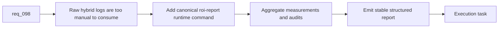

## item_164_add_a_canonical_hybrid_assist_roi_report_runtime_surface_over_existing_measurement_and_audit_logs - Add a canonical hybrid assist ROI report runtime surface over existing measurement and audit logs
> From version: 1.13.0
> Schema version: 1.0
> Status: Ready
> Understanding: 97%
> Confidence: 95%
> Progress: 0%
> Complexity: High
> Theme: Runtime aggregation for hybrid assist ROI reporting
> Reminder: Update status/understanding/confidence/progress and linked task references when you edit this doc.

# Problem
- The kit already collects hybrid assist audit and measurement records automatically, but operators still need ad hoc shell or `jq` inspection to understand usage, fallback behavior, or degraded-mode trends.
- `req_098` needs one canonical runtime surface that turns those raw logs into a stable structured report consumable by CLI automation and the plugin.
- Without a shared runtime aggregator, every consumer will derive its own metrics and drift from the source data.

# Scope
- In:
  - add a canonical `flow assist roi-report` style runtime surface
  - aggregate existing hybrid measurement and audit logs into stable report sections
  - include operational metrics such as run counts, backend requested versus used, fallback frequency, degraded frequency, review-required frequency, and recent-result distributions
  - keep the aggregation logic owned by the kit runtime
- Out:
  - plugin-specific rendering logic
  - unrelated telemetry pipelines
  - ROI estimate semantics beyond what is needed to structure the report sections cleanly

# Acceptance criteria
- AC1: A shared runtime report command exists for hybrid assist ROI and dispatch reporting.
- AC2: The report aggregates stable operational metrics over existing hybrid measurement and audit records.
- AC3: The report shape is machine-readable and suitable for plugin consumption without UI-side metric re-derivation.

# AC Traceability
- req098-AC1 -> Scope: add canonical runtime surface. Proof: the item introduces the shared `roi-report` command rather than leaving manual log parsing in place.
- req098-AC2 -> Scope: aggregate operational metrics. Proof: the item explicitly requires backend split, fallback, degraded, review, and recent-result summaries.
- req098-AC6/AC7 -> Scope: keep aggregation in the kit runtime over existing logs. Proof: the item keeps report semantics in shared runtime code and reuses current automatic log collection.

# Decision framing
- Product framing: Consider
- Product signals: adoption and clarity
- Product follow-up: Review whether the resulting report should be exposed in lightweight CLI summaries beyond JSON.
- Architecture framing: Consider
- Architecture signals: report schema and runtime ownership
- Architecture follow-up: Consider an architecture note only if the report schema becomes a cross-tool public contract.

# Links
- Product brief(s): `prod_001_hybrid_assist_operator_experience_for_repetitive_logics_delivery_flows`
- Architecture decision(s): `adr_011_keep_hybrid_assist_runtime_contracts_shared_backend_agnostic_and_safely_bounded`
- Request: `req_098_add_a_hybrid_assist_roi_dispatch_report_with_runtime_aggregation_and_plugin_insights`
- Primary task(s): `task_102_orchestration_delivery_for_req_098_hybrid_assist_roi_dispatch_reporting_and_plugin_insights`

# AI Context
- Summary: Add the shared runtime command and aggregation layer that turns hybrid audit and measurement logs into one consumable ROI dispatch report.
- Keywords: roi report, hybrid assist, measurements, audit, aggregation, runtime, dispatch
- Use when: Use when implementing the kit-side aggregation command for hybrid assist reporting.
- Skip when: Skip when the work is only about plugin charts or wording.

# References
- `logics/request/req_098_add_a_hybrid_assist_roi_dispatch_report_with_runtime_aggregation_and_plugin_insights.md`
- `logics/skills/logics-flow-manager/scripts/logics_flow.py`
- `logics/skills/logics-flow-manager/scripts/logics_flow_hybrid.py`
- `logics/skills/logics-flow-manager/scripts/logics_flow_config.py`
- `logics/skills/README.md`

# Priority
- Impact: High. Without a canonical runtime surface, the reporting story stays terminal-only and inconsistent.
- Urgency: High. This is the foundation for any plugin insights work.

# Notes
- Keep report generation bounded and deterministic even if the underlying logs grow over time.
