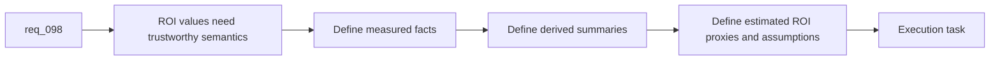

## item_165_define_explicit_measured_derived_and_estimated_roi_semantics_for_hybrid_assist_reports - Define explicit measured, derived, and estimated ROI semantics for hybrid assist reports
> From version: 1.13.0
> Schema version: 1.0
> Status: Ready
> Understanding: 96%
> Confidence: 94%
> Progress: 0%
> Complexity: Medium
> Theme: Trustworthy semantics for hybrid assist ROI reporting
> Reminder: Update status/understanding/confidence/progress and linked task references when you edit this doc.

# Problem
- A hybrid dispatch report is only trustworthy if operators can tell which values are measured facts, which are derived summaries, and which are estimates.
- `req_098` explicitly rejects fake precision around token or cost savings, so the report needs clear semantics and visible assumptions.
- Without one semantic layer, the plugin risks presenting estimated token avoidance as if it were exact billing data.

# Scope
- In:
  - define report sections and field semantics for measured, derived, and estimated values
  - document assumptions behind local-offload and token-avoidance style estimates
  - extend measurement records only where needed to support those semantics safely
  - add tests and operator guidance for interpreting the report
- Out:
  - advanced financial modeling
  - plugin layout decisions
  - unrelated telemetry expansion outside hybrid assist reporting

# Acceptance criteria
- AC1: Report fields clearly separate measured facts, derived summaries, and estimated ROI proxies.
- AC2: Any estimated token or local-offload benefit metrics expose their assumptions in operator-facing documentation or report metadata.
- AC3: Tests and docs cover how to interpret fallback-heavy or degraded-heavy reports without overstating ROI.

# AC Traceability
- req098-AC3 -> Scope: define measured, derived, and estimated semantics. Proof: the item requires explicit sectioning and assumptions.
- req098-AC7 -> Scope: extend existing records only where necessary. Proof: the item keeps one telemetry path and only enriches it if justified by report semantics.
- req098-AC8 -> Scope: add tests and operator guidance. Proof: the item requires interpretation docs and validation coverage.

# Decision framing
- Product framing: Consider
- Product signals: trust and comprehension
- Product follow-up: Review whether operators need preset explanations for “healthy”, “fallback-heavy”, and “degraded-heavy” report states.
- Architecture framing: Not needed
- Architecture signals: (none detected)
- Architecture follow-up: No separate ADR is required unless estimate semantics become shared across multiple product surfaces beyond this report.

# Links
- Product brief(s): `prod_001_hybrid_assist_operator_experience_for_repetitive_logics_delivery_flows`
- Architecture decision(s): `adr_011_keep_hybrid_assist_runtime_contracts_shared_backend_agnostic_and_safely_bounded`
- Request: `req_098_add_a_hybrid_assist_roi_dispatch_report_with_runtime_aggregation_and_plugin_insights`
- Primary task(s): `task_102_orchestration_delivery_for_req_098_hybrid_assist_roi_dispatch_reporting_and_plugin_insights`

# AI Context
- Summary: Define the trust model and field semantics for measured, derived, and estimated values in the hybrid assist ROI report.
- Keywords: roi semantics, measured, derived, estimated, token avoidance, assumptions, hybrid assist
- Use when: Use when specifying how ROI-oriented metrics should be labeled and documented in the hybrid assist report.
- Skip when: Skip when the work is only about adding a runtime command shell or building plugin widgets.

# References
- `logics/request/req_098_add_a_hybrid_assist_roi_dispatch_report_with_runtime_aggregation_and_plugin_insights.md`
- `logics/request/req_094_add_hybrid_assist_measurement_shared_context_strategy_and_degraded_mode_governance_for_logics_delivery_automation.md`
- `logics/request/req_093_add_shared_hybrid_assist_contracts_fallback_policy_activation_rules_and_audit_governance_for_logics_delivery_automation.md`
- `logics/skills/logics-flow-manager/scripts/logics_flow_hybrid.py`
- `logics/skills/README.md`
- `README.md`

# Priority
- Impact: High. Clear semantics are what stop the report from becoming misleading.
- Urgency: High. This should land with the aggregation surface, not as cleanup afterward.

# Notes
- Prefer conservative estimate language over precise-looking but weakly grounded numbers.
