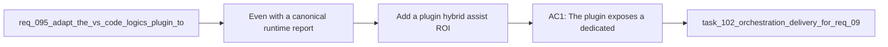

## item_166_add_a_plugin_hybrid_assist_roi_dispatch_insights_surface_with_recent_audit_drill_down - Add a plugin hybrid assist ROI dispatch insights surface with recent audit drill-down
> From version: 1.13.0
> Schema version: 1.0
> Status: Done
> Understanding: 99%
> Confidence: 97%
> Progress: 100%
> Complexity: High
> Theme: Plugin insights surface for hybrid assist observability
> Reminder: Update status/understanding/confidence/progress and linked task references when you edit this doc.

# Problem
- Even with a canonical runtime report, operators still need a plugin-native place to understand dispatch behavior without opening raw JSONL logs or running terminal commands.
- `req_098` calls for a dedicated observability screen or panel that makes usage, backend split, degraded reasons, review flags, and ROI proxies visible at a glance.
- The plugin must keep acting as a thin client over the runtime report and recent audit snippets, not recalculate the metrics itself.

# Scope
- In:
  - add a dedicated plugin insights screen or panel for hybrid assist ROI dispatch reporting
  - render usage-by-flow, backend split, degraded or fallback reasons, operator-review flags, and estimated ROI proxy metrics
  - support drill-down into recent provenance or audit snippets for recent runs
  - keep data acquisition driven by the shared runtime report surface
- Out:
  - duplicating report aggregation logic in TypeScript
  - broad analytics features unrelated to hybrid assist observability
  - replacing terminal access to raw logs for advanced debugging

# Acceptance criteria
- AC1: The plugin exposes a dedicated hybrid assist insights surface driven by the shared runtime report.
- AC2: The surface highlights usage volume, backend dispatch split, degraded or fallback reasons, review flags, and estimated ROI proxies with clear labeling.
- AC3: Operators can inspect recent backend provenance or audit details without dropping directly into raw JSONL logs.

# AC Traceability
- req098-AC4 -> Scope: add plugin insights surface. Proof: the item requires a dedicated observability panel fed by the runtime report.
- req098-AC5 -> Scope: support recent audit drill-down. Proof: the item requires recent provenance and degraded context to stay inspectable.
- req098-AC6/AC8 -> Scope: keep plugin thin and add coverage. Proof: the item requires runtime-driven data, plugin rendering only, and plugin documentation/tests.

# Decision framing
- Product framing: Yes
- Product signals: visibility, trust, habit formation
- Product follow-up: Consider extending the plugin home or environment area with a lightweight “latest ROI dispatch summary” once the full insights screen proves useful.
- Architecture framing: Consider
- Architecture signals: plugin thin-client boundary
- Architecture follow-up: Reaffirm `adr_012` if any implementation pressure appears to move aggregation logic into TypeScript.

# Links
- Product brief(s): `prod_002_plugin_hybrid_assist_runtime_visibility_and_action_ux`
- Architecture decision(s): `adr_012_keep_the_vs_code_plugin_as_a_thin_client_over_shared_hybrid_runtime_commands`
- Request: `req_098_add_a_hybrid_assist_roi_dispatch_report_with_runtime_aggregation_and_plugin_insights`
- Primary task(s): `task_102_orchestration_delivery_for_req_098_hybrid_assist_roi_dispatch_reporting_and_plugin_insights`

# AI Context
- Summary: Add a plugin-native insights surface for hybrid assist dispatch reporting, backed by the shared runtime report and recent audit drill-downs.
- Keywords: plugin, roi dispatch, insights, observability, fallback, degraded mode, audit drill-down
- Use when: Use when implementing the UI layer for hybrid assist reporting and recent-run inspection.
- Skip when: Skip when the work is only about raw runtime aggregation or report semantics.

# References
- `logics/request/req_098_add_a_hybrid_assist_roi_dispatch_report_with_runtime_aggregation_and_plugin_insights.md`
- `logics/request/req_095_adapt_the_vs_code_logics_plugin_to_expose_hybrid_assist_runtime_status_actions_audit_and_cross_agent_messaging.md`
- `src/logicsEnvironment.ts`
- `src/logicsViewProvider.ts`
- `src/logicsWebviewHtml.ts`
- `src/logicsViewDocumentController.ts`
- `README.md`

# Priority
- Impact: High. Without a plugin surface, the report remains mostly a CLI-only operator tool.
- Urgency: Medium. It should follow immediately after the runtime report exists.

# Notes
- Favor trust and explainability over decorative charts.
