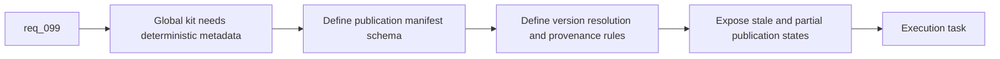

## item_167_define_a_global_logics_kit_publication_manifest_and_version_resolution_policy - Define a global Logics kit publication manifest and version resolution policy
> From version: 1.14.0
> Schema version: 1.0
> Status: Done
> Understanding: 100%
> Confidence: 97%
> Progress: 100%
> Complexity: High
> Theme: Global kit runtime contract and version policy
> Reminder: Update status/understanding/confidence/progress and linked task references when you edit this doc.

# Problem
- `req_099` changes the runtime model from per-repository overlays to one globally published Logics kit.
- That only works if the global runtime is inspectable and deterministic enough that operators and the plugin can explain what is installed, where it came from, and why that version won.
- Without a manifest and an explicit version policy, “auto-upgrade the global kit” becomes an opaque mutation of `~/.codex` that will be hard to support across several repositories.

# Scope
- In:
  - define the global publication manifest schema for the shared Logics kit
  - define the version and source-revision policy used to decide when a repo-local kit should replace the installed global kit
  - define provenance fields such as source repo, source revision, publish time, and published skill set
  - define degraded or partial-publication state markers that repair logic and diagnostics can consume
  - define how non-compatible or missing version signals are handled during migration
- Out:
  - implementing plugin write paths
  - final plugin UX copy or diagnostics layout
  - preserving overlay precedence as an alternate long-term runtime policy

# Acceptance criteria
- AC1: A global publication manifest schema is defined for the shared Logics kit and includes version, source, revision, publish time, and published skill inventory.
- AC2: The winning-version policy is explicit enough that the plugin can decide whether a repo-local kit should replace the installed global kit without relying on ad hoc heuristics.
- AC3: The manifest and policy cover degraded states such as partial publication, failed upgrade, missing revision metadata, or stale published content.

# AC Traceability
- req099-AC3 -> Scope: define manifest schema and provenance fields. Proof: the item requires a stable global metadata contract rather than opaque filesystem state.
- req099-AC5 -> Scope: define the multi-project version policy. Proof: the item requires explicit resolution rules for competing kit revisions from different repositories.
- req099-AC7 -> Scope: keep the shared runtime boundary explicit. Proof: the manifest contract defines publication metadata for shared kit content only and excludes repo-owned workflow docs from the global runtime surface.
- req099-AC8 -> Scope: represent degraded and repairable publication states. Proof: the item requires the global model to surface partial installs and failed-upgrade conditions deterministically.

# Decision framing
- Product framing: Not needed
- Product signals: (none detected)
- Product follow-up: No separate product brief is needed unless the publication manifest becomes user-editable beyond plugin diagnostics.
- Architecture framing: Yes
- Architecture signals: runtime contract, source of truth, version policy
- Architecture follow-up: Prepare an ADR that supersedes or revises `adr_008` once the publication and resolution policy is accepted.

# Links
- Product brief(s): (none yet)
- Architecture decision(s): `adr_008_keep_codex_workspace_overlays_repo_local_isolated_and_composable`, `adr_012_keep_the_vs_code_plugin_as_a_thin_client_over_shared_hybrid_runtime_commands`, `adr_013_replace_repo_local_codex_workspace_overlays_with_a_global_published_logics_kit`
- Request: `req_099_replace_repo_local_codex_overlays_with_a_global_published_logics_kit_and_managed_migration`
- Primary task(s): `task_103_orchestration_delivery_for_req_099_global_logics_kit_publication_and_overlay_migration`

# AI Context
- Summary: Define the manifest and version-resolution contract that makes a globally published Logics kit explainable and deterministic across several repositories.
- Keywords: global kit, manifest, provenance, version policy, source revision, auto upgrade, codex
- Use when: Use when specifying the metadata and winner-selection rules for the globally published Logics kit runtime.
- Skip when: Skip when the work is only about plugin wording, copy-to-clipboard handoff behavior, or local UI polish.

# References
- `logics/request/req_099_replace_repo_local_codex_overlays_with_a_global_published_logics_kit_and_managed_migration.md`
- `logics/request/req_067_add_multi_project_codex_workspace_overlays_for_logics_skills.md`
- `logics/request/req_070_define_workspace_overlay_precedence_and_coexistence_with_global_codex_skills.md`
- `logics/architecture/adr_008_keep_codex_workspace_overlays_repo_local_isolated_and_composable.md`
- `logics/architecture/adr_013_replace_repo_local_codex_workspace_overlays_with_a_global_published_logics_kit.md`
- `logics/skills/README.md`
- `src/logicsCodexWorkspace.ts`
- `src/logicsEnvironment.ts`

# Priority
- Impact: High. Without one manifest and version policy, the global runtime cannot be trusted or repaired coherently.
- Urgency: High. This needs to be settled before plugin automation lands.

# Notes
- Prefer an explicit source-revision contract over filesystem timestamps.
- Delivered through `src/logicsCodexWorkspace.ts` using `logics-global-kit.json`, explicit installed version/source revision fields, published skill inventory, and deterministic stale/missing publication states.
