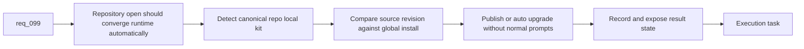

## item_168_publish_and_auto_upgrade_the_global_codex_logics_kit_from_canonical_repo_sources_in_the_plugin - Publish and auto-upgrade the global Codex Logics kit from canonical repo sources in the plugin
> From version: 1.14.0
> Schema version: 1.0
> Status: Ready
> Understanding: 97%
> Confidence: 94%
> Progress: 0%
> Complexity: High
> Theme: Zero-touch plugin publication and global kit upgrades
> Reminder: Update status/understanding/confidence/progress and linked task references when you edit this doc.

# Problem
- `req_099` only improves the operator experience if opening a compatible repository is enough to publish or upgrade the global shared kit automatically.
- The plugin currently understands repo-local state and overlay-aware diagnostics, but it does not yet own a zero-touch publication path into the global Codex runtime.
- Without one normal-path automation slice, users will still have to run manual migration or publishing steps and the new model will not feel simpler than overlays.

# Scope
- In:
  - detect canonical repo-local kit sources when a repository is opened or refreshed
  - compare the repo-local kit version or revision against the installed global published kit
  - publish or auto-upgrade the global shared kit in the normal path without user prompts
  - record success, failure, or partial-publication state in the global manifest
  - reserve user prompts for exceptional cases such as missing permissions or unrecoverable publication conflicts
  - expose enough plugin telemetry or diagnostics to explain what happened after automatic publication
- Out:
  - redesigning all plugin wording and docs for the post-overlay world
  - inventing a separate package manager outside the plugin and repo-local kit
  - preserving overlay sync as a required fallback for the normal migration path

# Acceptance criteria
- AC1: The plugin detects compatible repo-local kit sources and compares them against the installed global published kit during normal repository usage.
- AC2: In the normal path, the plugin publishes or upgrades the global shared kit automatically without requiring a dedicated migration, publish, or overlay-sync action.
- AC3: Exceptional failures such as permission issues or unrecoverable publication errors produce clear diagnostics and do not silently leave the global runtime in an unknown state.

# AC Traceability
- req099-AC4 -> Scope: plugin detection and auto-upgrade behavior. Proof: the item requires the plugin to keep the global kit current from canonical repo sources.
- req099-AC4b -> Scope: zero-touch normal-path migration. Proof: the item explicitly removes user-driven migration steps from the successful path.
- req099-AC8/AC9 -> Scope: repair semantics and diagnostics. Proof: the item requires clear degraded-state visibility when automatic publication fails.

# Decision framing
- Product framing: Yes
- Product signals: automation, reduced friction, trust
- Product follow-up: Validate whether silent success should surface as passive status only or as a lightweight one-time informational toast.
- Architecture framing: Consider
- Architecture signals: plugin ownership boundary, write-path safety
- Architecture follow-up: Reconfirm `adr_012` if publication automation pressures the plugin to own too much kit logic instead of delegating to shared scripts or helpers.

# Links
- Product brief(s): `prod_002_plugin_hybrid_assist_runtime_visibility_and_action_ux`
- Architecture decision(s): `adr_012_keep_the_vs_code_plugin_as_a_thin_client_over_shared_hybrid_runtime_commands`
- Request: `req_099_replace_repo_local_codex_overlays_with_a_global_published_logics_kit_and_managed_migration`
- Primary task(s): `task_103_orchestration_delivery_for_req_099_global_logics_kit_publication_and_overlay_migration`

# AI Context
- Summary: Add the plugin automation that detects repo-local kit sources and keeps the globally published Codex Logics kit current without manual migration steps in the normal path.
- Keywords: plugin, auto upgrade, publish, zero touch, global kit, codex, migration, manifest
- Use when: Use when implementing the automatic publication and upgrade flow from repo-local Logics kit sources into the global Codex runtime.
- Skip when: Skip when the work is only about manifest schema design or post-migration doc cleanup.

# References
- `logics/request/req_099_replace_repo_local_codex_overlays_with_a_global_published_logics_kit_and_managed_migration.md`
- `logics/request/req_076_adapt_the_vs_code_logics_plugin_to_codex_workspace_overlays.md`
- `logics/request/req_078_add_plugin_actions_to_update_the_logics_kit_and_sync_codex_overlays.md`
- `logics/skills/README.md`
- `src/logicsEnvironment.ts`
- `src/logicsViewProvider.ts`
- `src/logicsViewDocumentController.ts`
- `README.md`

# Priority
- Impact: High. This is the slice that makes the new runtime model actually feel automatic.
- Urgency: High. It must land with the migration path, not after a manual interim period.

# Notes
- Favor idempotent publication and repair behavior so repeated repository opens are safe.
