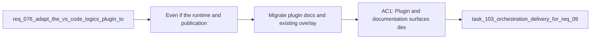

## item_169_migrate_plugin_docs_and_existing_overlay_ux_to_the_global_published_kit_model - Migrate plugin docs and existing overlay UX to the global published kit model
> From version: 1.14.0
> Schema version: 1.0
> Status: Done
> Understanding: 100%
> Confidence: 97%
> Progress: 100%
> Complexity: Medium
> Theme: Plugin migration UX and overlay retirement
> Reminder: Update status/understanding/confidence/progress and linked task references when you edit this doc.

# Problem
- Even if the runtime and publication logic are changed, operators will stay confused if the plugin, README, and diagnostic surfaces keep speaking the language of overlays, overlay sync, and overlay run commands.
- `req_099` requires the migration to be automatic for existing projects, which means the user-facing surfaces must stop implying that they still need to perform an overlay-specific handoff.
- Existing overlay state may still be present on disk, so the migration UX must retire or downscope those concepts without turning stale overlay artifacts into a long-term support burden.

# Scope
- In:
  - update plugin diagnostics, tools, and environment wording to describe the global published kit as the primary runtime
  - replace or deprecate overlay-specific actions and copy in the README and operator flows
  - surface the installed global kit version, source, and publication health where relevant
  - define how stale overlay state is ignored, hidden, or cleaned up from user-facing flows
  - document the migration story for repositories that already used overlay-aware plugin flows
- Out:
  - implementing the core publication manifest
  - implementing the automatic global publication write path itself
  - preserving legacy overlay affordances indefinitely for convenience

# Acceptance criteria
- AC1: Plugin and documentation surfaces describe the global published kit as the primary Codex runtime and stop requiring overlay-specific mental models in the normal path.
- AC2: Existing overlay actions or diagnostics are deprecated, hidden, or replaced in a way that does not mislead users during migration.
- AC3: Users can see the active global kit version, source, and publication health without needing to infer runtime state from obsolete overlay terminology.

# AC Traceability
- req099-AC6 -> Scope: migrate overlay-aware UX and docs. Proof: the item explicitly covers deprecation and retirement of overlay-specific surfaces.
- req099-AC6b -> Scope: preserve the automatic migration story in user-facing flows. Proof: the item requires documentation and UX to avoid reintroducing manual migration steps.
- req099-AC9 -> Scope: update `Check Environment`, launch wording, and kit visibility. Proof: the item explicitly covers the plugin surfaces most affected by the new runtime model.
- req099-AC10 -> Scope: deliver one concrete migration slice for implementation. Proof: this item makes the request directly actionable as the UX/docs retirement slice without reopening the architecture choice.

# Decision framing
- Product framing: Yes
- Product signals: clarity, habit change, reduced confusion
- Product follow-up: Consider a short “runtime changed” note in the environment screen for one transition window, then remove it once the new model is established.
- Architecture framing: Consider
- Architecture signals: deprecation path, stale runtime artifacts
- Architecture follow-up: No new ADR is required for wording alone, but any retained overlay cleanup behavior should stay aligned with the architecture replacement plan.

# Links
- Product brief(s): `prod_002_plugin_hybrid_assist_runtime_visibility_and_action_ux`
- Architecture decision(s): `adr_008_keep_codex_workspace_overlays_repo_local_isolated_and_composable`, `adr_012_keep_the_vs_code_plugin_as_a_thin_client_over_shared_hybrid_runtime_commands`, `adr_013_replace_repo_local_codex_workspace_overlays_with_a_global_published_logics_kit`
- Request: `req_099_replace_repo_local_codex_overlays_with_a_global_published_logics_kit_and_managed_migration`
- Primary task(s): `task_103_orchestration_delivery_for_req_099_global_logics_kit_publication_and_overlay_migration`

# AI Context
- Summary: Update the plugin and docs so the migration from overlays to a globally published kit is understandable, automatic, and free of stale overlay-centric guidance.
- Keywords: migration ux, overlay deprecation, docs, plugin diagnostics, global kit, codex, environment check
- Use when: Use when implementing the user-facing migration from overlay terminology and actions to the global published Logics kit model.
- Skip when: Skip when the work is only about manifest internals or background publication mechanics.

# References
- `logics/request/req_099_replace_repo_local_codex_overlays_with_a_global_published_logics_kit_and_managed_migration.md`
- `logics/request/req_076_adapt_the_vs_code_logics_plugin_to_codex_workspace_overlays.md`
- `logics/request/req_078_add_plugin_actions_to_update_the_logics_kit_and_sync_codex_overlays.md`
- `logics/architecture/adr_008_keep_codex_workspace_overlays_repo_local_isolated_and_composable.md`
- `logics/architecture/adr_013_replace_repo_local_codex_workspace_overlays_with_a_global_published_logics_kit.md`
- `src/logicsEnvironment.ts`
- `src/logicsViewProvider.ts`
- `src/logicsViewDocumentController.ts`
- `README.md`

# Priority
- Impact: High. If the UX stays overlay-centric, the architecture change will feel incomplete and confusing.
- Urgency: Medium to high. It should land in the same migration wave as automatic publication, not as a distant cleanup task.

# Notes
- Remove obsolete operator instructions quickly enough that the normal path stays singular.
- Delivered across `src/logicsViewProvider.ts`, `src/logicsViewDocumentController.ts`, `src/logicsWebviewHtml.ts`, `media/hostApi.js`, `README.md`, and related tests by replacing the primary overlay UX with global-kit wording and explicit legacy compatibility downscoping.
