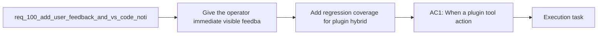

## item_172_add_regression_coverage_for_plugin_hybrid_assist_execution_feedback - Add regression coverage for plugin hybrid assist execution feedback
> From version: 1.14.0
> Schema version: 1.0
> Status: Ready
> Understanding: 96%
> Confidence: 94%
> Progress: 0%
> Complexity: Medium
> Theme: VS Code plugin UX for Ollama backed assist execution feedback
> Reminder: Update status/understanding/confidence/progress and linked task references when you edit this doc.

# Problem
- Give the operator immediate visible feedback in VS Code when the extension triggers an Ollama-backed backend call, so the UI never feels frozen while the local model is working.
- Show a clear completion notification when the run succeeds, including enough context to understand which action completed and whether the result came from Ollama, fallback, or a degraded path.
- Show a clear failure notification when the run fails or returns invalid output, so the operator can distinguish backend latency from an actual error.
- Keep the plugin as a thin UX wrapper over the shared hybrid-assist runtime rather than moving Ollama orchestration logic into the extension.
- - The plugin already exposes several tool actions that run the shared hybrid-assist runtime from the extension, including runtime checks, next-step suggestions, validation summaries, commit planning, and ROI insights.
- - Those actions currently call the shared runtime through `runHybridAssistCommand` in [src/logicsViewProvider.ts](/Users/alexandreagostini/Documents/cdx-logics-vscode/src/logicsViewProvider.ts#L531) and mostly surface only a final `showInformationMessage` or `showErrorMessage` after the Python command finishes.

# Scope
- In:
- Out:

# Acceptance criteria
- AC1: When a plugin tool action triggers a shared hybrid-assist command whose requested or selected backend path involves Ollama, the operator sees immediate in-progress feedback in VS Code instead of waiting silently for the final result.
- AC2: The in-progress feedback is action-aware and bounded:
- it names or implies the action being executed;
- it indicates that the extension is waiting on the backend;
- it does not create several redundant notifications for one run.
- AC3: When the run completes successfully, the operator sees a completion notification that includes at minimum:
- which plugin action completed;
- whether the actual backend used was Ollama or a fallback backend when relevant;
- whether the result is degraded or requires attention when that information is available from the runtime.
- AC4: When the run fails, times out, or returns invalid output, the operator sees an error notification that makes the failing action explicit and distinguishes execution failure from silent waiting.
- AC5: The implementation remains plugin-thin:
- the extension adds execution feedback around shared runtime invocation;
- backend routing, degraded-state semantics, and assist payload ownership remain in the shared Logics runtime.
- AC6: The plugin coverage is extended with focused tests for the execution-feedback UX around hybrid-assist actions, including at least one successful path and one failing path.

# AC Traceability
- AC1 -> Scope: When a plugin tool action triggers a shared hybrid-assist command whose requested or selected backend path involves Ollama, the operator sees immediate in-progress feedback in VS Code instead of waiting silently for the final result.. Proof: TODO.
- AC2 -> Scope: The in-progress feedback is action-aware and bounded:. Proof: TODO.
- AC3 -> Scope: it names or implies the action being executed;. Proof: TODO.
- AC4 -> Scope: it indicates that the extension is waiting on the backend;. Proof: TODO.
- AC5 -> Scope: it does not create several redundant notifications for one run.. Proof: TODO.
- AC3 -> Scope: When the run completes successfully, the operator sees a completion notification that includes at minimum:. Proof: TODO.
- AC6 -> Scope: which plugin action completed;. Proof: TODO.
- AC7 -> Scope: whether the actual backend used was Ollama or a fallback backend when relevant;. Proof: TODO.
- AC8 -> Scope: whether the result is degraded or requires attention when that information is available from the runtime.. Proof: TODO.
- AC4 -> Scope: When the run fails, times out, or returns invalid output, the operator sees an error notification that makes the failing action explicit and distinguishes execution failure from silent waiting.. Proof: TODO.
- AC5 -> Scope: The implementation remains plugin-thin:. Proof: TODO.
- AC9 -> Scope: the extension adds execution feedback around shared runtime invocation;. Proof: TODO.
- AC10 -> Scope: backend routing, degraded-state semantics, and assist payload ownership remain in the shared Logics runtime.. Proof: TODO.
- AC6 -> Scope: The plugin coverage is extended with focused tests for the execution-feedback UX around hybrid-assist actions, including at least one successful path and one failing path.. Proof: TODO.

# Decision framing
- Product framing: Consider
- Product signals: engagement loop
- Product follow-up: Review whether a product brief is needed before scope becomes harder to change.
- Architecture framing: Required
- Architecture signals: data model and persistence, contracts and integration
- Architecture follow-up: Create or link an architecture decision before irreversible implementation work starts.

# Links
- Product brief(s): (none yet)
- Architecture decision(s): `adr_012_keep_the_vs_code_plugin_as_a_thin_client_over_shared_hybrid_runtime_commands`
- Request: `req_100_add_user_feedback_and_vs_code_notifications_for_ollama_backend_calls`
- Primary task(s): `task_104_orchestration_delivery_for_req_100_and_req_101_plugin_feedback_and_bootstrap_global_kit_convergence`

# AI Context
- Summary: Add explicit VS Code in-progress, success, and failure feedback for plugin-launched Ollama-backed hybrid-assist calls so operators are not...
- Keywords: plugin, vscode, ollama, hybrid assist, notification, progress, feedback, backend, degraded, fallback
- Use when: Use when planning plugin UX that should acknowledge long-running or failure-prone Ollama-backed hybrid-assist actions started from the extension.
- Skip when: Skip when the work is only about terminal-side Ollama usage, model selection policy, or backend runtime logic with no plugin UX change.

# References
- `logics/request/req_095_adapt_the_vs_code_logics_plugin_to_expose_hybrid_assist_runtime_status_actions_audit_and_cross_agent_messaging.md`
- `logics/request/req_097_expand_hybrid_local_model_support_beyond_deepseek_with_configurable_qwen_and_deepseek_profiles.md`
- `logics/backlog/item_157_add_plugin_audit_visibility_result_panels_and_cross_agent_runtime_messaging_cleanup.md`
- `src/logicsViewProvider.ts`
- `src/logicsEnvironment.ts`
- `logics/skills/logics-ui-steering/SKILL.md`

# Priority
- Impact:
- Urgency:

# Notes
- Derived from request `req_100_add_user_feedback_and_vs_code_notifications_for_ollama_backend_calls`.
- Source file: `logics/request/req_100_add_user_feedback_and_vs_code_notifications_for_ollama_backend_calls.md`.
- Request context seeded into this backlog item from `logics/request/req_100_add_user_feedback_and_vs_code_notifications_for_ollama_backend_calls.md`.
