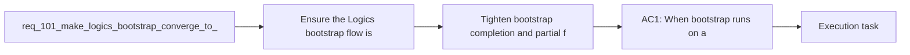

## item_174_tighten_bootstrap_completion_and_partial_failure_messaging_around_global_kit_readiness - Tighten bootstrap completion and partial failure messaging around global kit readiness
> From version: 1.14.0
> Schema version: 1.0
> Status: Done
> Understanding: 97%
> Confidence: 95%
> Progress: 100%
> Complexity: Medium
> Theme: Bootstrap completion semantics and global kit publication
> Reminder: Update status/understanding/confidence/progress and linked task references when you edit this doc.

# Problem
- Ensure the Logics bootstrap flow is treated as globally complete only when the repo-local kit is installed and the shared global Codex kit is actually published and usable.
- Remove the operator ambiguity where bootstrap appears complete even though only the repository-local `logics/skills` source exists and the global runtime still requires a second manual step.
- Keep the bootstrap flow aligned with the repository direction introduced by global kit publication: normal bootstrap should converge toward a usable global install, not stop at partial local readiness.
- Preserve explicit recovery messaging when the repository cannot act as a healthy publication source or when publication fails, instead of masking those cases behind a misleading success message.
- - The repository already shifted from overlay-oriented runtime setup to a globally published Logics kit model in `req_099`, with the plugin expected to auto-publish or auto-upgrade the global kit from compatible repositories in the normal path.
- - The current bootstrap flow in [src/logicsViewProvider.ts](/Users/alexandreagostini/Documents/cdx-logics-vscode/src/logicsViewProvider.ts#L1113) still behaves in two phases:

# Scope
- In:
- Out:

# Acceptance criteria
- AC1: When bootstrap runs on a repository that exposes the canonical publishable `logics/skills` kit, the plugin attempts to converge the shared global Codex kit as part of the bootstrap flow instead of treating repo-local installation alone as the end state.
- AC2: A normal successful bootstrap completion message is shown only when both conditions are true:
- the repo-local Logics kit is present and bootstrapped;
- the global Codex kit is healthy or warning-healthy according to the global publication inspection contract.
- AC3: If bootstrap completes the repo-local phase but the repository cannot yet act as a healthy global publication source, the plugin reports that state explicitly and does not imply that the overall bootstrap is fully complete.
- AC4: If the repo is a valid publication source but global publication fails or remains stale after the attempt, the plugin reports an explicit partial or repair-required outcome, with remediation that is specific to the detected failure instead of a generic success toast.
- AC5: The implementation preserves the current architecture boundaries:
- bootstrap still installs or repairs repo-local Logics assets in the repository;
- global publication continues to use the shared global publication contract and manifest inspection rather than introducing a second ad hoc bootstrap-only write path.
- AC6: The plugin coverage is extended with focused tests for the bootstrap-plus-publication UX, including at least:
- a bootstrap path that ends with global kit readiness;
- a bootstrap path where the repo-local phase succeeds but global publication is unavailable or unhealthy.

# AC Traceability
- AC1 -> Scope: When bootstrap runs on a repository that exposes the canonical publishable `logics/skills` kit, the plugin attempts to converge the shared global Codex kit as part of the bootstrap flow instead of treating repo-local installation alone as the end state.. Proof: TODO.
- AC2 -> Scope: A normal successful bootstrap completion message is shown only when both conditions are true:. Proof: TODO.
- AC3 -> Scope: the repo-local Logics kit is present and bootstrapped;. Proof: TODO.
- AC4 -> Scope: the global Codex kit is healthy or warning-healthy according to the global publication inspection contract.. Proof: TODO.
- AC3 -> Scope: If bootstrap completes the repo-local phase but the repository cannot yet act as a healthy global publication source, the plugin reports that state explicitly and does not imply that the overall bootstrap is fully complete.. Proof: TODO.
- AC4 -> Scope: If the repo is a valid publication source but global publication fails or remains stale after the attempt, the plugin reports an explicit partial or repair-required outcome, with remediation that is specific to the detected failure instead of a generic success toast.. Proof: TODO.
- AC5 -> Scope: The implementation preserves the current architecture boundaries:. Proof: TODO.
- AC6 -> Scope: bootstrap still installs or repairs repo-local Logics assets in the repository;. Proof: TODO.
- AC7 -> Scope: global publication continues to use the shared global publication contract and manifest inspection rather than introducing a second ad hoc bootstrap-only write path.. Proof: TODO.
- AC6 -> Scope: The plugin coverage is extended with focused tests for the bootstrap-plus-publication UX, including at least:. Proof: TODO.
- AC8 -> Scope: a bootstrap path that ends with global kit readiness;. Proof: TODO.
- AC9 -> Scope: a bootstrap path where the repo-local phase succeeds but global publication is unavailable or unhealthy.. Proof: TODO.

# Decision framing
- Product framing: Not needed
- Product signals: (none detected)
- Product follow-up: No product brief follow-up is expected based on current signals.
- Architecture framing: Required
- Architecture signals: data model and persistence, contracts and integration, runtime and boundaries
- Architecture follow-up: Create or link an architecture decision before irreversible implementation work starts.

# Links
- Product brief(s): (none yet)
- Architecture decision(s): `adr_013_replace_repo_local_codex_workspace_overlays_with_a_global_published_logics_kit`
- Request: `req_101_make_logics_bootstrap_converge_to_a_ready_global_kit_before_reporting_completion`
- Primary task(s): `task_104_orchestration_delivery_for_req_100_and_req_101_plugin_feedback_and_bootstrap_global_kit_convergence`

# AI Context
- Summary: Make bootstrap of the Logics kit converge to an actually usable global published kit in the normal path...
- Keywords: bootstrap, global kit, publish, completion, plugin, repo local, manifest, repair, zero touch
- Use when: Use when planning or implementing bootstrap behavior that must end in a ready global Codex Logics kit rather than only a local repository setup.
- Skip when: Skip when the work is only about global publication policy, generic kit updates, or unrelated plugin messaging outside bootstrap completion behavior.

# References
- `logics/request/req_099_replace_repo_local_codex_overlays_with_a_global_published_logics_kit_and_managed_migration.md`
- `logics/backlog/item_168_publish_and_auto_upgrade_the_global_codex_logics_kit_from_canonical_repo_sources_in_the_plugin.md`
- `logics/backlog/item_169_migrate_plugin_docs_and_existing_overlay_ux_to_the_global_published_kit_model.md`
- `src/logicsViewProvider.ts`
- `src/logicsCodexWorkspace.ts`
- `README.md`

# Priority
- Impact:
- Urgency:

# Notes
- Derived from request `req_101_make_logics_bootstrap_converge_to_a_ready_global_kit_before_reporting_completion`.
- Source file: `logics/request/req_101_make_logics_bootstrap_converge_to_a_ready_global_kit_before_reporting_completion.md`.
- Request context seeded into this backlog item from `logics/request/req_101_make_logics_bootstrap_converge_to_a_ready_global_kit_before_reporting_completion.md`.
