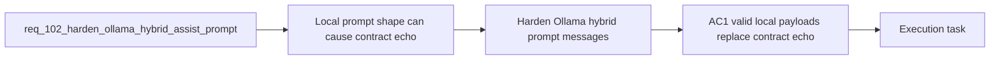

## item_176_harden_ollama_hybrid_prompt_messages_for_supported_local_flows - Harden Ollama hybrid prompt messages for supported local flows
> From version: 1.14.0
> Schema version: 1.0
> Status: Ready
> Understanding: 98%
> Confidence: 96%
> Progress: 0%
> Complexity: Medium
> Theme: Hybrid assist local-runtime contract reliability and Ollama result validation
> Reminder: Update status/understanding/confidence/progress and linked task references when you edit this doc.

# Problem
- The local Ollama path currently reaches the backend successfully but can still fail semantically because the prompt shape encourages the model to echo the contract object instead of returning a valid flow payload instance.
- This failure mode is visible on supported flows like `commit-message` and `commit-plan`, where the runtime expects business fields such as `subject`, `body`, `strategy`, or `steps` but instead receives schema-description fields like `flow` and `required_keys`.
- As long as the prompt remains ambiguous, `auto` cannot earn trust as a real local path because healthy Ollama runs keep degrading to Codex with `hybrid_missing_field` before the runtime can use the local answer.
- This slice is specifically about fixing prompt and message shaping at the source so supported local flows return valid bounded JSON payloads without changing the shared flow contracts themselves.

# Scope
- In:
  - clarify the system and user messages built for Ollama-backed hybrid flows so the model must return an instance of the contract rather than the contract description
  - keep output bounded to JSON-only payloads that satisfy the existing per-flow required keys for supported flows such as `commit-message` and `commit-plan`
  - preserve backend-agnostic shared runtime behavior so prompt hardening stays inside the existing hybrid-assist contract path
- Out:
  - preserving invalid payload diagnostics after validation failure
  - changing ROI aggregation or Hybrid Insights rendering beyond what naturally improves once the local path succeeds
  - broad model-profile expansion unrelated to the contract-echo failure mode

# Acceptance criteria
- AC1: For supported local hybrid flows such as `commit-message` and `commit-plan`, a healthy Ollama-backed run produces a valid flow payload that satisfies the existing contract keys, instead of echoing the contract schema.
- AC2: The prompt and message contract sent to Ollama explicitly differentiates between the schema description and the required answer instance, including bounded JSON-only output instructions.
- AC3: The prompt hardening stays compatible with the shared backend-agnostic runtime path and does not introduce model-specific ad hoc branches that would bypass the existing contract definitions.

# AC Traceability
- req102-AC1 -> This backlog slice. Proof: prompt hardening must let supported local flows return valid business payload instances.
- req102-AC2 -> This backlog slice. Proof: the core change is clarifying the Ollama prompt contract so the answer is an instance, not a schema echo.
- req102-AC5 -> Partial support from this slice. Proof: once local runs stop echoing the contract, ROI logs can record genuine `ollama` wins instead of forced fallback-heavy telemetry.

# Decision framing
- Product framing: Not needed
- Product signals: (none detected)
- Product follow-up: No product brief is required for this runtime-correctness slice.
- Architecture framing: Required
- Architecture signals: contracts and integration, delivery and operations
- Architecture follow-up: Reuse `adr_011` and `adr_012`; no new ADR is required unless prompt hardening forces contract branching per model family.

# Links
- Product brief(s): (none yet)
- Architecture decision(s): `adr_011_keep_hybrid_assist_runtime_contracts_shared_backend_agnostic_and_safely_bounded`, `adr_012_keep_the_vs_code_plugin_as_a_thin_client_over_shared_hybrid_runtime_commands`
- Request: `req_102_harden_ollama_hybrid_assist_prompts_and_response_validation_so_local_runs_stop_echoing_the_contract`
- Primary task(s): `task_104_orchestration_delivery_for_req_100_and_req_101_plugin_feedback_and_bootstrap_global_kit_convergence`

# AI Context
- Summary: Harden the local Ollama hybrid assist path so supported flows return valid business payloads instead of echoing the...
- Keywords: ollama, hybrid assist, prompt contract, local runtime, fallback, degraded, validation, audit, deepseek, qwen
- Use when: Use when planning or implementing a fix for local hybrid runs that reach Ollama successfully but fail semantic validation and degrade to Codex.
- Skip when: Skip when the work is only about plugin notification UX, global kit publication, or generic Ollama installation guidance.

# References
- `logics/request/req_097_expand_hybrid_local_model_support_beyond_deepseek_with_configurable_qwen_and_deepseek_profiles.md`
- `logics/request/req_098_add_a_hybrid_assist_roi_dispatch_report_with_runtime_aggregation_and_plugin_insights.md`
- `logics/skills/logics-flow-manager/scripts/logics_flow_hybrid.py`
- `logics/skills/logics-flow-manager/scripts/logics_flow.py`
- `logics/hybrid_assist_audit.jsonl`

# Priority
- Impact:
- Urgency:

# Notes
- Derived from request `req_102_harden_ollama_hybrid_assist_prompts_and_response_validation_so_local_runs_stop_echoing_the_contract`.
- Source file: `logics/request/req_102_harden_ollama_hybrid_assist_prompts_and_response_validation_so_local_runs_stop_echoing_the_contract.md`.
- Request context seeded into this backlog item from `logics/request/req_102_harden_ollama_hybrid_assist_prompts_and_response_validation_so_local_runs_stop_echoing_the_contract.md`.
