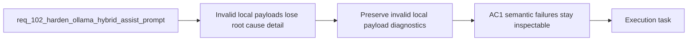

## item_177_preserve_invalid_local_payload_diagnostics_when_hybrid_validation_fails - Preserve invalid local payload diagnostics when hybrid validation fails
> From version: 1.14.0
> Schema version: 1.0
> Status: Done
> Understanding: 98%
> Confidence: 96%
> Progress: 100%
> Complexity: Medium
> Theme: Hybrid assist local-runtime contract reliability and Ollama result validation
> Reminder: Update status/understanding/confidence/progress and linked task references when you edit this doc.

# Problem
- When the local Ollama response is structurally wrong, the runtime currently records `hybrid_missing_field` and falls back safely, but it loses too much context about what the local model actually returned.
- That makes prompt-contract regressions look similar to generic backend problems even when Ollama is reachable and the failure is purely semantic.
- Operators need enough safe diagnostic detail to understand whether the local payload was invalid JSON, a schema echo, or a partially correct answer missing specific required fields.
- This slice is about preserving inspectable failure detail through validation, fallback, and audit logging without weakening the existing `auto -> codex` safety path.

# Scope
- In:
  - preserve safe diagnostic detail when local hybrid validation fails, including missing fields, parse failures, or a bounded representation of the invalid local payload
  - keep degraded reasons and audit entries specific enough to distinguish semantic local-response failures from transport or availability failures
  - ensure fallback to Codex remains allowed in `auto` mode after the diagnostic detail is recorded
- Out:
  - changing the prompt contract itself
  - redesigning the Hybrid Insights panel UI
  - removing or relaxing validation gates for local responses

# Acceptance criteria
- AC1: If the local model returns invalid JSON or a structurally wrong payload, the runtime records enough bounded failure detail for diagnosis, including either the specific missing fields, the parse error class, or a safe representation of the invalid local response.
- AC2: When `auto` falls back to Codex after a semantic local-response failure, the degraded reason remains inspectable as a prompt-contract or validation failure rather than being flattened into a generic local-backend failure.
- AC3: The preserved diagnostics remain compatible with the existing audit and ROI surfaces so degraded local runs stay visible and explainable without exposing unbounded raw output.

# AC Traceability
- req102-AC3 -> This backlog slice. Proof: the runtime must preserve enough detail to diagnose invalid local outputs instead of dropping the evidence on fallback.
- req102-AC4 -> This backlog slice. Proof: the fix keeps `auto -> codex` fallback safe while making the semantic cause inspectable.
- req102-AC5 -> Partial support from this slice. Proof: once degraded runs preserve their local failure facts, ROI and audit surfaces become materially more interpretable.

# Decision framing
- Product framing: Not needed
- Product signals: (none detected)
- Product follow-up: No product brief is required for this observability slice.
- Architecture framing: Required
- Architecture signals: data model and persistence, contracts and integration, delivery and operations
- Architecture follow-up: Reuse `adr_011` and `adr_012`; no new ADR is required unless diagnostic retention changes the shared audit schema materially.

# Links
- Product brief(s): (none yet)
- Architecture decision(s): `adr_011_keep_hybrid_assist_runtime_contracts_shared_backend_agnostic_and_safely_bounded`, `adr_012_keep_the_vs_code_plugin_as_a_thin_client_over_shared_hybrid_runtime_commands`
- Request: `req_102_harden_ollama_hybrid_assist_prompts_and_response_validation_so_local_runs_stop_echoing_the_contract`
- Primary task(s): `task_104_orchestration_delivery_for_req_100_and_req_101_plugin_feedback_and_bootstrap_global_kit_convergence`

# AI Context
- Summary: Harden the local Ollama hybrid assist path so supported flows return valid business payloads instead of echoing the...
- Keywords: ollama, hybrid assist, prompt contract, local runtime, fallback, degraded, validation, audit, deepseek, qwen
- Use when: Use when planning or implementing a fix for local hybrid runs that reach Ollama successfully but fail semantic validation and degrade to Codex.
- Skip when: Skip when the work is only about plugin notification UX, global kit publication, or generic Ollama installation guidance.

# References
- `logics/request/req_098_add_a_hybrid_assist_roi_dispatch_report_with_runtime_aggregation_and_plugin_insights.md`
- `logics/skills/logics-flow-manager/scripts/logics_flow.py`
- `logics/skills/logics-flow-manager/scripts/logics_flow_hybrid.py`
- `logics/hybrid_assist_audit.jsonl`
- `logics/hybrid_assist_measurements.jsonl`

# Priority
- Impact:
- Urgency:

# Notes
- Derived from request `req_102_harden_ollama_hybrid_assist_prompts_and_response_validation_so_local_runs_stop_echoing_the_contract`.
- Source file: `logics/request/req_102_harden_ollama_hybrid_assist_prompts_and_response_validation_so_local_runs_stop_echoing_the_contract.md`.
- Request context seeded into this backlog item from `logics/request/req_102_harden_ollama_hybrid_assist_prompts_and_response_validation_so_local_runs_stop_echoing_the_contract.md`.
