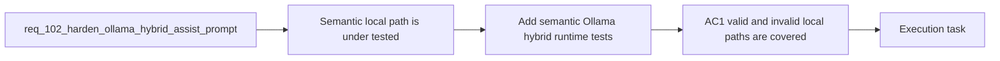

## item_178_add_semantic_ollama_hybrid_runtime_tests_for_valid_and_invalid_payloads - Add semantic Ollama hybrid runtime tests for valid and invalid payloads
> From version: 1.14.0
> Schema version: 1.0
> Status: Done
> Understanding: 98%
> Confidence: 96%
> Progress: 100%
> Complexity: Medium
> Theme: Hybrid assist local-runtime contract reliability and Ollama result validation
> Reminder: Update status/understanding/confidence/progress and linked task references when you edit this doc.

# Problem
- The current test surface proves runtime availability and ROI aggregation, but it does not prove that a healthy local Ollama response can satisfy the semantic contract for supported flows.
- That leaves a regression gap where transport-level health stays green while the local path silently degrades because the returned payload is malformed or echoes the schema.
- The repository needs focused tests that lock down both sides of the behavior: a valid local payload path that stays on Ollama, and an invalid local payload path that records bounded diagnostics before falling back safely.
- This slice is about regression coverage only. It should encode the intended runtime semantics without becoming the place where prompt or audit behavior is redesigned.

# Scope
- In:
  - add targeted tests for a successful local Ollama-assisted `commit-message` or `commit-plan` path with a contract-valid payload
  - add targeted tests for invalid local responses that trigger validation failure with preserved diagnostic detail
  - verify the runtime distinction between semantic local-response failure and transport unavailability
- Out:
  - implementing the prompt hardening itself
  - implementing diagnostic retention itself
  - broader end-to-end UI automation outside the shared runtime test surface

# Acceptance criteria
- AC1: Automated tests cover a successful Ollama-backed `commit-message` or `commit-plan` path where the local payload satisfies the existing contract and the runtime does not degrade unnecessarily.
- AC2: Automated tests cover an invalid local Ollama response that triggers validation failure and preserves bounded diagnostic detail instead of collapsing into an opaque generic failure.
- AC3: Automated tests distinguish semantic local-response failure from transport unavailability so regressions in prompt-contract behavior cannot hide behind the runtime-status health path.

# AC Traceability
- req102-AC5 -> Partial support from this slice. Proof: the tests verify that degraded invalid-payload runs and successful local runs remain observable as distinct outcomes.
- req102-AC6 -> This backlog slice. Proof: the tests explicitly cover both valid and invalid local Ollama response paths and the distinction from transport failure.

# Decision framing
- Product framing: Not needed
- Product signals: (none detected)
- Product follow-up: No product brief is required for this regression-coverage slice.
- Architecture framing: Required
- Architecture signals: contracts and integration, delivery and operations
- Architecture follow-up: Reuse `adr_011` and `adr_012`; no new ADR is required unless testability forces public runtime API changes.

# Links
- Product brief(s): (none yet)
- Architecture decision(s): `adr_011_keep_hybrid_assist_runtime_contracts_shared_backend_agnostic_and_safely_bounded`, `adr_012_keep_the_vs_code_plugin_as_a_thin_client_over_shared_hybrid_runtime_commands`
- Request: `req_102_harden_ollama_hybrid_assist_prompts_and_response_validation_so_local_runs_stop_echoing_the_contract`
- Primary task(s): `task_104_orchestration_delivery_for_req_100_and_req_101_plugin_feedback_and_bootstrap_global_kit_convergence`

# AI Context
- Summary: Harden the local Ollama hybrid assist path so supported flows return valid business payloads instead of echoing the...
- Keywords: ollama, hybrid assist, prompt contract, local runtime, fallback, degraded, validation, audit, deepseek, qwen
- Use when: Use when planning or implementing a fix for local hybrid runs that reach Ollama successfully but fail semantic validation and degrade to Codex.
- Skip when: Skip when the work is only about plugin notification UX, global kit publication, or generic Ollama installation guidance.

# References
- `logics/request/req_098_add_a_hybrid_assist_roi_dispatch_report_with_runtime_aggregation_and_plugin_insights.md`
- `logics/skills/logics-flow-manager/scripts/logics_flow.py`
- `logics/skills/logics-flow-manager/scripts/logics_flow_hybrid.py`
- `logics/skills/tests/test_logics_flow.py`
- `logics/hybrid_assist_measurements.jsonl`

# Priority
- Impact:
- Urgency:

# Notes
- Derived from request `req_102_harden_ollama_hybrid_assist_prompts_and_response_validation_so_local_runs_stop_echoing_the_contract`.
- Source file: `logics/request/req_102_harden_ollama_hybrid_assist_prompts_and_response_validation_so_local_runs_stop_echoing_the_contract.md`.
- Request context seeded into this backlog item from `logics/request/req_102_harden_ollama_hybrid_assist_prompts_and_response_validation_so_local_runs_stop_echoing_the_contract.md`.
