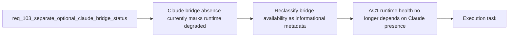

## item_179_reclassify_optional_claude_bridge_availability_as_non_degraded_hybrid_runtime_metadata - Reclassify optional Claude bridge availability as non-degraded hybrid runtime metadata
> From version: 1.15.0
> Schema version: 1.0
> Status: Done
> Understanding: 100%
> Confidence: 98%
> Progress: 100%
> Complexity: Medium
> Theme: Hybrid runtime health semantics and adapter-neutral status
> Reminder: Update status/understanding/confidence/progress and linked task references when you edit this doc.

# Problem
- The shared hybrid runtime currently treats missing Claude bridge files as a degraded runtime condition even when the actual backend and runtime path are healthy.
- That behavior makes a repository without Claude integration look operationally unhealthy, which distorts the meaning of runtime status for operators.
- Hybrid runtime health should describe backend viability and execution readiness, while Claude bridge presence should remain optional metadata.

# Scope
- In:
  - reclassifying Claude bridge availability away from degraded runtime health semantics
  - preserving Claude bridge visibility as informational adapter metadata
  - keeping runtime-status payloads explicit about what is runtime health versus optional integration presence
- Out:
  - changing which Claude bridge files are considered canonical
  - expanding Ollama delegation policy or plugin actions
  - Windows-specific validation coverage beyond what is needed to preserve the semantic contract

# Acceptance criteria
- AC1: Runtime-status no longer reports `degraded` solely because Claude bridge files are absent.
- AC2: Runtime-status still reports Claude bridge availability explicitly, but in a field or note that is semantically separate from degraded runtime health.
- AC3: A healthy Ollama-backed runtime with no Claude bridge resolves to `ready`, not `degraded`.

# AC Traceability
- req103-AC1 -> This backlog slice. Proof: the item removes Claude bridge absence from degraded runtime semantics.
- req103-AC2 -> This backlog slice. Proof: the item keeps Claude bridge availability visible while separating it from health.

# Decision framing
- Product framing: Not needed
- Product signals: operator trust, status clarity
- Product follow-up: Reuse existing product framing; no new brief is required for this semantic correction.
- Architecture framing: Required
- Architecture signals: contracts and integration, runtime and boundaries
- Architecture follow-up: Reuse `adr_011` and `adr_012`; no new ADR is required unless status payload schema changes materially.

# Links
- Product brief(s): `prod_001_hybrid_assist_operator_experience_for_repetitive_logics_delivery_flows`, `prod_002_plugin_hybrid_assist_runtime_visibility_and_action_ux`
- Architecture decision(s): `adr_011_keep_hybrid_assist_runtime_contracts_shared_backend_agnostic_and_safely_bounded`, `adr_012_keep_the_vs_code_plugin_as_a_thin_client_over_shared_hybrid_runtime_commands`
- Request: `req_103_separate_optional_claude_bridge_status_from_hybrid_runtime_degradation_and_expand_ollama_first_dispatch_across_supported_flows`
- Primary task(s): `task_105_orchestration_delivery_for_req_103_hybrid_runtime_status_semantics_dispatch_expansion_and_windows_global_kit_validation`

# AI Context
- Summary: Remove Claude bridge absence from degraded runtime semantics while preserving it as informational integration metadata.
- Keywords: hybrid assist, claude bridge, degraded, runtime status, metadata, health
- Use when: Use when implementing or reviewing runtime-status semantics so optional integrations do not look like runtime faults.
- Skip when: Skip when the work is about canonical bridge path unification, expanded Ollama delegation, or Windows validation.

# References
- `logics/request/req_103_separate_optional_claude_bridge_status_from_hybrid_runtime_degradation_and_expand_ollama_first_dispatch_across_supported_flows.md`
- `logics/skills/logics-flow-manager/scripts/logics_flow_hybrid.py`
- `src/logicsEnvironment.ts`

# Priority
- Impact:
- Urgency:

# Notes
- Derived from request `req_103_separate_optional_claude_bridge_status_from_hybrid_runtime_degradation_and_expand_ollama_first_dispatch_across_supported_flows`.
- Source file: `logics/request/req_103_separate_optional_claude_bridge_status_from_hybrid_runtime_degradation_and_expand_ollama_first_dispatch_across_supported_flows.md`.
