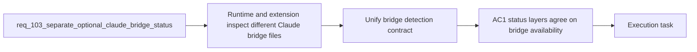

## item_180_unify_claude_bridge_detection_contracts_across_runtime_and_extension_status_surfaces - Unify Claude bridge detection contracts across runtime and extension status surfaces
> From version: 1.15.0
> Schema version: 1.0
> Status: Done
> Understanding: 100%
> Confidence: 98%
> Progress: 100%
> Complexity: Medium
> Theme: Claude bridge contract unification across Python runtime and VS Code extension
> Reminder: Update status/understanding/confidence/progress and linked task references when you edit this doc.

# Problem
- The Python runtime and the VS Code extension currently inspect different Claude bridge files to decide whether Claude integration is available.
- That mismatch can produce contradictory status output across the runtime probe, the environment panel, and any operator-facing diagnostics.
- A single canonical contract is needed so the same repository yields the same Claude-adapter availability regardless of which layer performs the inspection.

# Scope
- In:
  - choosing or reaffirming the canonical Claude bridge file contract for the hybrid runtime path
  - aligning Python runtime and extension detection with the same contract
  - preserving backward compatibility or explicit migration behavior when repositories still expose older bridge file names
- Out:
  - changing degraded health semantics beyond the reclassification handled in `item_179`
  - expanding Ollama-first dispatch policy
  - adding new plugin tools

# Acceptance criteria
- AC1: The Python runtime and the VS Code extension use the same canonical Claude bridge detection contract.
- AC2: Repositories that still expose older bridge file names are handled explicitly, either through compatibility support or a clear migration rule, rather than silent disagreement between layers.
- AC3: Operator-facing status output cannot report Claude bridge availability differently depending on whether the runtime probe or the extension-side environment inspection is consulted.

# AC Traceability
- req103-AC3 -> This backlog slice. Proof: the item aligns runtime and extension bridge detection semantics and paths.
- req103-AC2 -> Partial support from this slice. Proof: consistent bridge detection is required before healthy repositories can report adapter availability correctly.

# Decision framing
- Product framing: Not needed
- Product signals: operator trust, migration clarity
- Product follow-up: No new product brief is required; this is a contract-alignment slice.
- Architecture framing: Required
- Architecture signals: contracts and integration, migration and compatibility
- Architecture follow-up: Reuse `adr_011`, `adr_012`, and `adr_013`; add a new ADR only if backward compatibility rules become materially complex.

# Links
- Product brief(s): `prod_002_plugin_hybrid_assist_runtime_visibility_and_action_ux`
- Architecture decision(s): `adr_011_keep_hybrid_assist_runtime_contracts_shared_backend_agnostic_and_safely_bounded`, `adr_012_keep_the_vs_code_plugin_as_a_thin_client_over_shared_hybrid_runtime_commands`, `adr_013_replace_repo_local_codex_workspace_overlays_with_a_global_published_logics_kit`
- Request: `req_103_separate_optional_claude_bridge_status_from_hybrid_runtime_degradation_and_expand_ollama_first_dispatch_across_supported_flows`
- Primary task(s): `task_105_orchestration_delivery_for_req_103_hybrid_runtime_status_semantics_dispatch_expansion_and_windows_global_kit_validation`

# AI Context
- Summary: Align Claude bridge detection across the shared runtime and the extension so both layers report the same adapter availability.
- Keywords: claude bridge, detection, compatibility, runtime, extension, status, migration
- Use when: Use when implementing or reviewing the canonical Claude bridge contract and backward-compatible detection behavior.
- Skip when: Skip when the work is only about degraded-state semantics or flow delegation policy.

# References
- `logics/request/req_091_ensure_hybrid_logics_delivery_automation_stays_compatible_with_claude_environments_and_windows_runtimes.md`
- `logics/request/req_099_replace_repo_local_codex_overlays_with_a_global_published_logics_kit_and_managed_migration.md`
- `logics/request/req_103_separate_optional_claude_bridge_status_from_hybrid_runtime_degradation_and_expand_ollama_first_dispatch_across_supported_flows.md`
- `logics/skills/logics-flow-manager/scripts/logics_flow.py`
- `src/logicsEnvironment.ts`

# Priority
- Impact:
- Urgency:

# Notes
- Derived from request `req_103_separate_optional_claude_bridge_status_from_hybrid_runtime_degradation_and_expand_ollama_first_dispatch_across_supported_flows`.
- Source file: `logics/request/req_103_separate_optional_claude_bridge_status_from_hybrid_runtime_degradation_and_expand_ollama_first_dispatch_across_supported_flows.md`.
