## item_181_define_per_flow_ollama_first_dispatch_policy_for_supported_hybrid_assist_flows - Define per-flow Ollama-first dispatch policy for supported hybrid assist flows
> From version: 1.15.0
> Schema version: 1.0
> Status: Done
> Understanding: 100%
> Confidence: 97%
> Progress: 100%
> Complexity: High
> Theme: Explicit local-first hybrid dispatch policy and bounded backend selection
> Reminder: Update status/understanding/confidence/progress and linked task references when you edit this doc.

# Problem
- The current `auto` backend policy is intentionally simple: if Ollama is reachable and the configured model exists, the runtime selects `ollama`.
- That policy does not yet express whether all supported flows are equally good candidates for local-first execution, which makes broader delegation hard to reason about.
- Before exposing more work to Ollama, the runtime needs an explicit per-flow policy that describes which flows are Ollama-first, which stay Codex-only, and where stricter fallback or repair behavior is required.

# Scope
- In:
  - defining an explicit backend selection policy per supported hybrid assist flow
  - clarifying which flows are eligible for Ollama-first execution under `auto`
  - preserving safe fallback semantics when local results are unavailable or semantically weak
  - keeping policy ownership in the shared runtime rather than scattering it into the plugin
- Out:
  - adding new plugin buttons or menus for expanded flows
  - redesigning Hybrid Insights UI
  - removing Codex fallback or weakening validation safety

```mermaid
%% logics-kind: backlog
%% logics-signature: backlog|define-per-flow-ollama-first-dispatch-po|req-097-expand-hybrid-local-model-suppor|the-current-auto-backend-policy-is|ac1-the-shared-hybrid-runtime-exposes
flowchart LR
    Request[req_097_expand_hybrid_local_model_support_] --> Problem[The current auto backend policy is]
    Problem --> Scope[Define per-flow Ollama-first dispatch poli]
    Scope --> Acceptance[AC1: The shared hybrid runtime exposes]
    Acceptance --> Tasks[task_105_orchestration_delivery_for_req_10]
```

# Acceptance criteria
- AC1: The shared hybrid runtime exposes or applies an explicit per-flow backend policy instead of relying only on generic Ollama health.
- AC2: The policy makes it clear which supported flows are Ollama-first under `auto`, which remain Codex-only, and which require stricter fallback or repair handling.
- AC3: Policy changes preserve the existing bounded runtime contract and do not move backend-selection responsibility into the plugin layer.

# AC Traceability
- req103-AC4 -> This backlog slice. Proof: the item codifies a documented or encoded per-flow decision policy for local-first execution.
- req103-AC6 -> Partial support from this slice. Proof: trustworthy observability depends on explicit policy rather than hidden backend broadening.

# Decision framing
- Product framing: Not needed
- Product signals: local ROI, operator trust, rollout control
- Product follow-up: Reuse existing product framing; no new brief is required for dispatch-policy definition alone.
- Architecture framing: Required
- Architecture signals: contracts and integration, runtime and boundaries, delivery and operations
- Architecture follow-up: Reuse `adr_011` and `adr_012`; create a new ADR only if the policy introduces enduring rollout classes or policy metadata that deserves long-term governance.

# Links
- Product brief(s): `prod_001_hybrid_assist_operator_experience_for_repetitive_logics_delivery_flows`
- Architecture decision(s): `adr_011_keep_hybrid_assist_runtime_contracts_shared_backend_agnostic_and_safely_bounded`, `adr_012_keep_the_vs_code_plugin_as_a_thin_client_over_shared_hybrid_runtime_commands`
- Request: `req_103_separate_optional_claude_bridge_status_from_hybrid_runtime_degradation_and_expand_ollama_first_dispatch_across_supported_flows`
- Primary task(s): `task_105_orchestration_delivery_for_req_103_hybrid_runtime_status_semantics_dispatch_expansion_and_windows_global_kit_validation`

# AI Context
- Summary: Define an explicit per-flow local-first dispatch policy so Ollama delegation can expand without relying on an overly implicit health-only `auto` rule.
- Keywords: ollama, dispatch policy, hybrid assist, auto backend, flow policy, fallback, codex
- Use when: Use when implementing or reviewing how backend selection should vary by supported flow under the shared hybrid runtime.
- Skip when: Skip when the work is only about plugin exposure, Claude bridge semantics, or Windows validation evidence.

# References
- `logics/request/req_097_expand_hybrid_local_model_support_beyond_deepseek_with_configurable_qwen_and_deepseek_profiles.md`
- `logics/request/req_102_harden_ollama_hybrid_assist_prompts_and_response_validation_so_local_runs_stop_echoing_the_contract.md`
- `logics/request/req_103_separate_optional_claude_bridge_status_from_hybrid_runtime_degradation_and_expand_ollama_first_dispatch_across_supported_flows.md`
- `logics/skills/logics-flow-manager/scripts/logics_flow_hybrid.py`
- `logics/skills/logics-flow-manager/scripts/logics_flow.py`

# Priority
- Impact:
- Urgency:

# Notes
- Derived from request `req_103_separate_optional_claude_bridge_status_from_hybrid_runtime_degradation_and_expand_ollama_first_dispatch_across_supported_flows`.
- Source file: `logics/request/req_103_separate_optional_claude_bridge_status_from_hybrid_runtime_degradation_and_expand_ollama_first_dispatch_across_supported_flows.md`.
