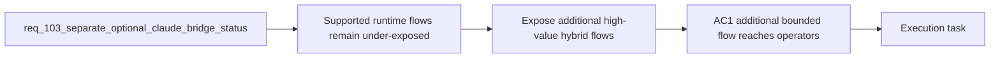

## item_182_expose_additional_high_value_hybrid_assist_flows_through_plugin_and_shared_operator_surfaces - Expose additional high-value hybrid assist flows through plugin and shared operator surfaces
> From version: 1.15.0
> Schema version: 1.0
> Status: Ready
> Understanding: 96%
> Confidence: 93%
> Progress: 0%
> Complexity: High
> Theme: Broader Ollama-first operator value through existing shared runtime flows
> Reminder: Update status/understanding/confidence/progress and linked task references when you edit this doc.

# Problem
- The shared runtime already supports more bounded high-value flows than the extension currently exposes, so local-first delegation remains narrower than it needs to be.
- As long as the operator surfaces only route a small subset of the supported flows, the measured Ollama offload rate will stay artificially low even if the runtime policy allows more local-first work.
- Broader delegation should therefore land as real operator-facing entrypoints rather than staying a theoretical capability hidden behind the CLI or internal contracts.

# Scope
- In:
  - exposing additional bounded high-value hybrid flows through the plugin or shared operator surfaces
  - prioritizing flows such as `triage`, `diff-risk`, `validation-checklist`, `doc-consistency`, `closure-summary`, or `suggest-split`
  - preserving runtime ownership of payloads, backend provenance, and degraded semantics
  - surfacing actual backend outcomes for the expanded flows through existing notification or result patterns
- Out:
  - inventing entirely new backend semantics outside the shared runtime
  - exposing every supported flow at once without prioritization
  - large UI redesign unrelated to reaching the already-supported runtime flows

# Acceptance criteria
- AC1: At least one additional bounded high-value hybrid assist flow beyond the current narrow set becomes reachable through the plugin or shared operator surfaces.
- AC2: The newly exposed flows preserve the extension-thin architecture by continuing to route through the shared runtime rather than duplicating backend logic in the plugin.
- AC3: Expanded flows continue to surface actual backend outcomes, fallback behavior, and degraded semantics through the existing shared runtime contract.

# AC Traceability
- req103-AC5 -> This backlog slice. Proof: the item makes additional supported flows reachable through operator surfaces rather than leaving them latent.
- req103-AC6 -> Partial support from this slice. Proof: exposing new flows must preserve backend provenance and degraded semantics through the shared runtime contract.

# Decision framing
- Product framing: Helpful
- Product signals: operator ROI, discoverability, repetitive delivery acceleration
- Product follow-up: Reuse `prod_001` and `prod_002`; no new brief is required unless the expanded flows materially change plugin information architecture.
- Architecture framing: Required
- Architecture signals: contracts and integration, runtime and boundaries
- Architecture follow-up: Reuse `adr_012`; no new ADR is required unless the plugin starts exposing a significantly larger assist action model.

# Links
- Product brief(s): `prod_001_hybrid_assist_operator_experience_for_repetitive_logics_delivery_flows`, `prod_002_plugin_hybrid_assist_runtime_visibility_and_action_ux`
- Architecture decision(s): `adr_012_keep_the_vs_code_plugin_as_a_thin_client_over_shared_hybrid_runtime_commands`
- Request: `req_103_separate_optional_claude_bridge_status_from_hybrid_runtime_degradation_and_expand_ollama_first_dispatch_across_supported_flows`
- Primary task(s): `task_105_orchestration_delivery_for_req_103_hybrid_runtime_status_semantics_dispatch_expansion_and_windows_global_kit_validation`

# AI Context
- Summary: Reach more bounded high-value hybrid assist flows from operator surfaces so Ollama-first delegation becomes a real workflow path rather than an under-exposed runtime capability.
- Keywords: hybrid assist, plugin, operator surface, triage, diff-risk, validation-checklist, closure-summary, suggest-split, ollama
- Use when: Use when planning or implementing how additional supported hybrid flows should become reachable to operators through the plugin or related shared entrypoints.
- Skip when: Skip when the work is only about backend policy, Claude bridge semantics, or Windows verification evidence.

# References
- `logics/request/req_092_add_a_second_wave_of_hybrid_ollama_or_codex_assist_flows_for_risk_triage_commit_planning_closure_summaries_doc_consistency_checks_and_validation_checklists.md`
- `logics/request/req_095_adapt_the_vs_code_logics_plugin_to_expose_hybrid_assist_runtime_status_actions_audit_and_cross_agent_messaging.md`
- `logics/request/req_103_separate_optional_claude_bridge_status_from_hybrid_runtime_degradation_and_expand_ollama_first_dispatch_across_supported_flows.md`
- `src/logicsViewProvider.ts`
- `logics/skills/logics-flow-manager/scripts/logics_flow_hybrid.py`

# Priority
- Impact:
- Urgency:

# Notes
- Derived from request `req_103_separate_optional_claude_bridge_status_from_hybrid_runtime_degradation_and_expand_ollama_first_dispatch_across_supported_flows`.
- Source file: `logics/request/req_103_separate_optional_claude_bridge_status_from_hybrid_runtime_degradation_and_expand_ollama_first_dispatch_across_supported_flows.md`.
