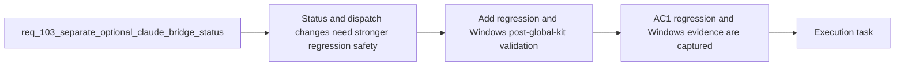

## item_183_add_regression_and_windows_post_global_kit_validation_for_hybrid_runtime_status_and_dispatch_expansion - Add regression and Windows post-global-kit validation for hybrid runtime status and dispatch expansion
> From version: 1.15.0
> Schema version: 1.0
> Status: Done
> Understanding: 100%
> Confidence: 97%
> Progress: 100%
> Complexity: Medium
> Theme: Regression safety and Windows compatibility after global Codex kit deployment
> Reminder: Update status/understanding/confidence/progress and linked task references when you edit this doc.

# Problem
- The request changes runtime semantics, bridge detection, and local-first delegation behavior, so regression coverage is required to keep operator status and backend routing trustworthy.
- The repository has already migrated to globally deployed Codex skills, which raises Windows-specific risk around entrypoints, launchers, PATH resolution, and shared-kit assumptions.
- Without a targeted validation slice, the rollout could look healthy on Unix-like environments while regressing on Windows or under the post-global-kit runtime path.

# Scope
- In:
  - adding regression coverage for runtime-status semantics and bridge detection alignment
  - adding coverage or validation evidence for at least one expanded local-first delegation path
  - performing a targeted Windows compatibility pass against the post-global-kit hybrid runtime and dispatcher path
  - documenting or preserving explicit evidence when Windows verification cannot be fully automated in the local environment
- Out:
  - rewriting the full test strategy for the repository
  - adding unrelated Windows work outside the hybrid runtime and global-kit dispatcher path
  - broad performance benchmarking of Ollama models

# Acceptance criteria
- AC1: Automated coverage proves that a healthy runtime without Claude bridge is not marked degraded.
- AC2: Automated coverage proves that runtime and extension-facing status inspection agree on Claude bridge availability semantics.
- AC3: Automated coverage or explicit validation evidence covers at least one newly expanded Ollama-eligible flow or dispatch-policy path.
- AC4: The delivery includes a targeted Windows compatibility pass for the post-global-kit hybrid runtime and dispatcher path, with explicit evidence or follow-up notes about runtime-status, entrypoints, backend dispatch, and launcher assumptions.

# AC Traceability
- req103-AC7 -> This backlog slice. Proof: the item adds regression coverage for new status semantics and expanded routing behavior.
- req103-AC8 -> This backlog slice. Proof: the item explicitly requires a Windows compatibility pass after the move to globally deployed Codex skills.

# Decision framing
- Product framing: Not needed
- Product signals: release safety, operator trust
- Product follow-up: No new product brief is required for regression and compatibility coverage.
- Architecture framing: Helpful
- Architecture signals: migration and compatibility, delivery and operations
- Architecture follow-up: Reuse `adr_013`; no new ADR is required unless Windows-safe runtime assumptions materially change.

# Links
- Product brief(s): `prod_002_plugin_hybrid_assist_runtime_visibility_and_action_ux`
- Architecture decision(s): `adr_013_replace_repo_local_codex_workspace_overlays_with_a_global_published_logics_kit`
- Request: `req_103_separate_optional_claude_bridge_status_from_hybrid_runtime_degradation_and_expand_ollama_first_dispatch_across_supported_flows`
- Primary task(s): `task_105_orchestration_delivery_for_req_103_hybrid_runtime_status_semantics_dispatch_expansion_and_windows_global_kit_validation`

# AI Context
- Summary: Add regression safety and Windows post-global-kit validation for the hybrid runtime status and expanded local-first dispatch path.
- Keywords: regression, windows, global codex kit, runtime-status, hybrid assist, dispatch, validation
- Use when: Use when planning or implementing tests and validation evidence for runtime semantic changes, expanded delegation, and Windows-safe operation after the global-kit migration.
- Skip when: Skip when the work is only about defining dispatch policy or exposing new operator actions without verification.

# References
- `logics/request/req_099_replace_repo_local_codex_overlays_with_a_global_published_logics_kit_and_managed_migration.md`
- `logics/request/req_103_separate_optional_claude_bridge_status_from_hybrid_runtime_degradation_and_expand_ollama_first_dispatch_across_supported_flows.md`
- `tests/logicsEnvironment.test.ts`
- `tests/logicsViewProvider.test.ts`
- `logics/skills/tests/test_logics_flow.py`
- `README.md`

# Priority
- Impact:
- Urgency:

# Notes
- Derived from request `req_103_separate_optional_claude_bridge_status_from_hybrid_runtime_degradation_and_expand_ollama_first_dispatch_across_supported_flows`.
- Source file: `logics/request/req_103_separate_optional_claude_bridge_status_from_hybrid_runtime_degradation_and_expand_ollama_first_dispatch_across_supported_flows.md`.
- Automated evidence now covers the healthy-without-Claude runtime-status path, unified bridge detection, and new dispatch-policy paths such as `diff-risk` and `next-step` under `auto`.
- Windows post-global-kit evidence is kept explicit in `README.md`: the supported shared-runtime entrypoint remains `python logics/skills/logics.py flow assist ...`, with manual VM smoke steps for `runtime-status`, `diff-risk`, and `validation-checklist` after the move away from repo-local overlays.
