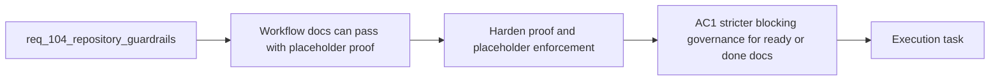

## item_184_harden_workflow_doc_proof_and_placeholder_enforcement - Harden workflow-doc proof and placeholder enforcement
> From version: 1.16.0
> Schema version: 1.0
> Status: Done
> Understanding: 96%
> Confidence: 93%
> Progress: 100%
> Complexity: Medium
> Theme: Workflow governance, proof quality, and blocking placeholder detection
> Reminder: Update status/understanding/confidence/progress and linked task references when you edit this doc.

# Problem
- Ready or done workflow docs can still pass repository checks with placeholder proof text or generic traceability scaffolds, which weakens trust in green workflow governance.
- The current split between workflow audit and doc linting leaves obvious low-quality proof markers under-enforced in the places where the repository most needs blocking guarantees.
- This slice should harden the proof and placeholder contract without turning every in-progress draft into a blocking failure.

# Scope
- In:
  - tightening proof detection for ready or done workflow docs
  - blocking unresolved proof markers or equivalent placeholders under the intended governance contract
  - expanding placeholder detection in key workflow sections such as `Problem`, `Scope`, `Acceptance criteria`, and `AC Traceability`
  - adding regression coverage for the chosen strictness rules
- Out:
  - redesigning the overall Logics workflow model
  - rewriting large numbers of historical docs outside the minimum needed to validate the stricter rule
  - packaging or plugin refresh behavior

# Acceptance criteria
- AC1: Ready or done workflow docs no longer pass the selected audit or lint path when they still contain unresolved proof markers or equivalent placeholder evidence.
- AC2: Generic scaffold content in key workflow sections is surfaced as a blocking failure where the repository contract requires it, rather than staying only a soft warning.
- AC3: The strictness scope is explicit and bounded so draft or intentionally incomplete docs are not blocked by rules meant for implementation-ready or completed workflow states.
- AC4: Regression coverage proves the hardened behavior against at least one placeholder-proof case and one generic-scaffold case.

# AC Traceability
- req104-AC1 -> This backlog slice. Proof: the item hardens proof validation for ready or done workflow docs.
- req104-AC2 -> This backlog slice. Proof: the item promotes important placeholder detection from advisory to blocking under the selected governance contract.
- req104-AC7 -> Partial support from this slice. Proof: regression coverage is required for placeholder-proof and generic-scaffold rejection.

# Decision framing
- Product framing: Not needed
- Product signals: repository trust, delivery governance
- Product follow-up: No product brief is required for this governance hardening slice.
- Architecture framing: Helpful
- Architecture signals: shared workflow contracts, lint versus audit responsibility
- Architecture follow-up: Reuse existing Logics workflow governance conventions; add no new ADR unless strictness modes become a lasting public contract.

# Links
- Product brief(s): (none)
- Architecture decision(s): (none)
- Request: `req_104_harden_repository_maintenance_guardrails_revealed_by_project_audit`
- Primary task(s): `task_106_orchestration_delivery_for_req_104_to_req_106_repository_guardrails_hybrid_insights_refinement_and_local_first_assist_expansion`

# AI Context
- Summary: Tighten workflow-doc governance so ready or done docs cannot pass with placeholder proof text or generic AC scaffolds in critical sections.
- Keywords: workflow docs, proof, placeholder, lint, audit, governance, traceability
- Use when: Use when implementing or reviewing stricter blocking rules for Logics proof quality and placeholder detection.
- Skip when: Skip when the work is only about packaging, watch scripts, plugin refresh, or Hybrid Insights UI.

# References
- `logics/request/req_104_harden_repository_maintenance_guardrails_revealed_by_project_audit.md`
- `logics/skills/logics-flow-manager/scripts/workflow_audit.py`
- `logics/skills/logics-doc-linter/scripts/logics_lint.py`
- `logics/backlog/item_028_replace_hide_used_requests_with_hide_processed_requests_semantics.md`
- `logics/tasks/task_038_improve_ui_state_persistence_in_the_plugin.md`

# Priority
- Impact:
- Urgency:

# Notes
- Derived from request `req_104_harden_repository_maintenance_guardrails_revealed_by_project_audit`.
- Source file: `logics/request/req_104_harden_repository_maintenance_guardrails_revealed_by_project_audit.md`.
- Task `task_106_orchestration_delivery_for_req_104_to_req_106_repository_guardrails_hybrid_insights_refinement_and_local_first_assist_expansion` was synchronized to `Done` on 2026-03-27 after confirming the delivered `1.6.0` runtime and documentation surface.
