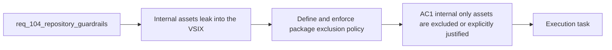

## item_185_enforce_internal_asset_exclusion_and_package_validation_coverage - Enforce internal asset exclusion and package validation coverage
> From version: 1.16.0
> Schema version: 1.0
> Status: Ready
> Understanding: 96%
> Confidence: 93%
> Progress: 0%
> Complexity: Medium
> Theme: VSIX hygiene, packaging contract, and smoke validation
> Reminder: Update status/understanding/confidence/progress and linked task references when you edit this doc.

# Problem
- The repository currently ships internal-only assets such as `.claude/` in the VSIX because the exclusion policy is incomplete and smoke validation does not assert the intended contract.
- This creates avoidable package noise and leaves the public extension surface ambiguous.
- Packaging hygiene should be explicit, tested, and stable across future changes.

# Scope
- In:
  - defining the package policy for internal-only repository assets such as `.claude/`
  - updating `.vscodeignore` or equivalent package filters to enforce that policy
  - extending smoke or package validation to assert the chosen exclusion contract
  - documenting the selected package surface where needed
- Out:
  - redesigning the full extension release process
  - changing public extension behavior unrelated to package contents
  - watch-loop or release-helper semantics

# Acceptance criteria
- AC1: Internal-only repository assets such as `.claude/` are excluded from the VSIX unless the repository explicitly decides they are part of the supported distribution surface.
- AC2: Package or smoke validation asserts the selected exclusion policy so future packaging drift fails automatically.
- AC3: Repository documentation or package-contract notes make the inclusion or exclusion rule understandable to maintainers.

# AC Traceability
- req104-AC3 -> This backlog slice. Proof: the item defines and enforces the VSIX content contract for internal-only assets.
- req104-AC7 -> Partial support from this slice. Proof: package validation coverage prevents silent drift in internal-asset packaging policy.

# Decision framing
- Product framing: Not needed
- Product signals: package hygiene, maintainer trust
- Product follow-up: No product brief is required for this packaging-governance slice.
- Architecture framing: Not needed
- Architecture signals: build and distribution contract clarity
- Architecture follow-up: No ADR is required unless package-surface governance becomes a long-term public compatibility guarantee.

# Links
- Product brief(s): (none)
- Architecture decision(s): (none)
- Request: `req_104_harden_repository_maintenance_guardrails_revealed_by_project_audit`
- Primary task(s): `task_106_orchestration_delivery_for_req_104_to_req_106_repository_guardrails_hybrid_insights_refinement_and_local_first_assist_expansion`

# AI Context
- Summary: Define and enforce a clean VSIX package contract so internal-only repository assets do not leak into the extension artifact unnoticed.
- Keywords: VSIX, packaging, vscodeignore, smoke test, internal assets, claude
- Use when: Use when implementing or reviewing package-surface rules for the extension artifact.
- Skip when: Skip when the work is about workflow-doc governance, watch scripts, or Hybrid Insights presentation.

# References
- `logics/request/req_104_harden_repository_maintenance_guardrails_revealed_by_project_audit.md`
- `.vscodeignore`
- `tests/run_extension_smoke_checks.mjs`
- `package.json`

# Priority
- Impact:
- Urgency:

# Notes
- Derived from request `req_104_harden_repository_maintenance_guardrails_revealed_by_project_audit`.
- Source file: `logics/request/req_104_harden_repository_maintenance_guardrails_revealed_by_project_audit.md`.
