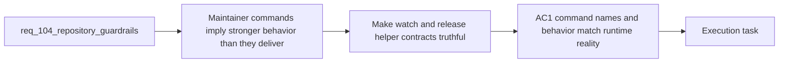

## item_186_align_watch_and_release_helper_contracts_with_actual_runtime_behavior - Align watch and release helper contracts with actual runtime behavior
> From version: 1.16.0
> Schema version: 1.0
> Status: Ready
> Understanding: 96%
> Confidence: 93%
> Progress: 0%
> Complexity: Medium
> Theme: Contributor command truthfulness, bundle behavior, and release helper semantics
> Reminder: Update status/understanding/confidence/progress and linked task references when you edit this doc.

# Problem
- `watch` currently suggests a live extension rebuild path even though the extension runs from a bundled `dist/extension.js` artifact that the existing watch command does not rebuild.
- The release changelog helper exposes `resolve` and `validate` as if they guaranteed different outcomes, even though the current implementation remains permissive.
- These command-surface mismatches create misleading maintainer expectations even when CI is green.

# Scope
- In:
  - aligning the `watch` command surface with the actual runtime artifact used by the extension
  - distinguishing typecheck-only watch behavior from bundle-watch behavior if both are needed
  - making `release:changelog:resolve` and `release:changelog:validate` truthful in naming, behavior, and documentation
  - adding regression or script-level checks to keep those command contracts from drifting again
- Out:
  - large build-pipeline rewrites unrelated to the current bundle contract
  - redesigning release automation beyond the curated changelog helper semantics
  - plugin refresh behavior for non-`logics/` runtime inputs

# Acceptance criteria
- AC1: A command named `watch` either rebuilds the bundled runtime artifact actually used by the extension, or the repository clearly separates bundle-watch and typecheck-watch behavior in scripts and docs.
- AC2: The release changelog helper contract becomes truthful: either `validate` fails under a stricter requirement than `resolve`, or the naming and docs stop implying that stronger guarantee.
- AC3: Automated checks or script-level regression coverage prevent future drift between command names, behavior, and maintainer documentation.

# AC Traceability
- req104-AC4 -> This backlog slice. Proof: the item aligns the watch command surface with the bundled runtime artifact contract.
- req104-AC6 -> This backlog slice. Proof: the item makes `resolve` versus `validate` truthful in behavior or naming.
- req104-AC7 -> Partial support from this slice. Proof: regression checks are required for watch/build and release-helper contract drift.

# Decision framing
- Product framing: Not needed
- Product signals: contributor trust, release hygiene
- Product follow-up: No product brief is required for this maintainer-command hardening slice.
- Architecture framing: Helpful
- Architecture signals: build contract clarity, script semantics, release-helper ownership
- Architecture follow-up: Reuse current build architecture unless a broader bundling decision becomes necessary.

# Links
- Product brief(s): (none)
- Architecture decision(s): (none)
- Request: `req_104_harden_repository_maintenance_guardrails_revealed_by_project_audit`
- Primary task(s): `task_106_orchestration_delivery_for_req_104_to_req_106_repository_guardrails_hybrid_insights_refinement_and_local_first_assist_expansion`

# AI Context
- Summary: Make watch and release-helper commands truthful so script names, runtime behavior, and maintainer documentation stay aligned.
- Keywords: watch, bundle, dist, extension, release helper, validate, resolve, maintainer commands
- Use when: Use when implementing or reviewing bundle-watch semantics and release helper naming or failure behavior.
- Skip when: Skip when the work is about package contents, workflow-doc linting, or UI redesign.

# References
- `logics/request/req_104_harden_repository_maintenance_guardrails_revealed_by_project_audit.md`
- `package.json`
- `scripts/release/resolve-release-changelog.mjs`
- `changelogs/README.md`
- `README.md`

# Priority
- Impact:
- Urgency:

# Notes
- Derived from request `req_104_harden_repository_maintenance_guardrails_revealed_by_project_audit`.
- Source file: `logics/request/req_104_harden_repository_maintenance_guardrails_revealed_by_project_audit.md`.
